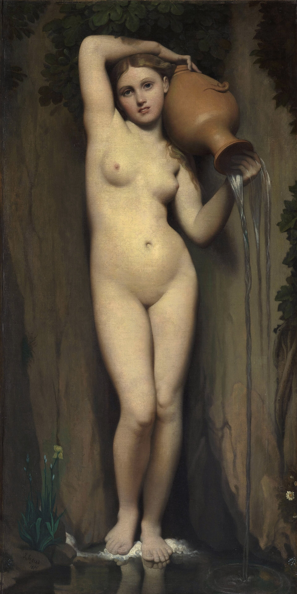
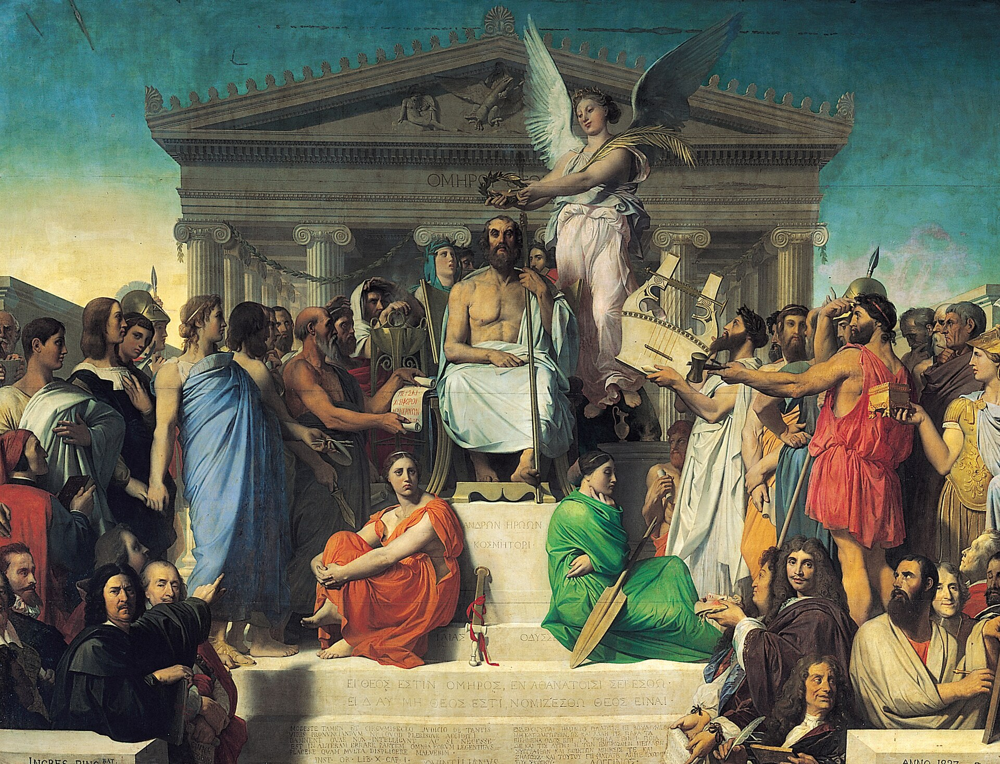
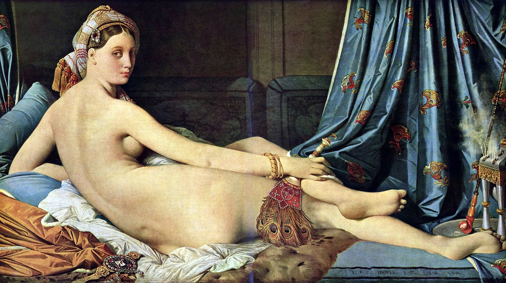

# Ingres · Art Appreciation Note

**Date**: July 2026  
**Based on**: A perceptual extension from Raphael to Ingres

---

## Works Ranking

Based on personal perception, the top three works by Ingres:

---

### #1 La Source

  
   
   
  <em>Ingres · La Source · 1820-1856 · Musée d'Orsay</em>

**A suffocating stillness of beauty.**

The gaze of the woman in the painting is anchored at the pivot of truth. The entire composition is harmonious beyond imagination. Art here freezes eternity — the trembling in each breath is proof enough. This is Ingres' masterpiece, the culmination of 36 years of devotion, a silent hymn to the world.

---

### #2 Apotheosis of Homer

  
   
   
  <em>Ingres · Apotheosis of Homer · 1827 · Louvre</em>

**Philosophers and men of letters gather to crown Homer.**

Each figure has its own expressive posture. On the steps, the two goddesses — especially the red one with her vexed expression — are simply strokes of genius. She is the embodiment of the *Iliad*, representing war and rage. This painting is Ingres' highest tribute to Raphael's *School of Athens*.

---

### #3 La Grande Odalisque

  
   
   
  <em>Ingres · La Grande Odalisque · 1814 · Louvre</em>

**A reclining nude, turning her gaze back.**

This is a rare and unusual painting. An ideal bodily beauty — formed by means that remain elusive — is somehow bestowed upon her. To achieve this ideal form, Ingres deliberately elongated her back. Words fall short in describing it — the visual impact itself surpasses all language.

---

## Thread of the Three Works

> **La Source** — harmony beyond imagination, stillness  
> **Apotheosis of Homer** — a collective tribute to classical thought  
> **La Grande Odalisque** — ideal beauty emerging from controversy

Ingres spent a lifetime searching for the "ideal form" on canvas. These three works represent his pursuit of three different poles: **perfection of form, structure of thought, and the tension of controversy.**
