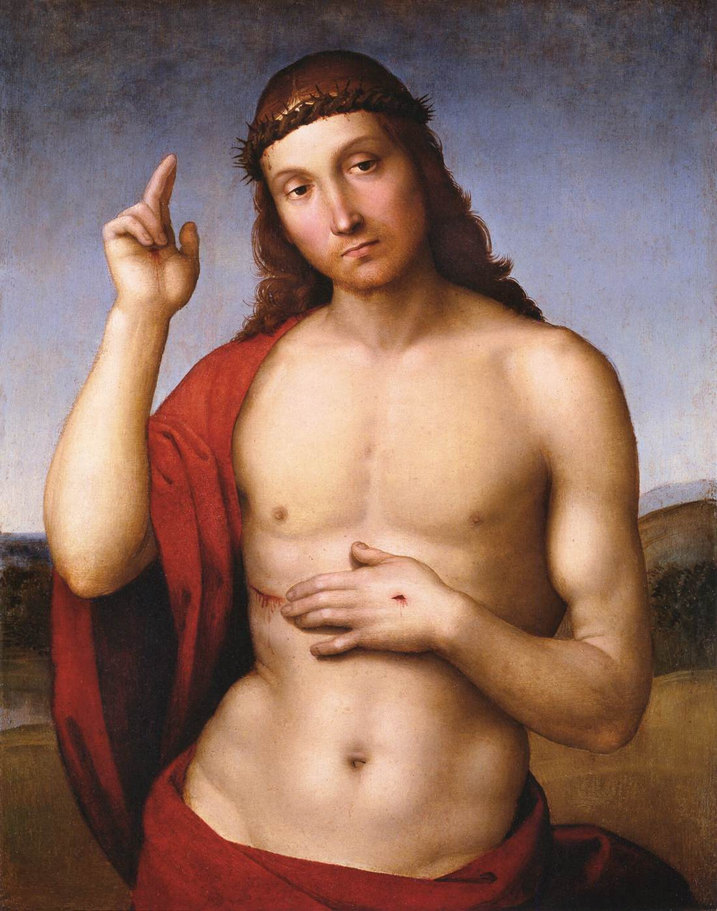
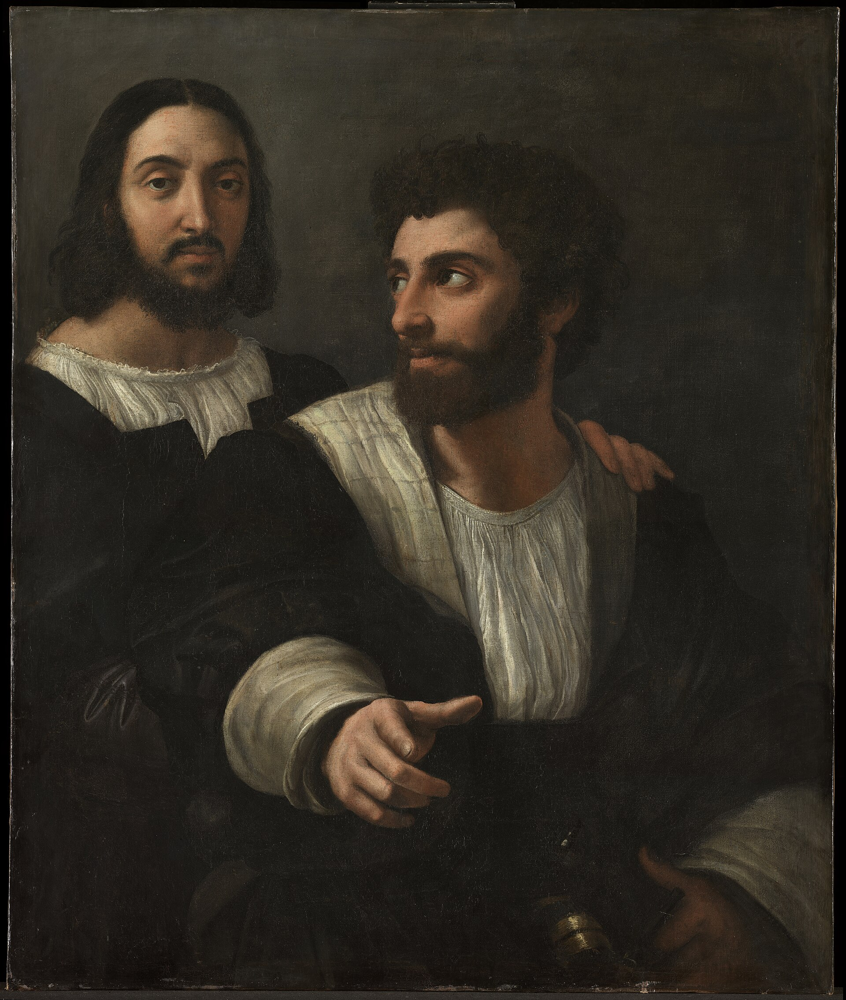

# Raphael · Art Appreciation Note

**Date**: July 2026  
**Based on**: A perceptual journey from Ingres to Raphael

---

## Works Ranking

Based on personal perception, the top three works by Raphael:

---

### #1 The School of Athens

  
   
   
  <em>Raphael · The School of Athens · 1509-1511</em>

**The highest temple of human reason. An aesthetic miracle where thought merges into art.**

He gathers the stars of ancient Greece — separated by centuries — into a single hall, and lets Plato and Aristotle debate face to face. This is not about the manifestation of "God," but about the awakening of "Man" — geometry, philosophy, gaze, and discourse all converge under one vault. This is Raphael's declaration to the "world."

---

### #2 Christ Blessing (Pax Vobiscum)

  
   
   
  <em>Raphael · Christ Blessing · c.1505-1506</em>

**The lonely abyss of the divine gaze. A thunderbolt from outside the present time and space.**

The crown of thorns remains, the wound is not concealed. Those eyes pass beyond you, looking toward eternity. He neither examines nor judges — he simply "is" there — and that gaze silences all words. This is Raphael's question to "eternity."

---

### #3 Self-Portrait with a Friend

  
   
   
  <em>Raphael · Self-Portrait with a Friend · c.1518-1519</em>

**Settlement after completion. From youthful melancholy to mature repose.**

He no longer needs to prove anything. The painting holds no peak of thought, no abyss of the divine — only a person who has completed his own path, resting his hand calmly on a friend's shoulder on an ordinary afternoon. This is Raphael's answer to "himself."

---

## Arc

These three works together trace the complete arc of Raphael's life:

> From *"I can achieve"* in *The School of Athens*  
> To *"I cannot reach"* in *Christ Blessing*  
> And finally to *"I no longer need to do anything"* in *Self-Portrait with a Friend*
