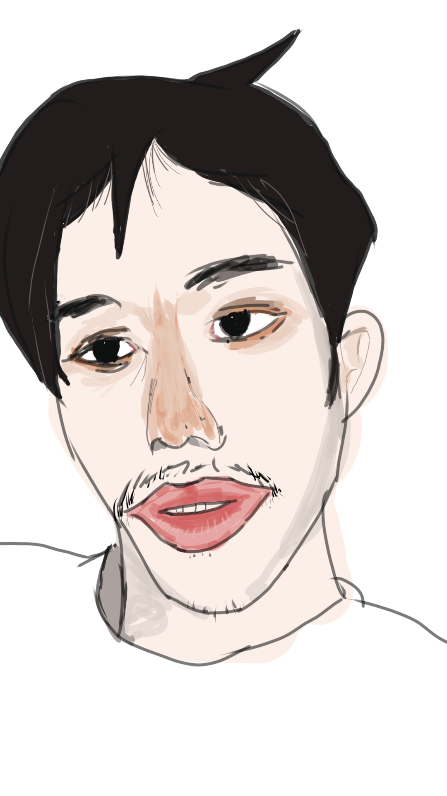

# Self-Portrait · Gallery Notes

---

*Self-portrait, painted on September 9, 2026*

---

The figure in this painting is looking at something—or perhaps looking through it. He appears to be examining a question, but not urgently seeking an answer. As if he already senses that an answer may not be there.

His face is not particularly distinctive—almost ordinary. And yet that ordinariness is not simple: his features carry traces of southeastern and southwestern China—the coastal contours of Fujian and Guangdong, the mountain-bred bone structure of Sichuan and Hunan. They meet on his face in a way that is unremarkable, but real. Like a genetic ancestry report that requires no laboratory, his face already records the history of migration and fusion.

He does not try to stand out. He simply sits there, looking at himself, and at whoever is looking back.

---

## Observations

**Facial structure**
The overall face is moderately broad and slightly short, with a jaw that is square-ish but softened by subcutaneous tissue. Cheekbones are not prominent; the mid-face is relatively flat. This is a blend of southern mountain-type and coastal-type features—the underlying bone structure leans toward Hunan, while the soft tissue coverage leans toward Fujian.

**Features**
Lips are full, with the lower lip slightly more pronounced—a common trait in the southeastern coastal region. The eyes are set slightly wide apart, moderate in size, and rounder in shape. The nose bridge is not high, with medium-width nostrils. The space between brows and eyes is neither too tight nor too open, giving a relaxed look of observation without conclusion.

**Light and shadow**
Light falls from the upper left, leaving the right side of the face in shadow. This lighting makes the left side structurally readable while the right side recedes into darkness—a quiet suggestion of the tension between what is seen and what remains unseen.

**Color palette**
The skin tone is warm but subdued. Lip color is slightly deeper, creating a faint contrast with the overall complexion. The background uses a neutral, slightly cool gray, which does not compete with the figure.

---

## Technique & Style

**Medium**
Digital painting (or: oil / acrylic / pencil—adjust as needed)

**Brushwork**
Brushwork is restrained, without heavy impasto. The facial structure is modeled in broad planes, with soft transitions and gentle edges. This treatment gives the image a quiet, distanced quality—neither rough nor overly polished.

**Overall mood**
Calm, slightly scrutinizing. The mood is not outwardly expressive but inwardly contained. The relationship between the viewer and the painted figure feels like two people sitting quietly in the same room.

---

## Personal Reflection

**State of mind**
While painting this, I was in a state of wanting to see myself clearly—not through a mirror, but through the act of painting itself.

**Satisfied with**
The lips and the width of the eyes came out well—they capture the most "Fujian" part of my features. The background also turned out right, not pulling attention away from the figure.

**Would revise**
The transition on the shadow side of the right cheek could be smoother. I might also darken the overall color slightly to give the image more weight.

---

## Date
September 9, 2026
