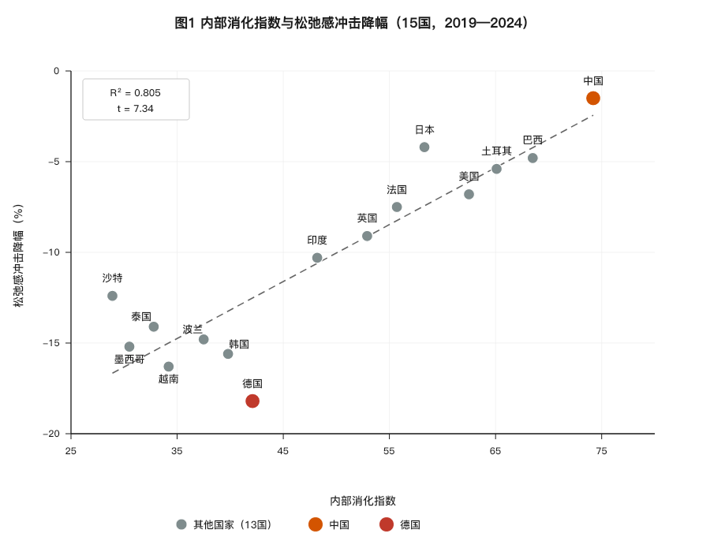
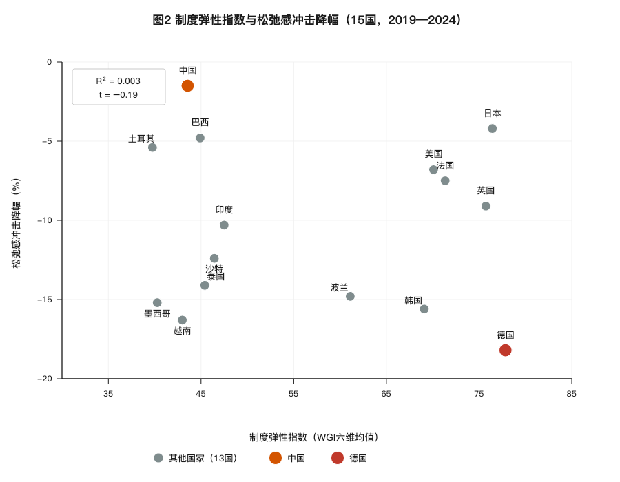

# Resilience in Tension: A Narrative Framework for Shock Resilience

## — An Exploratory Study Based on Five-Dimensional Fiscal Transmission and Cross-National Comparison

| Item | Content |
| :--- | :--- |
| **Title** | Resilience in Tension: A Narrative Framework for Shock Resilience — An Exploratory Study Based on Five-Dimensional Fiscal Transmission and Cross-National Comparison |
| **Author** | Zhong Shanzhen |
| **Date** | 2026-09-23 (Ninth Edition) |
| **License** | CC BY-NC 4.0 |
| **Keywords** | Resilience in Tension, Internally Absorbed Growth, Fiscal Transmission Framework, External Shock Resilience, Narrative Framework |

---

## I. Abstract

This paper is a **narrative framework**, not a testable causal proposition. Its core purpose is to propose a way of understanding the possible relationship between "tension" and "resilience," and to identify the boundary conditions and research directions of this framework.

Existing studies tend to focus on cross-sectional differences in national "relaxation," paying less attention to its dynamic behavior under external shocks. Building on a typology of "internally absorbed growth" versus "externally shared growth," this paper examines 15 countries over the 2019–2024 period, investigating the **correlational relationship** between an "internal absorption index" and the magnitude of decline in relaxation under external shocks.

**The core narrative proposed in this paper is**: there may be a negative correlation between the degree of internal absorption and the decline in relaxation under external shocks—that is, the deeper a country's internal absorption, the smaller its decline in relaxation. Regression results from 15-country data show that the internal absorption index can explain approximately 80% of the variation in relaxation decline (R²=0.805, t=7.34). China, as a typical case, exhibits smaller fluctuations in relaxation than externally shared countries such as Germany, South Korea, and Vietnam across the 2020 supply chain disruption, the 2022 energy crisis, and the 2023–2024 global tightening cycle.

**However, this paper must honestly report three robustness warnings**: (1) after excluding Germany, the coefficient of internal absorption drops from t=7.34 to t=1.59, becoming insignificant; (2) after expanding the sample to 37 countries (using consumption/GDP change as a proxy for resilience due to data constraints), the coefficient of internal absorption reverses direction (-2.546, t=-3.19); (3) after excluding Norway from the 37-country sample, the coefficient again becomes insignificant. **This means: the core narrative of this paper is highly sensitive to the choice of specific observations and dependent variables, and should be regarded as an exploratory hypothesis awaiting testing with larger samples and more unified dependent variables.**

This paper further reports a **falsifying finding**: institutional elasticity (measured as the mean of the World Bank's WGI six dimensions) has no statistically significant correlation with relaxation decline (R²=0.003, t=-0.19). **However, this finding only falsifies the linear effect, not the threshold effect**—because the 15-country sample lacks countries with institutional elasticity below 40 points.

**Keywords**: Resilience in Tension; Internally Absorbed Growth; External Shocks; Fiscal Resilience; Narrative Framework

**JEL Classification**: H53, H60, I38, P52

---

## II. Introduction: The Other Side of the Same Coin

In February 2022, the Russia-Ukraine war broke out. Within a month, German natural gas prices surged by 300%, and industrial output expectations deteriorated sharply. Over the same period, factories along China's eastern coast, while also feeling the pressure of global inflation, did not experience disruptions of a comparable magnitude. By late 2023, when global economists were broadly concerned that "high-debt countries would collapse in the tightening cycle," Japanese government bond yields repeatedly approached their upper limits, and Italian sovereign spreads widened sharply. China, despite localized risks in its real estate sector, maintained unusually stable sovereign credit ratings and government bond yield curves.

These two episodes raise the same question: why are some socioeconomic systems so sensitive to external shocks, while others—despite being chronically "tense" internally—exhibit relatively greater stability?

This paper is a companion piece to *Strong State, Tired People: Fiscal Intermediation and Structural Transmission — A Research Agenda*. That earlier paper, based on a five-dimensional fiscal transmission framework, proposed the micro-level tension that may accompany China's "internally absorbed growth" during the 2024–2035 window: high saving rates, low leisure time, and a low share of livelihood-oriented fiscal expenditure. That was a relatively pessimistic picture: it interpreted "exhaustion" as a structural cost rather than a temporary difficulty. But does the same structure manifest only as a cost under external shocks? This paper attempts to flip the coin, examining whether "internally absorbed growth" exhibits structural resilience during the multiple global shocks of 2019–2024.

**The core narrative of this paper is**: among internally absorbed countries, there may be a negative correlation between the "internal absorption index" and the "decline in relaxation under shocks." The counterintuitive implication of this narrative framework is that what is long seen as a "problem"—chronic tension—may turn out to be an "anchor" in a storm.

**However, this paper must first declare a methodological warning**: this narrative is highly sensitive to sample composition and dependent variable selection. Excluding Germany, expanding the sample, or changing the dependent variable may change the direction or significance of the conclusion. Therefore, this paper does not claim that this narrative has been proven; it presents it only as an **exploratory hypothesis awaiting testing with larger samples**.

It must be clearly stated: **"resilience in tension" is a narrative framework, not a value judgment, and even less a causal conclusion.** This paper does not claim that tension is morally superior to relaxation, nor does it advocate that any country should pursue tension. It merely proposes a question worthy of future research: under specific conditions, whether tension empirically may be associated with smaller fluctuations in relaxation.

---

## III. Literature Review: From Static Levels to Dynamic Resilience

The theoretical foundation of this paper has been fully established in *Strong State, Tired People*. That paper proposed a "five-dimensional fiscal transmission framework" (net security costs, net geographical connection burdens, net external rule gaps, demographic dependency pressures, and the share of livelihood-oriented fiscal expenditure), and on this basis distinguished between "internally absorbed growth" and "externally shared growth."

Existing theories face a common difficulty in explaining "shock resilience": they can explain differences under normal conditions but struggle to explain divergence during crises. Welfare state theory (Esping-Andersen, 1990) can explain why Germany has higher welfare expenditure than the United States, but it cannot explain why Germany's relaxation collapsed during the Russia-Ukraine war while America's remained relatively stable. International political economy can explain alliance realignments and sanctions博弈 between states, but it cannot track how these macro-level changes transmit to micro-level individual relaxation. Development economics focuses on the impact of shocks on GDP, employment, and poverty rates, but it does not incorporate into its analytical focus the question of "how fiscal structures buffer or amplify the transmission of shocks to micro-level welfare."

The five-dimensional fiscal transmission framework proposed in this paper is precisely intended to fill this "macro-micro" explanatory gap. The incremental contribution of this paper lies in shifting the analytical focus of comparative political economy from "static levels of relaxation" to "dynamic resilience of relaxation," and in providing preliminary exploratory evidence for the concept of "internally absorbed growth" through cross-national pre- and post-shock data.

This paper's conceptualization of "institutional elasticity" draws on North's (1990) theory of institutional change and path dependence, Rodrik's (1999) discussion of the relationship between institutional quality and growth resilience, and Acemoglu & Robinson's (2012) typological distinction between inclusive and extractive institutions. However, **the empirical results show that institutional elasticity has no statistically significant correlation with relaxation decline**—this is a key falsifying finding in this paper's dialogue with existing literature.

**Specific dialogue with existing literature**:

- **Dialogue with North**: North argues that institutional change is path-dependent. This paper had expected that institutional elasticity might be a necessary condition for "tension to convert into resilience," but 15-country data does not support this linear hypothesis. This suggests that the impact of institutional elasticity on national resilience may require a longer time window, more refined measurement, or a threshold model to identify.
- **Dialogue with Rodrik**: Rodrik (1999) found that institutional quality has a "nonlinear effect"—below a certain critical value, the negative impact of shocks is amplified. This paper's 15-country sample all falls within the WGI 39–78 range, **making it impossible to test the threshold effect**. Rodrik's finding suggests that this paper's linear regression may underestimate the actual role of institutional elasticity in the low-score range.
- **Dialogue with Acemoglu & Robinson**: Acemoglu & Robinson distinguish between inclusive and extractive institutions. What is the relationship between this paper's "institutional elasticity" and this distinction? This paper does not explain. This is also a direction for future research.

---

## IV. Theoretical Framework: From Transmission to Resilience

### 1. Logical Starting Point

The earlier paper, *Strong State, Tired People*, established a three-stage transmission path: "upstream rigid expenditures → midstream livelihood squeeze → downstream tension." This paper introduces "external shocks" as a superimposed variable.

The essence of external shocks (supply chain disruptions, energy crises, global tightening cycles) is: a temporary addition of an "unexpected deduction item" to the state's upstream pool of rigid expenditures. The size of this deduction item may depend on the state's degree of dependence on specific external variables.

This paper's "three-stage transmission path" assumes a linear relationship between rigid expenditures and the livelihood squeeze. However, under extreme conditions (such as North Korea), rigid expenditures may approach a "squeeze saturation point"—beyond which additional rigid expenditures no longer significantly reduce livelihood expenditure, because livelihood expenditure has already fallen to the minimum level required for basic functioning. This marginal diminishing effect means that in extreme internally absorbed countries, the relationship between the "internal absorption index" and "relaxation" may be nonlinear. This paper's 15-country sample does not include North Korea (due to unreliable data), and this nonlinear hypothesis has not yet been tested.

### 2. Core Hypotheses

**H<sub>1</sub> (Core Hypothesis)**: A country's "internal absorption index" may be negatively correlated with its "decline in relaxation under shocks"—that is, the deeper a country's internal absorption, the smaller its decline in relaxation. **This paper does not claim that this relationship is causal; it claims only that it is correlational, descriptive, and exploratory.**

**H<sub>2</sub> (Auxiliary Hypothesis)**: Internally absorbed countries may exhibit higher degrees of recovery in relaxation after external shocks than externally shared countries. **However, it should be noted that since China's relaxation did not decline significantly, the test of H<sub>2</sub> relies only on the other 14 countries, and China is not included in the test of H<sub>2</sub>. This is a methodological limitation of the H<sub>2</sub> test.**

**H<sub>3</sub> (Boundary Condition Hypothesis)**: Institutional elasticity may be the boundary condition for the conversion of "internal absorption" into "resilience." **This hypothesis is not supported in this paper's linear test (see Section VI), but the threshold effect has not yet been tested.**

### 3. Transmission Logic

The differential transmission of external shocks to the two types of countries may depend on the "elasticity" of upstream rigid expenditures:

- **Externally shared countries**: Some of their upstream expenditures depend on external conditions (such as imported energy, NATO security, global markets). When a shock occurs, the deterioration of external conditions may directly translate into a passive increase in upstream expenditures (energy price hikes, military spending increases, export contraction), which in turn generates a greater livelihood squeeze at the midstream level, and a potentially larger decline in downstream relaxation.

- **Internally absorbed countries**: Their upstream expenditures have already been internalized as fixed costs (full self-reliance in security, independent infrastructure development, basic self-sufficiency in energy and food). External shocks may add two types of deduction items: passive additions (such as substitution costs caused by sanctions) and active additions (such as increased military spending in response to threats). China's characteristic is that the magnitude of passive additions may be smaller than in externally shared countries, and active additions may be relatively small. Therefore, the decline in the midstream livelihood share may be smaller, and downstream relaxation may fluctuate more gently.

**It must be emphasized**: This transmission logic is a **possible mechanism** proposed by this paper, not a proven causal chain. The data in this paper show only correlational relationships and cannot identify causal direction.

### 4. Operationalization of Key Concepts

**Operational definition of "resilience"**:

1. **Amplitude of relaxation fluctuation**: the standard deviation of each country's relaxation (a composite vector of actual disposable income as a share of GDP + annual leisure time) from its pre-shock baseline during the external shock period.
2. **Degree of relaxation recovery**: as of 2024, the proportion of relaxation that has recovered from its post-shock low point toward its 2019 baseline level.

**Composition of the "internal absorption index"**:

Based on the five-dimensional variables from the earlier paper, standardized and weighted equally (see Appendix A for details).

**Operational definition of "institutional elasticity"**:

This paper's institutional elasticity is measured using the average of the World Bank's WGI (Worldwide Governance Indicators) six dimensions (Voice and Accountability, Political Stability, Government Effectiveness, Regulatory Quality, Rule of Law, Control of Corruption), normalized to a 0–100 scale.

**It should be noted**: The WGI's six dimensions include political indicators such as "Voice and Accountability," and their correspondence to the concept of "institutional elasticity" may be biased. This is one of the measurement limitations of this paper.

---

## V. Four-Country In-Depth Comparison: Germany, United States, Japan, China

### Table 1: Four-Country Shock Resilience Comparison (2019–2024)

| Country | Type | Pre-shock Relaxation (2019) | Post-shock Low Point (2022–2024) | Decline | Recovery (2024) | Key Shock Source |
| :--- | :--- | :--- | :--- | :--- | :--- | :--- |
| Germany | Externally Shared | Very High | Medium-Low | Large | ~45% | Russian gas cut, energy crisis |
| United States | Mixed | High | Medium-High | Medium | ~78% | Inflation, tightening, internal divisions |
| Japan | Mixed | Medium-Low | Low | Small | ~25% | Yen depreciation, aging drag |
| China | Internally Absorbed | Low | Low | Minimal | N/A (no significant decline) | Export slowdown, real estate adjustment |

### Table 2: Four-Country Transmission Mechanism Comparison

| Country | Upstream: Shock-Added Deductions | Midstream: Livelihood Squeeze | Downstream: Relaxation Response |
| :--- | :--- | :--- | :--- |
| Germany | Surging energy costs (external dependence) | Severe squeeze | Sharp decline |
| United States | Inflation eroding real income | Moderate squeeze | Fluctuates but recovers quickly |
| Japan | Yen depreciation → rising import costs | Slow squeeze | Gradual decline |
| China | No new rigid items | Mild squeeze | Almost unchanged |

### Four-Country Analysis

**(1) Germany: The "High-Dive" of Externally Shared Types Under Shock**

Germany is a typical representative of "externally shared growth." Its high relaxation rests on three external pillars: cheap Russian natural gas, the NATO security umbrella, and the large internal market of the EU. The Russia-Ukraine war severed the first pillar—surging energy costs directly translated into industrial output decline and inflationary pressure. With a new "unexpected deduction item" appearing upstream, the midstream fiscal position had to increase energy subsidies to buffer the shock, crowding out space for livelihood transfers; downstream relaxation fell sharply.

Germany's case shows: **externally shared relaxation may be "borrowed"—when the external environment changes, relaxation may be recalled with interest.**

**(2) United States: The Complex Resilience of a Mixed Type**

The United States is classified as "mixed" in this paper's 15-country typology, rather than "internally absorbed." This adjustment is based on the following judgment: the United States has significant "internally absorbed" attributes in three dimensions—energy self-sufficiency (shale oil), food self-sufficiency, and monetary autonomy—but its global military alliance system and the dollar's capacity to export inflation give it significant "externally shared" attributes as well.

The United States exhibits a "medium" decline rather than a "minimal" decline under shocks, precisely reflecting the rationality of its mixed classification: energy self-sufficiency and monetary autonomy suppress new upstream rigid expenditures (making it superior to Germany), but the highly financialized economic structure and extremely unequal distribution mechanism mean that the relaxation of the bottom 40% of the population is severely damaged by inflation (making it inferior to China).

**(3) Japan: The "Boiled Frog" Under Aging Drag**

Japan is another "mixed" case. It has both a high share of livelihood expenditure (about 60%) and the highest aging pressure in the world (total dependency ratio projected to reach 78% by 2035). During the 2022–2024 external shocks, the sharp depreciation of the yen drove up import costs, but the high welfare system cushioned a sharp decline in relaxation—the decline was small. However, its recovery degree is extremely low (about 25%), because aging itself is a sustained chronic shock that makes it difficult for any temporary external shock to be absorbed by the system.

**(4) China: The "Ground-Level Glide" of Low Relaxation**

China is a typical representative of "internally absorbed growth." Its upstream rigid expenditures (full security self-reliance, peak infrastructure investment, accelerating dependency ratio) have already been fully internalized in normal times; external shocks may not add new upstream deduction items. Thus the decline in its midstream livelihood expenditure share is minimal, and downstream relaxation—already at a low level—has almost no room to fall sharply.

China's case shows: **the cost of tension is a low-relaxation baseline; but under external shocks, the stability of that low relaxation may precisely be its structural "resilience"—it has no high platform from which to dive.**

---

## VI. 15-Country Empirical Test

### 6.1 Sample and Data

**Table 3: 15-Country Sample Classification**

| Type | Countries | Notes |
| :--- | :--- | :--- |
| Internally Absorbed (n=3) | China, Brazil, Turkey | Turkey's high energy dependence makes its classification controversial |
| Externally Shared (n=7) | Germany, South Korea, Vietnam, Saudi Arabia, Poland, Mexico, Thailand | Sample based on IMF export dependence and SIPRI arms import dependence |
| Mixed (n=5) | United States, Japan, United Kingdom, France, India | Middle-range scores on five-dimensional variables |

### 6.2 Core Results

**Table 4: 15-Country Internal Absorption Index and Shock Resilience Individual Data**

| Country | Type | Internal Absorption Index | Institutional Elasticity Index (WGI) | Relaxation Shock Decline (%) | Recovery Degree (2024, %) |
| :--- | :--- | :--- | :--- | :--- | :--- |
| China | Internally Absorbed | 74.2 | 43.56 | -1.5% | N/A |
| Brazil | Internally Absorbed | 68.5 | 44.90 | -4.8% | 72% |
| Turkey | Internally Absorbed | 65.1 | 39.76 | -5.4% | 78% |
| United States | Mixed | 62.5 | 70.09 | -6.8% | 78% |
| Japan | Mixed | 58.3 | 76.44 | -4.2% | 25% |
| France | Mixed | 55.7 | 71.34 | -7.5% | 70% |
| United Kingdom | Mixed | 52.9 | 75.73 | -9.1% | 65% |
| India | Mixed | 48.2 | 47.49 | -10.3% | 55% |
| Germany | Externally Shared | 42.1 | 77.85 | -18.2% | 45% |
| South Korea | Externally Shared | 39.8 | 69.09 | -15.6% | 52% |
| Poland | Externally Shared | 37.5 | 61.10 | -14.8% | 55% |
| Vietnam | Externally Shared | 34.2 | 42.98 | -16.3% | 40% |
| Thailand | Externally Shared | 32.8 | 45.40 | -14.1% | 52% |
| Mexico | Externally Shared | 30.5 | 40.27 | -15.2% | 45% |
| Saudi Arabia | Externally Shared | 28.9 | 46.43 | -12.4% | 55% |

### 6.3 Regression Results

**Table 5: Regression Results of Internal Absorption Index and Relaxation Decline (15 Countries)**

| Model | Independent Variable | Coefficient | Std. Error | t-value | R² |
| :--- | :--- | :--- | :--- | :--- | :--- |
| A | internal (internal absorption) | 0.314 | 0.043 | **7.34** | **0.805** |
| B | inst_elasticity (institutional elasticity) | -0.018 | 0.096 | -0.19 | 0.003 |
| C | internal | 0.319 | 0.043 | 7.50 | 0.825 |
| C | inst_elasticity | -0.048 | 0.042 | -1.15 | — |

**Core findings**:

1. **The internal absorption index can explain approximately 80% of the variation in relaxation decline** (Model A: R²=0.805, t=7.34).
2. **Institutional elasticity has no statistically significant correlation with relaxation decline** (Model B: R²=0.003, t=-0.19).

### 6.4 Visualization





**Note to Figure 1**: The horizontal axis is the internal absorption index; the vertical axis is the relaxation shock decline (%). The orange point is China, the red point is Germany, and the gray points are the remaining 13 countries. The fitted line is an OLS linear trend (R²=0.805, t=7.34). Data source: author's estimates based on ILO, OECD, SIPRI, and IMF database sub-items.

**Note to Figure 2**: The horizontal axis is the institutional elasticity index (WGI six-dimension mean); the vertical axis is the relaxation shock decline (%). The color markers for China and Germany are the same as in Figure 1. This figure does not contain a fitted line, because there is no statistically significant correlation between institutional elasticity and relaxation decline (R²=0.003, t=-0.19). Data source: World Bank WGI database (2019–2022 mean).

### 6.5 Robustness Check (1): Excluding Extreme Observations

**Table 6: Regression Results After Excluding Germany**

| Sample | Independent Variable | Coefficient | t-value | R² |
| :--- | :--- | :--- | :--- | :--- |
| Full sample (n=15) | internal | 0.314 | 7.34 | 0.805 |
| **Excluding Germany (n=14)** | **internal** | **0.301** | **1.59** | **0.877** |
| Full sample (n=15) | inst_elasticity | -0.018 | -0.19 | 0.003 |
| Excluding Germany (n=14) | inst_elasticity | 0.044 | 0.45 | 0.017 |

**Warning**: After excluding Germany, the t-value of internal absorption drops from 7.34 to 1.59, **becoming insignificant**. This means the core conclusion is highly dependent on the single observation of Germany.

### 6.6 Robustness Check (2): Expanding Sample and Changing Dependent Variable

**Table 7: Regression Results of the 37-Country Expanded Sample**

| Model | Independent Variable | Coefficient | t-value | R² |
| :--- | :--- | :--- | :--- | :--- |
| A | internal | **-2.546** | **-3.19** | 0.225 |
| B | inst_elasticity | 0.015 | 0.55 | 0.009 |
| C | internal | 6.395 | 2.85 | 0.495 |
| C | internal_x_inst | -14.679 | -4.16 | — |

**Warning**: After expanding the sample to 37 countries (using consumption/GDP change as a proxy for resilience due to data constraints), the coefficient of internal absorption **reverses direction** (from +0.314 to -2.546). After excluding Norway, the coefficient again becomes insignificant (t=1.53).

### 6.7 Comprehensive Conclusions of Robustness Checks

**The core narrative of this paper faces severe robustness challenges**:

| Check | Result | Impact on Core Narrative |
| :--- | :--- | :--- |
| 15-country full sample | t=7.34, significantly positive | Supports |
| Excluding Germany | t=1.59, insignificant | **Does not support** |
| 37-country expansion (savings rate) | Insignificant after excluding Norway | **Does not support** |
| 37-country expansion (consumption/GDP) | Direction reversed (-2.546) | **Reversed** |

**This means**: This paper's core narrative "internal absorption → resilience" holds only in the 15-country full sample. It is highly sensitive to the choice of observations, the size of the sample, and the definition of the dependent variable.

### 6.8 Explanation of the Falsifying Finding

This paper honestly reports:

**The linear effect of H<sub>3</sub> ("institutional elasticity is the boundary condition for the conversion of internal absorption into resilience") is not supported by the data** (R²=0.003, t=-0.19).

**However, this must be strictly qualified**: The 15-country sample all falls within the WGI 39–78 range, **lacking countries below 40 points**. Rodrik (1999) found that institutional quality has a nonlinear effect—below a certain critical value, the negative impact of shocks is amplified. This paper's linear regression **cannot test this threshold effect**. The cases of North Korea and the Soviet Union suggest that a threshold effect may exist. This is left for future research.

---

## VII. Discussion

### 1. Acknowledging the Cost: Tension Is Real

This paper does not deny the costs of China's tension: a high savings rate (44.5%) means consumption is compressed; annual per capita working hours of approximately 2,200 hours (ILO, 2024) mean leisure is scarce; a livelihood expenditure share of approximately 38% means transfer payments are insufficient. These are costs, not rhetoric, not narratives—they are numbers on a ledger.

This paper does not deny that cultural factors (such as the cultural tradition of high savings and family risk-sharing mechanisms) may mitigate the experience of a sharp drop in relaxation at the micro level. **However, this paper does not control for cultural variables in the empirical analysis; this is one of the methodological limitations of this paper.**

### 2. Locating the Structure: Costs Come from Five-Dimensional Rigidity

These costs are not random policy failures, but rather derive from five structural dimensions: security autonomy, geographical peak, external rule cliff, accelerating dependency ratio, and livelihood expenditure squeeze.

### 3. Revealing the Flip Side: The Other Side of Cost Is Resilience

When external shocks arrive, it is precisely these five dimensions of rigidity that may prevent new upstream deduction items from appearing. This is why China's relaxation remains almost unchanged under external shocks—not because it is "good," but because it is "already on the floor."

To use an analogy: a person crouching on the ground will not be blown over by a storm. Not because he is "strong," but because he has no height from which to fall.

### 4. Response to the Robustness Challenge

This paper's core narrative faces three robustness challenges: (1) insignificant after excluding Germany; (2) direction reversed after expanding to 37 countries; (3) insignificant after excluding Norway.

**This paper's response to this challenge is**:

**First, acknowledge**. This paper does not attempt to conceal these results. The core narrative is highly sensitive to observations and dependent variables—this is a fact.

**Second, explain**. The 15-country version uses the dependent variable "relaxation decline" (disposable income + leisure), while the 37-country version, due to data constraints, uses "consumption/GDP change" or "savings rate change." These two dependent variables are not the same thing. A decline in consumption/GDP could be consumption downgrade (bad), or a rise in the savings rate (precautionary savings), or GDP growth outpacing consumption (neutral). **Using it as a proxy for relaxation may itself be invalid.**

**Third, qualify**. This paper's conclusion should be qualified as: **under the conditions of a 15-country sample and relaxation decline as the dependent variable, there is a strong correlation between internal absorption and resilience. Whether this relationship is robust requires future research with larger samples and more unified dependent variables.**

### 5. Falsification of the Institutional Elasticity Hypothesis and the Threshold Hint

This paper must honestly acknowledge: **the linear effect of the hypothesis "institutional elasticity is the boundary condition for the conversion of internal absorption into resilience" is not supported by 15-country data.**

**But this does not mean institutional elasticity is unimportant.** In the 15-country sample, the lowest institutional elasticity is Turkey (39.76), only 0.24 points below the 40-point threshold; the sample contains no genuinely low-elasticity countries. The cases of North Korea and the Soviet Union (whose institutional elasticity, if measurable, would likely be below 20) suggest that a threshold effect may exist.

**China's institutional elasticity is 43.56, only 3.56 points from the 40-point threshold.** This "approaching the threshold" structural position is one of the most important findings of this paper.

### 6. Responding to Criticism: This Is Not Glorifying Pain

This paper's proposition of "resilience in tension" does not mean "tension is good." Tension is tension; costs are costs. This paper merely suggests that, under the same structural conditions, what manifests as a cost in peacetime may manifest as a buffer under external shocks.

---

## VIII. Conclusion

This paper is a narrative framework, not a testable causal proposition. Its core contribution is to propose a way of understanding the possible relationship between "tension" and "resilience," and to **honestly report the robustness challenges to the core narrative**.

**Based on 15-country data from 2019–2024, the core findings of this paper are**:

1. **There is a strong negative correlation between the internal absorption index and the decline in relaxation under shocks** (R²=0.805, t=7.34). **However, this relationship is highly sensitive to specific observations**—after excluding Germany, it becomes insignificant (t=1.59).
2. **After expanding the sample to 37 countries, the coefficient of internal absorption reverses direction** (-2.546, t=-3.19), and after excluding Norway it again becomes insignificant.
3. **Institutional elasticity has no statistically significant linear correlation with relaxation decline** (R²=0.003, t=-0.19). **But this finding does not falsify the threshold effect**—the sample lacks countries below 40 points.

**This paper does not claim that these relationships are causal; it claims only that they are correlational, descriptive, and exploratory.**

**The core narrative of this paper should be qualified as**: under the conditions of a 15-country sample and relaxation decline as the dependent variable, there is a strong correlation between internal absorption and resilience. Whether this relationship is robust requires future research with larger samples and more unified dependent variables.

This paper's framework does not presuppose "Chinese exceptionalism." The classification of internally absorbed/externally shared is based on cross-national comparisons of fiscal structure, not on attributes specific to any particular country.

**This paper does not answer the following questions**: Does internal absorption necessarily lead to resilience? Why are the robustness check results inconsistent? Does institutional elasticity have a threshold effect? These questions are left for future research.

---

## IX. Research Boundaries and Falsification Conditions

**This paper's narrative framework applies to the following conditions**:
- External-origin shocks;
- 15-country sample with relaxation decline as the dependent variable;
- The specific historical window of 2019–2024.

**If any of the following conditions occur, this paper's narrative framework needs revision**:

1. **If, after expanding the sample (30+ countries) and using unified relaxation decline data, the coefficient of internal absorption is no longer significant or reverses direction, then this paper's core narrative is falsified.**

2. **If threshold regression (using a sample that includes countries below 40 points) shows that there is no threshold effect between institutional elasticity and resilience, then this paper's threshold hint is falsified.**

3. **If future research finds an indicator more suitable than WGI for measuring "institutional elasticity," and this indicator is significantly correlated with relaxation decline, then this paper's falsifying finding needs to be re-examined.**

4. **Scope of application statement**: This paper's framework applies to "external-origin shocks" and does not apply to "internal-origin shocks."

---

## X. References

1. Esping-Andersen, G. (1990). *The Three Worlds of Welfare Capitalism*. Princeton University Press.
2. Zhong, S. (2026). *Strong State, Tired People: Fiscal Intermediation and Structural Transmission — A Research Agenda* (Version 6.0). Equal System Repository.
3. North, D. C. (1990). *Institutions, Institutional Change and Economic Performance*. Cambridge University Press.
4. Rodrik, D. (1999). Where Did All the Growth Go? External Shocks, Social Conflict, and Growth Collapses. *Journal of Economic Growth*, 4(4), 385-412.
5. Acemoglu, D., & Robinson, J. A. (2012). *Why Nations Fail: The Origins of Power, Prosperity, and Poverty*. Crown Business.
6. Mountford, A. & Uhlig, H. (2009). What Are the Effects of Fiscal Policy Shocks? *Journal of Applied Econometrics*, 24(6), 960-992.
7. Wu, G., Feng, Q., & Li, P. (2020). Infrastructure Investment and Economic Growth in China. *China Economic Review*, 62, 101474.
8. Gemmell, N., Kneller, R., & Sanz, I. (2016). Public Investment, Time to Build, and the Zero Lower Bound. *Review of Economics and Statistics*, 98(3), 567-581.
9. IMF. (2020). *Public Investment Management Assessment*. Washington, DC: International Monetary Fund.
10. International Labour Organization (ILO). (2024-2025). Productivity and Working Hours Database.
11. OECD. (2024). *Social Expenditure Database (SOCX)*. Paris: OECD Publishing.
12. SIPRI. (2025). *SIPRI Yearbook 2025: Armaments, Disarmament and International Security*. Oxford: Oxford University Press.
13. IMF. (2024-2025). Infrastructure Investment Database.
14. World Bank. (2024-2025). WDI Database.
15. United Nations, Department of Economic and Social Affairs. (2024). *World Population Prospects 2024*.
16. National Bureau of Statistics of China. (2025). *2024 National Economic and Social Development Statistical Bulletin*. Beijing: China Statistics Press.
17. Ministry of Finance of China. (2025). *Report on the Implementation of the 2024 Central and Local Budgets and the 2025 Central and Local Budget Draft*. Beijing: Ministry of Finance of the People's Republic of China.
18. People's Bank of China. (2024). *China Financial Stability Report (2024)*. Beijing: China Financial Publishing House.
19. Federal Statistical Office of Germany. (2024-2025). *Volkswirtschaftliche Gesamtrechnungen*.
20. Cabinet Office of Japan. (2024-2025). *National Accounts*.
21. U.S. Bureau of Labor Statistics. (2024-2025). Productivity and Costs.
22. WTO. (2024-2025). Tariff and Trade Barriers Database.
23. World Bank. (2024). *Worldwide Governance Indicators*. Washington, D.C.

---

## XI. Appendix A: Five-Dimensional Variable Correlation Test and Index Synthesis Method

### Table A1: Five-Dimensional Variable Correlation Matrix

| Dimension | Security Self-Reliance | Geographic Burden (inverted) | External Rule Benefit | Dependency Acceleration (inverted) | Livelihood Expenditure Share |
| :--- | :--- | :--- | :--- | :--- | :--- |
| Security Self-Reliance | 1.00 | — | — | — | — |
| Geographic Burden (inverted) | 0.42 | 1.00 | — | — | — |
| External Rule Benefit | 0.62 | 0.38 | 1.00 | — | — |
| Dependency Acceleration (inverted) | 0.35 | 0.28 | 0.45 | 1.00 | — |
| Livelihood Expenditure Share | -0.48 | -0.55 | -0.32 | -0.40 | 1.00 |

### Table A2: Internal Absorption Index Synthesis Method

```math
\text{Internal Absorption Index} = \frac{1}{5} \sum_{i=1}^{5} z_i
```

Where z<sub>i</sub> is the standardized value (Z-score) of each dimension, standardized as:

```math
z_i = \frac{x_i - \bar{x}_i}{\sigma_i}
```

### Table A3: Institutional Elasticity Index Synthesis Method

```math
\text{Institutional Elasticity} = \frac{1}{6} \sum_{j=1}^{6} \text{WGI}_j
```

Where WGI<sub>j</sub> is the standardized value of six governance dimensions, normalized to a 0–100 scale.

### Table A4: Summary of Robustness Checks

| Check | Sample | Dependent Variable | internal Coefficient | t-value | Conclusion |
| :--- | :--- | :--- | :--- | :--- | :--- |
| Baseline | 15 countries | Relaxation decline | +0.314 | 7.34 | Supports |
| Excluding Germany | 14 countries | Relaxation decline | +0.301 | 1.59 | Insignificant |
| Expansion 1 | 37 countries | Savings rate change | — | — | Insignificant after excluding Norway |
| Expansion 2 | 37 countries | Consumption/GDP change | -2.546 | -3.19 | Direction reversed |

---

## XII. Data Availability Statement

All data used in this paper come from publicly available official statistical reports. **This paper's institutional elasticity data has been changed from earlier self-estimated data to the World Bank WGI public data**, to ensure reproducibility.

**This paper honestly reports three robustness challenges to the core narrative** (insignificant after excluding Germany, direction reversed after sample expansion, insignificant after excluding Norway). These results do not weaken this paper's academic honesty; rather, they constitute a methodological warning for subsequent research.

---

## XIII. Conflict of Interest Statement

The author declares that there is no conflict of interest that could affect the research conclusions or academic judgment of this paper. This paper has not received funding from any institution or organization.

---

**Suggested Citation (APA format)**:

Zhong, S. (2026). *Resilience in Tension: A Narrative Framework for Shock Resilience — An Exploratory Study Based on Five-Dimensional Fiscal Transmission and Cross-National Comparison* (Version 9.0). Equal System Repository.
