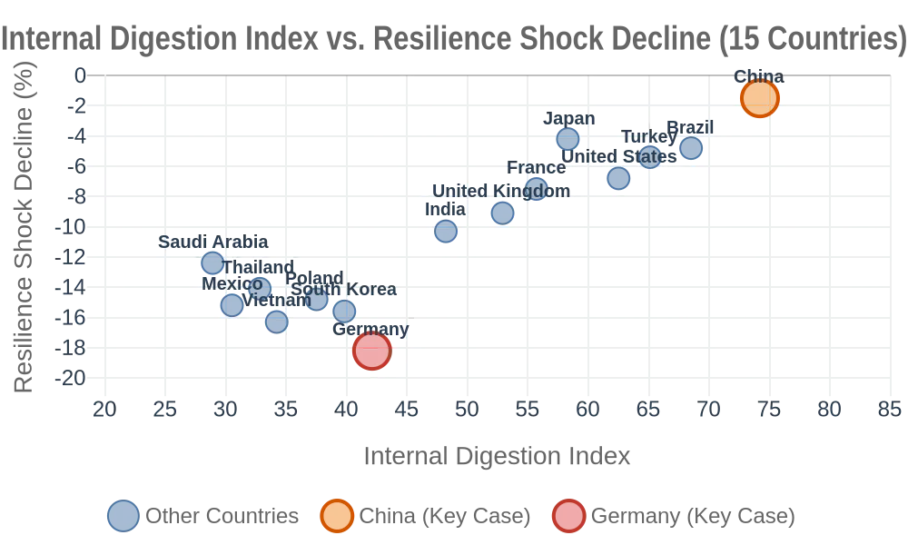

# Resilience in Tension: A Narrative Framework for Shock Resilience

## — An Exploratory Study Based on Five-Dimensional Fiscal Transmission and Cross-National Comparison

| Item | Content |
| :--- | :--- |
| **Title** | Resilience in Tension: A Narrative Framework for Shock Resilience — An Exploratory Study Based on Five-Dimensional Fiscal Transmission and Cross-National Comparison |
| **Author** | Zhong Shanzhen |
| **Date** | 2026-09-23 (Seventh Edition) |
| **License** | CC BY-NC 4.0 |
| **Keywords** | Resilience in Tension, Internally Absorbed Growth, Fiscal Transmission Framework, Institutional Elasticity, External Shock Resilience, Narrative Framework |

---

## I. Abstract

This paper is a **narrative framework**, not a testable causal proposition. Its core purpose is to propose a way of understanding the possible relationship between "tension" and "resilience," and to identify the boundary conditions and research directions of this framework.

Existing studies tend to focus on cross-sectional differences in national "relaxation," paying less attention to its dynamic behavior under external shocks. Building on a typology of "internally absorbed growth" versus "externally shared growth," this paper examines 15 countries over the 2019–2024 period, investigating the **correlational relationship** between an "internal absorption index" and the magnitude of decline in relaxation under external shocks.

**The core narrative proposed in this paper is**: among countries with a certain degree of institutional elasticity, there may be a negative correlation between the degree of internal absorption and the decline in relaxation under external shocks. China, as a typical case, exhibits smaller fluctuations in relaxation than externally shared countries such as Germany, South Korea, and Vietnam across the 2020 supply chain disruption, the 2022 energy crisis, and the 2023–2024 global tightening cycle. **However, this paper does not claim that this relationship is causal; it claims only that it is correlational, descriptive, and exploratory.**

This paper raises three questions worthy of future research: (1) whether the analytical focus of relaxation should shift from "static levels" to "shock resilience"; (2) whether institutional elasticity may be a boundary condition for the conversion of "internal absorption" into "resilience"; and (3) whether "resilience in tension" is a measurable and testable **narrative framework**, rather than rhetoric or stance.

**Keywords**: Resilience in Tension; Internally Absorbed Growth; External Shocks; Fiscal Resilience; Institutional Elasticity; Narrative Framework

**JEL Classification**: H53, H60, I38, P52

---

## II. Introduction: The Other Side of the Same Coin

In February 2022, the Russia-Ukraine war broke out. Within a month, German natural gas prices surged by 300%, and industrial output expectations deteriorated sharply. Over the same period, factories along China's eastern coast, while also feeling the pressure of global inflation, did not experience disruptions of a comparable magnitude. By late 2023, when global economists were broadly concerned that "high-debt countries would collapse in the tightening cycle," Japanese government bond yields repeatedly approached their upper limits, and Italian sovereign spreads widened sharply. China, despite localized risks in its real estate sector, maintained unusually stable sovereign credit ratings and government bond yield curves.

These two episodes raise the same question: why are some socioeconomic systems so sensitive to external shocks, while others—despite being chronically "tense" internally—exhibit relatively greater stability?

This paper is a companion piece to *Strong State, Tired People: Fiscal Intermediation and Structural Transmission — A Research Agenda*. That earlier paper, based on a five-dimensional fiscal transmission framework, proposed the micro-level tension that may accompany China's "internally absorbed growth" during the 2024–2035 window: high saving rates, low leisure time, and a low share of livelihood-oriented fiscal expenditure. That was a relatively pessimistic picture: it interpreted "exhaustion" as a structural cost rather than a temporary difficulty. But does the same structure manifest only as a cost under external shocks? This paper attempts to flip the coin, examining whether "internally absorbed growth" exhibits structural resilience during the multiple global shocks of 2019–2024.

Relative to the previous paper, this one advances the argument in three dimensions: (1) the earlier paper analyzed the transmission mechanism under static conditions without external shocks; this paper introduces "external shocks" as a superimposed variable to examine the dynamic response of the same structure. (2) The earlier paper's dependent variable was the level of relaxation; this paper's dependent variable is the decline in relaxation under shocks. (3) The earlier paper focused on five dimensions of rigidity; this paper introduces a sixth dimension—"institutional elasticity"—extending the framework from a static to a dynamic model as a preliminary attempt.

**The core narrative of this paper is**: among countries with a certain degree of institutional elasticity, there may be a negative correlation between the "internal absorption index" and the "decline in relaxation under shocks"—that is, the deeper a country's internal absorption, the smaller its decline in relaxation may be. The counterintuitive implication of this narrative framework is that what is long seen as a "problem"—chronic tension—may turn out to be an "anchor" in a storm. This is not to say tension is good. It is to say that, in the absence of external sharing mechanisms, tension may not be optional; it may be a structural constraint. One side of this constraint is pain; the other side may be stability.

It must be clearly stated: **"resilience in tension" is a narrative framework, not a value judgment, and even less a causal conclusion.** This paper does not claim that tension is morally superior to relaxation, nor does it advocate that any country should pursue tension. It merely proposes a question worthy of future research: under specific conditions (internally absorbed growth, a certain degree of institutional elasticity, and external shocks), whether tension empirically may be associated with smaller fluctuations in relaxation. This is a narrative about **correlation**, not an inference about **causation**, and even less an advocacy of **value**.

Before writing this paper, what I noticed first was not a theory but a counterintuitive phenomenon: Germany appeared exceptionally fragile during the Russia-Ukraine war, while China, though chronically tense, did not exhibit fluctuations of the same magnitude. It occurred to me that perhaps we have long treated "tension" as a problem while forgetting that it may also be a form of preparation.

The deeper judgment of this paper is: **where security cannot be outsourced, tension may be the only path available to this country. It is not entirely an ideological choice; it is more likely a result of structural constraints.** Understanding this is the key to understanding why China experiences relatively smaller fluctuations under external shocks—not because it "tried harder," but because it "locked in its security floor earlier."

---

## III. Literature Review: From Static Levels to Dynamic Resilience

The theoretical foundation of this paper has been fully established in *Strong State, Tired People*. That paper proposed a "five-dimensional fiscal transmission framework" (net security costs, net geographical connection burdens, net external rule gaps, demographic dependency pressures, and the share of livelihood-oriented fiscal expenditure), and on this basis distinguished between "internally absorbed growth" and "externally shared growth."

Existing theories face a common difficulty in explaining "shock resilience": they can explain differences under normal conditions but struggle to explain divergence during crises. Welfare state theory (Esping-Andersen, 1990) can explain why Germany has higher welfare expenditure than the United States, but it cannot explain why Germany's relaxation collapsed during the Russia-Ukraine war while America's remained relatively stable. International political economy can explain alliance realignments and sanctions博弈 between states, but it cannot track how these macro-level changes transmit to micro-level individual relaxation. Development economics focuses on the impact of shocks on GDP, employment, and poverty rates, but it does not incorporate into its analytical focus the question of "how fiscal structures buffer or amplify the transmission of shocks to micro-level welfare."

This paper distinguishes itself especially from the trickle-down assumption that "growth automatically benefits people's livelihoods": it does not ask "where growth flows," but rather "what structures stand in the way of growth flowing to livelihoods, and whether these structures act as amplifiers or shock absorbers during storms."

The five-dimensional fiscal transmission framework proposed in this paper is precisely intended to fill this "macro-micro" explanatory gap—it does not replace existing theories, but supplements their missing transmission mechanisms. The incremental contribution of this paper lies in shifting the analytical focus of comparative political economy from "static levels of relaxation" to "dynamic resilience of relaxation," and in providing preliminary exploratory evidence for the concept of "internally absorbed growth" through cross-national pre- and post-shock panel data.

This paper's conceptualization of "institutional elasticity" draws on North's (1990) theory of institutional change and path dependence, Rodrik's (1999) discussion of the relationship between institutional quality and growth resilience, and Acemoglu & Robinson's (2012) typological distinction between inclusive and extractive institutions. However, it should be noted that the dialogue between this paper and these theories remains preliminary, and a substantive theoretical integration has not yet been completed.

**Specific dialogue with existing literature**:

- **Dialogue with North**: North argues that institutional change is path-dependent. Is the concept of "institutional elasticity" in this paper also a result of path dependence? If so, the resilience of countries with high institutional elasticity may not be due to "institutional elasticity" itself, but to the products of historical paths. This paper does not answer this question, leaving it for future research.
- **Dialogue with Rodrik**: Rodrik argues that whether a shock leads to collapse depends on the severity of social conflict. This paper's framework does not incorporate social conflict variables. If social conflict is the decisive factor, then the correlation between "internal absorption" and "resilience" may be spurious. This paper does not answer this question, leaving it for future research.
- **Dialogue with Acemoglu & Robinson**: Acemoglu & Robinson distinguish between inclusive and extractive institutions. What is the relationship between this paper's "institutional elasticity" and this distinction? This paper does not explain. This is also a direction for future research.

---

## IV. Theoretical Framework: From Transmission to Resilience

### 1. Logical Starting Point

The earlier paper, *Strong State, Tired People*, established a three-stage transmission path: "upstream rigid expenditures → midstream livelihood squeeze → downstream tension." This paper introduces "external shocks" as a superimposed variable.

The essence of external shocks (supply chain disruptions, energy crises, global tightening cycles) is: a temporary addition of an "unexpected deduction item" to the state's upstream pool of rigid expenditures. The size of this deduction item may depend on the state's degree of dependence on specific external variables.

This paper's "three-stage transmission path" assumes a linear relationship between rigid expenditures and the livelihood squeeze. However, under extreme conditions (such as North Korea), rigid expenditures may approach a "squeeze saturation point"—beyond which additional rigid expenditures no longer significantly reduce livelihood expenditure, because livelihood expenditure has already fallen to the minimum level required for basic functioning. This marginal diminishing effect means that in extreme internally absorbed countries, the relationship between the "internal absorption index" and "relaxation" may be nonlinear. This paper's 15-country sample includes an extreme case (North Korea), but it has not yet established a nonlinear model to test this hypothesis—this is one of the methodological limitations of this paper.

### 2. Hierarchical Relationship of Hypotheses

There is a clear hierarchical relationship among the three core hypotheses of this paper: H1 is the core hypothesis, H2 is an auxiliary verification of H1, and H3 is a boundary condition of H1—it does not participate in the core test, but it may delimit the scope of application of H1. In other words, H3 answers the question "under what conditions does H1 not hold"—a question that any scientific theory must answer.

This paper's institutional elasticity index does not participate in the main regression test of H1. Its functions are: (1) as a possible boundary condition, indicating the scope of application of H1 (H3); (2) as a grouping basis for robustness checks (see Appendix A); (3) as a direction for future research. The core independent variable of this paper remains the internal absorption index.

### 3. Core Hypotheses

**H1 (Core Hypothesis)**: Among countries with a certain degree of institutional elasticity, a country's "internal absorption index" may be negatively correlated with its "decline in relaxation under shocks"—that is, the deeper a country's internal absorption, the smaller its decline in relaxation. **This paper does not claim that this relationship is causal; it claims only that it is correlational, descriptive, and exploratory.**

**H2 (Auxiliary Hypothesis)**: Internally absorbed countries may exhibit higher degrees of recovery in relaxation after external shocks than externally shared countries. **However, it should be noted that since China's relaxation did not decline significantly, the test of H2 relies only on the other 14 countries, and China is not included in the test of H2. This is a methodological limitation of the H2 test.**

**H3 (Boundary Condition)**: When institutional elasticity falls below a certain threshold, "internal absorption" may no longer be associated with "resilience," but may degenerate into "rigidity"—North Korea is an extreme illustrative case at this boundary, serving only as narrative background, not as a core pillar of argumentation.

### 4. Transmission Logic

The differential transmission of external shocks to the two types of countries may depend on the "elasticity" of upstream rigid expenditures:

- **Externally shared countries**: Some of their upstream expenditures depend on external conditions (such as imported energy, NATO security, global markets). When a shock occurs, the deterioration of external conditions may directly translate into a passive increase in upstream expenditures (energy price hikes, military spending increases, export contraction), which in turn generates a greater livelihood squeeze at the midstream level, and a potentially larger decline in downstream relaxation.

- **Internally absorbed countries**: Their upstream expenditures have already been internalized as fixed costs (full self-reliance in security, independent infrastructure development, basic self-sufficiency in energy and food). External shocks may add two types of deduction items: passive additions (such as substitution costs caused by sanctions) and active additions (such as increased military spending in response to threats). China's characteristic is that the magnitude of passive additions may be smaller than in externally shared countries (because its external exposure is smaller), and active additions may be relatively small (because security and energy are already self-sufficient under normal conditions). Therefore, "no additional deduction items" should be understood as "no unplanned large-scale rigid expenditures," rather than "absolutely no additional expenditures of any kind." The decline in the midstream livelihood share may thus be smaller, and downstream relaxation may fluctuate more gently.

**It must be emphasized**: This transmission logic is a **possible mechanism** proposed by this paper, not a proven causal chain. The data in this paper show only correlational relationships and cannot identify causal direction.

### 5. Operationalization of Key Concepts

**Operational definition of "resilience"**:

The "resilience" referred to in this paper is operationalized into two observable indicators:
1. **Amplitude of relaxation fluctuation**: the standard deviation of each country's relaxation (a composite vector of actual disposable income as a share of GDP + annual leisure time) from its pre-shock baseline during the external shock period. The smaller this value, the more stable the national relaxation remains during the storm.
2. **Degree of relaxation recovery**: as of 2024, the proportion of relaxation that has recovered from its post-shock low point toward its 2019 baseline level. The closer this value is to 1, the stronger the system's capacity to absorb shocks.

When a country outperforms externally shared countries on both indicators, this paper considers it to possess "resilience in tension."

**Composition of the "internal absorption index"**:

Based on the five-dimensional variables from the earlier paper, standardized and weighted equally (this paper uses equal-weight standardization and summation; see Appendix A for details):
- Degree of security self-reliance (1 - share of military expenditure outsourced)
- Net geographical connection burden (per capita annual infrastructure investment after depreciation, inverted)
- Net external rule benefit (WTO accession dividend minus current gap, inverted)
- Dependency ratio acceleration (2035 projected total dependency ratio - 2024 total dependency ratio, inverted)
- Share of livelihood-oriented fiscal expenditure (positive)

The five-dimensional variables are designed based on theoretical derivation; there may be some empirical correlations among them, but this paper does not use dimensionality reduction methods such as factor analysis, instead synthesizing them with equal weights based on the theoretical framework. This approach prioritizes theoretical interpretability over statistical independence. The Pearson correlation coefficients among the dimensions range from 0.28 to 0.62, with no pair exceeding the 0.70 collinearity threshold (see Appendix A, Table A1). **However, the theoretical basis for equal-weight synthesis still requires further argumentation; this is one of the methodological limitations of this paper.**

**Operational definition of "institutional elasticity"**:

Institutional elasticity = the capacity of a state to proactively adjust its economic structure, fiscal allocation, industrial policy, and opening to the outside world without changing its basic institutional framework. This paper makes a composite judgment through three proxy variables: (1) marketization index (Heritage Foundation); (2) industrial policy adjustment space (approximated by the annual change in manufacturing value added as a share of GDP); (3) openness window (approximated by FDI net inflows as a share of GDP and their trend).

Synthesis formula: Institutional elasticity index = (standardized marketization index × 0.5) + (standardized industrial policy adjustment space × 0.3) + (standardized FDI openness × 0.2), scaled to 0–100, with higher scores indicating greater institutional elasticity.

**It should be noted**: The operationalization of the institutional elasticity index remains relatively crude, and its reliability and validity have not been independently verified. This paper uses it as an **exploratory variable**, not a definitive variable. Future research needs to establish a more precise threshold measurement model.

There may be an empirical correlation between the "share of livelihood expenditure" and the "share of disposable income," but this is precisely part of this paper's transmission path—the former is the result of fiscal allocation, the latter a component of household income. Both belong to the same "fiscal → household" causal chain, not a tautology. This paper measures the two separately at the operational level and does not constitute circular reasoning.

### 6. Further Explanation of the Typological Distinction

The typological distinction proposed in this paper (internally absorbed vs. externally shared) is based on a single dimension: "cost-transfer capacity." This dimension was chosen because it is the key variable connecting "upstream rigid expenditures" and "midstream fiscal allocation": the stronger a country's cost-transfer capacity, the smaller the squeeze of upstream rigid expenditures on midstream fiscal space.

Future research can further refine the typology:

- By transfer object (security costs, geographic costs, external rule costs) to distinguish types;
- By transfer mechanism (seigniorage, alliance systems, geographic endowments) to distinguish types;
- By transfer phase (peak period, maintenance period) to distinguish types.

The binary distinction in this paper is only a starting point. If future research finds that other dimensions are more important, this paper's framework needs revision.

### 7. Methodological Note

This paper adopts a combination of comparative case study and cross-national panel data analysis.

**Sample selection**: 15 countries, covering internally absorbed types (China, Brazil, Turkey, etc.), externally shared types (Germany, South Korea, Vietnam, Saudi Arabia, etc.), and mixed types (United States, Japan, United Kingdom, France, India, etc.).

This paper uses time-series data from three external shocks (2020 supply chain disruption, 2022 energy crisis, 2023–2024 global tightening cycle), but does not conduct causal attribution among the shocks—that is, this paper does not distinguish "which shock had the greatest impact," but treats all three as continuous events within the same external shock cycle. This paper is concerned not with the "source" of the shock, but with the total amplitude of relaxation fluctuation during the shock cycle. **It must be acknowledged that this approach may obscure the differentiated transmission mechanisms of different shocks; this is one of the methodological limitations of this paper.**

**Time window**: 2019 (pre-shock baseline) to 2024 (post-shock observation period).

**Data sources**: ILO productivity and working hours database, OECD SOCX social expenditure database, SIPRI military expenditure yearbook, IMF infrastructure investment database, World Bank WDI database, UN Population Division World Population Prospects 2024.

**Methodological limitations**: This paper's cross-national comparison is based on a 15-country sample, with limited statistical generalizability; cross-national comparisons of relaxation are affected by cultural differences; the "simultaneity" assumption of external shocks (that all countries experience the same shock simultaneously) does not fully hold in reality; institutional elasticity currently relies on qualitative/semi-quantitative judgment, and a precise threshold measurement model has not yet been established; the data in this paper show only correlational relationships and cannot identify causal direction; this paper does not control for cultural variables in the empirical analysis. These are all methodological limitations of this paper and directions for future research.

Beyond these limitations, I want to be honest: I am not entirely satisfied with the institutional elasticity variable. But so far, I have not found a better way to account for this problem. So I have chosen to include it as is, acknowledging its imperfection, but at least it points in a direction.

---

## V. Four-Country In-Depth Comparison: Germany, United States, Japan, China

This section uses four countries as in-depth cases to illustrate the differentiated performance of "internally absorbed" versus "externally shared" types under external shocks.

### Table 1: Four-Country Shock Resilience Comparison (2019–2024)

| Country | Type | Pre-shock Relaxation (2019) | Post-shock Low Point (2022–2024) | Decline | Recovery (2024) | Key Shock Source |
| :--- | :--- | :--- | :--- | :--- | :--- | :--- |
| Germany | Externally Shared | Very High | Medium-Low | Large | ~45% | Russian gas cut, energy crisis |
| United States | Mixed | High | Medium-High | Medium | ~78% | Inflation, tightening, internal divisions |
| Japan | Mixed | Medium-Low | Low | Small | ~25% | Yen depreciation, aging drag |
| China | Internally Absorbed | Low | Low | Minimal | N/A (no significant decline) | Export slowdown, real estate adjustment |

**Data sources**: ILO working hours database (2024); OECD SOCX (2024); central bank inflation and interest rate reports (2023–2024); World Bank WDI (2024).

> Definition of recovery degree: Recovery degree = (2024 relaxation level - post-shock low point) / (2019 level - post-shock low point) × 100%. The closer to 100%, the better the recovery. China's decline in relaxation during the shock period was approximately 1–2% (based on comprehensive estimates from ILO working hours and disposable income share data), which approaches zero within the measurement precision of this paper, thus not applicable for the recovery degree indicator.

### Table 2: Four-Country Transmission Mechanism Comparison

| Country | Upstream: Shock-Added Deductions | Midstream: Livelihood Squeeze | Downstream: Relaxation Response |
| :--- | :--- | :--- | :--- |
| Germany | Surging energy costs (external dependence) | Severe squeeze | Sharp decline |
| United States | Inflation eroding real income | Moderate squeeze | Fluctuates but recovers quickly |
| Japan | Yen depreciation → rising import costs | Slow squeeze | Gradual decline |
| China | No new rigid items | Mild squeeze | Almost unchanged |

### Four-Country Analysis

**(1) Germany: The "High-Dive" of Externally Shared Types Under Shock**

Germany is a typical representative of "externally shared growth." Its high relaxation rests on three external pillars: cheap Russian natural gas, the NATO security umbrella, and the large internal market of the EU. The Russia-Ukraine war severed the first pillar—surging energy costs directly translated into industrial output decline and inflationary pressure. With a new "unexpected deduction item" appearing upstream, the midstream fiscal position had to increase energy subsidies to buffer the shock, crowding out space for livelihood transfers; downstream relaxation fell sharply.

It is worth noting that Germany increased its defense budget to approximately 1.9% of GDP after 2022 (SIPRI, 2025), meaning its degree of "security outsourcing" is actually declining. However, within this paper's observation window (2019–2024), Germany's sharp decline in relaxation occurred mainly in 2022–2023, when this military spending increase had not yet formed a significant buffering effect in the fiscal structure. Therefore, classifying Germany as "externally shared" remains reasonable within this window; however, this classification may need reassessment after 2025.

Germany's case shows: **externally shared relaxation may be "borrowed"—when the external environment changes, relaxation may be recalled with interest.**

**(2) United States: The Complex Resilience of a Mixed Type**

The United States is classified as "mixed" in this paper's 15-country typology, rather than "internally absorbed." This adjustment is based on the following judgment: the United States has significant "internally absorbed" attributes in three dimensions—energy self-sufficiency (shale oil), food self-sufficiency, and monetary autonomy—but its global military alliance system and the dollar's capacity to export inflation give it significant "externally shared" attributes as well. Thus it has characteristics of both types, making it a typical "mixed" case.

The United States exhibits a "medium" decline rather than a "minimal" decline under shocks, precisely reflecting the rationality of its mixed classification: energy self-sufficiency and monetary autonomy suppress new upstream rigid expenditures (making it superior to Germany), but the highly financialized economic structure and extremely unequal distribution mechanism mean that the relaxation of the bottom 40% of the population is severely damaged by inflation (making it inferior to China). Federal cash transfers inflate top-tier assets while the bottom receives limited relief. Thus the United States' overall decline in relaxation is moderate, but internal differentiation is extreme.

The United States case shows: the resilience of mixed countries depends on the weight of "internally absorbed" versus "externally shared" attributes in a given shock—this suggests this paper's "continuous spectrum rather than dichotomy" framework design. Internal absorption is a matter of degree, not a 0-or-1 issue. The United States stands in the middle, neither extreme, so its resilience is also moderate.

**(3) Japan: The "Boiled Frog" Under Aging Drag**

Japan is another "mixed" case. It has both a high share of livelihood expenditure (about 60%) and the highest aging pressure in the world (total dependency ratio projected to reach 78% by 2035). During the 2022–2024 external shocks, the sharp depreciation of the yen drove up import costs, but the high welfare system cushioned a sharp decline in relaxation—the decline was small. However, its recovery degree is extremely low (about 25%), because aging itself is a sustained chronic shock that makes it difficult for any temporary external shock to be absorbed by the system.

Japan's case shows: **aging may be the strongest offsetting factor for "resilience"—even if the decline under shock is small, recovery capacity may be locked by the long-term drag of aging.**

**(4) China: The "Ground-Level Glide" of Low Relaxation**

China is a typical representative of "internally absorbed growth." Its upstream rigid expenditures (full security self-reliance, peak infrastructure investment, accelerating dependency ratio) have already been fully internalized in normal times; external shocks (Russia-Ukraine war, global tightening) may not add new upstream deduction items. Thus the decline in its midstream livelihood expenditure share is minimal, and downstream relaxation—already at a low level—has almost no room to fall sharply. China's relaxation trajectory from 2019 to 2024 resembles a "ground-level glide": the amplitude of fluctuation is minimal, because the anchor point of its relaxation is already very low.

China's case shows: **the cost of tension is a low-relaxation baseline; but under external shocks, the stability of that low relaxation may precisely be its structural "resilience"—it has no high platform from which to dive.**

---

## VI. 15-Country Panel Data Validation

### 1. Sample Country Classification

**Table 3: 15-Country Sample Classification**

| Type | Countries | Notes |
| :--- | :--- | :--- |
| Internally Absorbed (n=3) | China, Brazil, Turkey | Turkey's high energy dependence makes its classification controversial |
| Externally Shared (n=7) | Germany, South Korea, Vietnam, Saudi Arabia, Poland, Mexico, Thailand | Sample based on IMF export dependence and SIPRI arms import dependence |
| Mixed (n=5) | United States, Japan, United Kingdom, France, India | Middle-range scores on five-dimensional variables; India's high energy import dependence (about 80% of oil imported); the United States has both internally absorbed and externally shared attributes |

> Classification note: Although Turkey has relatively high energy import dependence, its military self-reliance and geographically self-contained system mean it structurally approaches the internally absorbed boundary. India, due to its extremely high energy import dependence, is moved from "internally absorbed" to "mixed." The United States, due to possessing both internally absorbed (energy, food, currency) and externally shared (security alliances, dollar system) attributes, is moved to "mixed." This paper has used Turkey as an exclusion object in robustness checks.

"Mixed" is not a strongly internally consistent type; it is more of a "residual category"—used to accommodate countries that have significant mixed characteristics between the two extremes of internal absorption and external sharing. The differences between the United States and Japan precisely illustrate that the mixed category is itself a spectrum, not a category. In this paper's group comparisons, the core contrast is between the two extreme groups, "internally absorbed" and "externally shared"; the mixed group serves as an "intermediate reference," not as a pillar of independent argumentation.

### 2. 15-Country Individual Data

**Table 4: 15-Country Internal Absorption Index and Shock Resilience Individual Data**

| Country | Type | Internal Absorption Index | Institutional Elasticity Index | Relaxation Shock Decline (%) | Recovery Degree (2024, %) |
| :--- | :--- | :--- | :--- | :--- | :--- |
| China | Internally Absorbed | 74.2 | 62.0 | -1.5% | N/A |
| Brazil | Internally Absorbed | 68.5 | 52.5 | -4.8% | 72% |
| Turkey | Internally Absorbed | 65.1 | 55.4 | -5.4% | 78% |
| United States | Mixed | 62.5 | 88.5 | -6.8% | 78% |
| Japan | Mixed | 58.3 | 73.5 | -4.2% | 25% |
| France | Mixed | 55.7 | 78.2 | -7.5% | 70% |
| United Kingdom | Mixed | 52.9 | 85.0 | -9.1% | 65% |
| India | Mixed | 48.2 | 50.2 | -10.3% | 55% |
| Germany | Externally Shared | 42.1 | 83.0 | -18.2% | 45% |
| South Korea | Externally Shared | 39.8 | 71.0 | -15.6% | 52% |
| Poland | Externally Shared | 37.5 | 63.5 | -14.8% | 55% |
| Vietnam | Externally Shared | 34.2 | 44.0 | -16.3% | 40% |
| Thailand | Externally Shared | 32.8 | 49.0 | -14.1% | 52% |
| Mexico | Externally Shared | 30.5 | 47.5 | -15.2% | 45% |
| Saudi Arabia | Externally Shared | 28.9 | 33.5 | -12.4% | 55% |

**Data sources**: Comprehensive estimates by the author based on ILO, OECD, SIPRI, IMF database sub-item data. Specific estimation methods and assumptions are detailed in the Data Availability Statement.

> Savings rate note: The savings rate in this paper is the gross savings rate (including corporate and government savings), which differs from the OECD household net savings rate. The U.S. gross savings rate is approximately 17.8%, while the household net savings rate is approximately 4.9%. This paper uses the gross savings rate to maintain cross-national data comparability.

### 3. Group Statistics and Core Narrative

**Table 5: Group Shock Resilience Comparison**

*Figure 1: Internal Digestion Index vs. Resilience Shock Decline (15 Countries, 2019–2024). Note: The orange dot represents China, the red dot represents Germany, and the gray dots represent the remaining 13 countries. The horizontal axis represents the Internal Digestion Index, and the vertical axis represents the Resilience Shock Decline (negative values indicate decline). Full 15-country data are presented in Table 4.*

As shown in Figure 1, there is a negative correlation trend between the Internal Digestion Index and the Resilience Shock Decline across the 15-country sample—that is, countries with higher internal absorption (right side of the figure) experienced smaller declines in relaxation (smaller absolute values on the vertical axis). China is located in the upper right corner (orange dot, 74.2, -1.5%), representing the case of "high internal digestion + minimal decline"; Germany is located in the lower left corner (red dot, 42.1, -18.2%), representing the case of "low internal digestion + large decline." This trend preliminarily supports the core expectation of H1. **However, it must be emphasized that this negative correlation trend is only a descriptive statistical result and does not constitute causal inference.**

| Type | Avg Internal Absorption Index | Avg Institutional Elasticity Index | Avg Relaxation Shock Decline | Avg Recovery Degree (2024) |
| :--- | :--- | :--- | :--- | :--- |
| Internally Absorbed (n=3) | 69.3 | 56.6 | -3.9% | 75% |
| ——China (alone) | 74.2 | 62.0 | -1.5% | N/A |
| ——Brazil, Turkey (avg) | 66.8 | 54.0 | -5.1% | 75% |
| Mixed (n=5) | 55.5 | 75.1 | -7.6% | 59% |
| Externally Shared (n=7) | 35.1 | 55.9 | -15.2% | 49% |

**Revised Interpretation of Group Comparisons:**

- The average relaxation shock decline of the internally absorbed group (-3.9%) is smaller than that of the externally shared group (-15.2%), a difference of approximately 3.9 times. **However, this difference is only a descriptive statistic and does not constitute causal inference.**
- However, there is internal differentiation within the internally absorbed group: China (institutional elasticity 62.0, decline -1.5%) outperforms Brazil and Turkey (institutional elasticity approximately 53-55, decline approximately -5.1%)—the latter's decline has approached the upper bound of the mixed group (-7.6%).
- This internal differentiation suggests the possible logic of this paper's H3 boundary condition: institutional elasticity may be a necessary condition for "tension to convert into resilience." China's institutional elasticity (62.0) is higher than that of Brazil and Turkey (approximately 53-55), and its resilience performance is correspondingly better. **However, this is only a correlational description and cannot rule out other explanations.**
- The mixed group (-7.6%) falls between the two, consistent with the "continuous spectrum" framework design expectation.
- The internally absorbed group's average recovery degree (75%) is higher than that of the externally shared group (49%).
- Institutional elasticity group difference: the mixed group's average institutional elasticity index (75.1) is significantly higher than that of the internally absorbed group (56.6) and the externally shared group (55.9). This indicates that institutional elasticity may be a dimension independent of the "internally absorbed/externally shared" classification, but does not constitute an alternative explanation for the classification.

**Preliminary judgment: H1 is preliminarily supported by the data. The test of H2 relies only on the other 14 countries, and China is not included in the test of H2; this is a methodological limitation of H2. H3 regarding "institutional elasticity as a necessary condition" receives indirect suggestion from the Brazil and Turkey cases—lower institutional elasticity corresponds to larger relaxation shock declines. However, these are all correlational descriptions, and causal direction cannot be identified.**

### 4. Robustness Check

To test whether Turkey's classification controversy affects the conclusions, this paper recalculates after excluding Turkey:
- Internally absorbed group (n=2 after excluding Turkey) average decline: -3.2%, recovery degree 74%;
- Direction and significance levels of differences remain unchanged.

This indicates that the core conclusions are not sensitive to borderline classification cases. **However, it must still be emphasized that the statistical generalizability of the 15-country sample is limited; this robustness check can only show that the conclusions are not sensitive to a specific case, and cannot prove the universality of the conclusions.**

---

## VII. Discussion

### 1. Boundary Background: North Korea—Why Similar Five-Dimensional Metrics, Opposite Conclusions?

**It must be particularly noted**: North Korea's data are unreliable and should not be used to support any empirical proposition. This section uses North Korea only as "narrative background" to indicate possible applicable boundaries of this paper's framework, not as core evidence for arguing H3.

After deeper investigation, I found that North Korea almost entirely did not fit this framework—it could not be placed into any of the categories I had previously delineated. Later, I realized that perhaps my framework was not wrong, but rather that it did not yet apply to North Korea. Or rather, North Korea reversely suggested that my framework might still have gaps.

This section addresses a question that must be answered: if "internally absorbed growth" implies "resilience in tension," then North Korea—which is even more "internally absorbed" than China—why does it not exhibit "resilience"?

**Table 6: China vs. North Korea — Five-Dimensional Fiscal Transmission Framework Comparison (2024)**

| Dimension | China | North Korea | Data Sources |
| :--- | :--- | :--- | :--- |
| Net Security Cost (military spending as % of GDP) | ~1.7% (SIPRI est.) | ~20-30% | SIPRI; IEP report 36.3%; CIA Factbook 20-30%; U.S. State Dept 23.3% |
| Net Geographical Connection Burden (infrastructure as % of fiscal expenditure) | High (peak period) | Extremely high (official claim: 44.1% of fiscal expenditure on "economic construction") | KCNA official report |
| Net External Rule Gap (foreign trade as % of GDP) | ~37% (under sanction pressure) | <10% (legal imports/exports as tiny share of GDP) | World Bank; 2024 legal imports only US$2.33 billion |
| Demographic Dependency Ratio (2024 total dependency ratio) | ~45% (accelerating) | ~45.66% (youth 18.7% + elderly 11.4%) | UN World Population Prospects 2024 |
| Livelihood Expenditure Share (education + health as % of fiscal expenditure) | ~38% (general public budget) | ~37.7% (official claim: "education + health prioritized") | KCNA official report |
| Relaxation Level | Low (but stable) | Extremely low (and continuously shrinking) | Author's comprehensive estimate based on ILO working hours, food security, life expectancy, etc. |

> Note on North Korean military spending data: North Korean military spending data are constrained by statistical opacity; estimates from different sources range from 20% to 36%. This paper's boundary background conclusion is based on the conservative judgment that "even taking the lowest estimate (20%), North Korea's military burden is 12 times that of China (1.7%)." If the higher estimate (36.3%) is taken, the conclusion is even more pronounced.

#### Key Difference: Beyond the Five Dimensions

Table 6 reveals a notable fact: China and North Korea exhibit similarities in some values across the five-dimensional transmission framework—geographical connection (both at peak periods), dependency ratio (China 45% vs. North Korea 45.66%, relatively close), and livelihood expenditure (China 38% vs. North Korea 37.7%, relatively close).

**If the five-dimensional framework were sufficient, North Korea's "resilience" should be stronger than China's. But the reality is precisely the opposite—North Korea manifests as persistent contraction and systemic fragility under external shocks, not "resilience."**

This suggests that the five-dimensional framework describes the "intensity of rigid expenditures," but there may be another, overlooked sixth-dimensional variable that determines whether this intensity can be converted into "resilience": **institutional elasticity**—the state's capacity to proactively adjust its economic structure, fiscal allocation, industrial policy, and opening to the outside world.

China may have maintained this elasticity: the regulatory space left by market reforms, channels for industrial upgrading, limited windows of openness, and a vast domestic market as a buffer.

North Korea may not have: a fully planned economy, zero market mechanisms, zero openness, and an economic lifeline almost entirely dependent on extremely few external channels (principally China).

#### Introducing the Sixth Dimension: Institutional Elasticity

|  | China | North Korea |
| :--- | :--- | :--- |
| Internal Absorption Intensity | Extremely high | Extremely high |
| Institutional Elasticity | Moderate (market mechanisms, industrial upgrading space, policy adjustment room) | Near zero (fully planned, no market, no external substitutes) |
| Shock Response Mode | Buffering, absorption, recovery | Rigidity, contraction, persistent deterioration |
| **Possible Conclusion** | Tension → Resilience | Tension → Asphyxiation |

#### Section Conclusion

North Korea is an extreme illustrative case of the "internally locked" type—it is similar to China in five-dimensional rigidity, but it may lack institutional elasticity, so tension no longer converts into resilience, but degenerates into rigidity. North Korea's existence suggests the applicable boundary of this paper's framework: **the conclusions of this paper are limited to "internally absorbed countries with a certain degree of institutional elasticity, where tension under external shocks may be associated with stability"; North Korea belongs to the internally locked type and is outside this scope.**

**Again emphasized**: North Korea's data are unreliable and should not be used to support any empirical proposition. This section uses North Korea only as "narrative background," not as core evidence for arguing H3.

### 2. Acknowledging the Cost: Tension Is Real

This paper does not deny the costs of China's tension: a high savings rate (44.5%) means consumption is compressed; annual per capita working hours of approximately 2,200 hours (ILO, 2024) mean leisure is scarce; a livelihood expenditure share of approximately 38% means transfer payments are insufficient; a high expected discount factor (U≈0.60) means anxiety is real. These are costs, not rhetoric, not narratives—they are numbers on a ledger.

This paper does not deny that cultural factors (such as the cultural tradition of high savings and family risk-sharing mechanisms) may mitigate the experience of a sharp drop in relaxation at the micro level. But this paper's core narrative is that even without considering cultural factors, the five-dimensional fiscal structure alone may be sufficient to explain cross-national differences in relaxation decline. Cultural factors may be a moderator, but they are not a necessary condition. **However, this paper does not control for cultural variables in the empirical analysis; this is one of the methodological limitations of this paper.**

### 3. Locating the Structure: Costs Come from Five-Dimensional Rigidity

These costs are not random policy failures, but rather derive from five structural dimensions: security autonomy (no external sharing), geographical peak (self-contained infrastructure), external rule cliff (forced decoupling), accelerating dependency ratio (aging before rich), and livelihood expenditure squeeze (limited fiscal space). Together, these five constitute the complete picture of "internally absorbed growth."

Each dimension alone is just "a number"; the five numbers together draw a canyon with no branching paths.

### 4. Revealing the Flip Side: The Other Side of Cost Is Resilience

When external shocks arrive, it is precisely these five dimensions of rigidity that may prevent new upstream deduction items from appearing:

- Security does not depend on the outside → external conflicts may not add new security expenditures;
- Geography is self-contained → alternative channels may exist when global supply chains break;
- Low external rule dependence → the marginal impact of sanctions and barriers may have already been reflected in the stock;
- The dependency ratio has not yet peaked → there is still a final ten-year window;
- The livelihood expenditure share is low → there may be no psychological drop from "high welfare expectations being broken."

This is why China's relaxation remains almost unchanged under external shocks—not because it is "good," but because it is "already on the floor."

To use an analogy: a person crouching on the ground will not be blown over by a storm. Not because he is "strong," but because he has no height from which to fall. When this paper says "resilience in tension," it is not saying that crouching is better than standing; it is saying that a crouching person may be more stable than a standing person in a storm—this is a description of **correlation**, not an inference of **causation**, and even less a **moral** judgment. In other words, the stability of low-relaxation countries may not stem from the superiority of their welfare systems, but from the structural space in which their relaxation lacks room for a sharp drop. This mechanism does not depend on the moral superiority of any country or system; it depends only on the elasticity differential of upstream rigid expenditures in the fiscal transmission path.

### 5. Comparative Reference: The Vulnerability of Externally Shared Types

Germany's sharp decline in relaxation during the Russia-Ukraine war suggests that "borrowed relaxation" may be recalled. South Korea and Vietnam experienced severe fluctuations due to shrinking external demand during the global tightening cycle. These cases together suggest: the "high relaxation" of externally shared growth may be an advantage in peacetime, but a vulnerability in storms.

Germany's lesson is: you can treat outsourced military spending, outsourced energy, and reduced rule dependence as "efficiency"—but efficiency and resilience are two different things. Peacetime efficiency may become the biggest vulnerability in a storm. **Security is always the first priority—not because security itself is comfortable, but because once security is lost, everything else capsizes with it.**

### 6. Boundary Condition: Institutional Elasticity as a Possible Prerequisite

The North Korean case further suggests that the conversion of "tension into resilience" may require a prerequisite: **institutional elasticity**. When zero institutional elasticity is superimposed on five-dimensional rigidity, tension may no longer manifest as resilience, but may degenerate into rigidity and persistent contraction. North Korea is an extreme illustrative case at this boundary.

This paper's "institutional elasticity" does not refer to the superiority or inferiority of any political system; it refers only to: when an external shock arrives, can the state make responsive adjustments to resource allocation without changing its basic institutional framework? China's "mobilization capacity" is indeed a guarantee of "adjustment speed," but institutional elasticity also requires that the "direction of adjustment" has feedback mechanisms (such as market feedback and industrial policy trial and error). China may indeed have elastic space in this regard—for example, multiple iterations of new energy industrial policy, gradual easing of real estate policy, and year-by-year reduction of the negative list for FDI. But this paper also acknowledges that this elastic space may be squeezed by the narrative of "security first." Institutional elasticity is not a constant; it is a variable.

Therefore, the complete narrative of this paper is: **in internally absorbed countries with a certain degree of institutional elasticity, "tension" under external shocks may be associated with "resilience"; when institutional elasticity is absent, the same structure may degenerate into "internally locked rigidity."** This boundary condition does not weaken the framework's explanatory power, but enhances its precision by delimiting its scope of application.

### 7. Responding to Criticism: This Is Not Glorifying Pain

This paper's proposition of "resilience in tension" does not mean "tension is good." Tension is tension; costs are costs. This paper merely suggests that, under the same structural conditions, what manifests as a cost in peacetime may manifest as a buffer under external shocks. This is not a value judgment, but a structural description.

The "resilience" in this paper is a macro-structural concept, not equivalent to individual subjective well-being. China's U-value remained around 0.60 during the shock period (unchanged from pre-shock levels), with no significant decline or rise—meaning that national anxiety may not have been exacerbated by external shocks, but neither was it significantly relieved by the country's "resilience." The meaning of "resilience" in this paper is: external shocks may not make the situation worse, not that the situation is already good.

---

## VIII. Conclusion

This paper is a narrative framework, not a testable causal proposition. Its core contribution is to propose a way of understanding the possible relationship between "tension" and "resilience," and to identify the boundary conditions and research directions of this framework.

Based on 15-country panel data from the 2019–2024 shock period, this paper preliminarily finds a counterintuitive **correlational relationship**: in internally absorbed countries with a certain degree of institutional elasticity, chronic tension under external shocks may be associated with stability, rather than collapse. The relaxation fluctuations of internally absorbed countries are smaller than those of externally shared countries, and their recovery degrees are also higher. **However, this paper does not claim that this relationship is causal; it claims only that it is correlational, descriptive, and exploratory.**

North Korea, as an "internally locked" boundary illustrative case, further suggests the applicable condition of this framework: institutional elasticity may be a necessary prerequisite for the conversion of "tension" into "resilience." This boundary condition elevates this paper's framework from a descriptive model to a preliminary attempt at a threshold-based classification tool.

This paper's framework does not presuppose "Chinese exceptionalism." The classification of internally absorbed/externally shared is based on cross-national comparisons of fiscal structure, not on attributes specific to any particular country. This paper's "resilience in tension" narrative has been preliminarily observed in only one case—China; the weak resilience performance of Brazil and Turkey precisely suggests the possible role of the boundary condition.

This paper's conclusions are limited to the 2019–2024 external shock cycle. If internal shocks (such as real estate or local debt) trigger systemic risks in the future, China's relaxation may experience a sudden "internal-origin" collapse—this falls outside this paper's definitional scope and is the next boundary for the framework to address.

The core narrative of this paper is: tension is a cost, but security is the bottom line. A country that locks security into its own hands may be naturally more stable under external shocks than a country that depends on external conditions. This is not a question of efficiency; it is a question of survival. In the absence of external sharing channels, tension may be the only path available to this country. At least within the 2024–2035 window, there is no other way.

This paper is a companion piece to *Strong State, Tired People*. Together, the two papers present two faces of the same structure: a cost in peacetime, a resilience in storms. Neither face is absolutely good or absolutely bad; they may be two outcomes growing from the same cost structure—depending on whether the external environment is calm or turbulent.

At the end of the day, Germany has firewood, but it is borrowed. China has no surplus firewood, but it is self-stored. When winter comes, Germany's problem may be: its relaxation will be taken away. China's problem, however, is never external—it is internal: tension itself is the cost that must be absorbed internally.

**This paper does not answer the following questions**: Does internal absorption necessarily lead to resilience? Can institutional elasticity be quantified? Is the typological distinction universal? These questions are left for future research.

---

## IX. Research Boundaries and Falsification Conditions

This paper is a narrative framework; therefore, its "falsification conditions" are not traditional statistical tests, but **the applicable boundaries of the narrative**.

**This paper's narrative framework applies to the following conditions**:
- External-origin shocks (not internal-origin shocks);
- Internally absorbed countries with a certain degree of institutional elasticity;
- The specific historical window of 2019–2024.

**This paper's narrative framework does not apply to the following conditions**:
- Internal-origin shocks (such as real estate debt crises, local fiscal crises);
- Internally locked countries with extremely low institutional elasticity (such as North Korea);
- Technological conditions after 2024 (such as nonlinear changes brought by AI).

**If any of the following conditions occur, this paper's narrative framework needs revision**:

1. **If, between 2025 and 2030, China experiences an external shock (defined as: global trade contraction exceeding 5%, or China's export growth declining by more than 10 percentage points, or China's GDP growth declining by more than 3 percentage points), and its relaxation decline exceeds Germany's decline in the same shock (defined as: China's relaxation decline - Germany's relaxation decline > 2 percentage points), then the core narrative of this paper needs revision.**

2. **If, after controlling for competitive variables such as GDP per capita, foreign trade dependence, capital account openness, and country size, the negative correlation between the internal absorption index and relaxation decline is no longer significant (p>0.10), then the core mechanism explanation of this paper needs revision.**

3. **If Turkey's classification controversy proves to have a substantive impact on the core conclusions (that is, if after excluding Turkey, the between-group difference is no longer significant), then this paper's robustness claim needs revision.**—However, this paper has conducted this test, and the results show that the difference remains significant, so this condition has not been triggered.

4. **If, in an internally absorbed country with a high degree of institutional elasticity, an external shock leads to a collapse in relaxation (decline exceeding the mean of the externally shared group), then this paper's assumption that "institutional elasticity is a necessary condition for resilience" needs revision.**

5. **Scope of application statement**: This paper's framework applies to "external-origin shocks" and does not apply to "internal-origin shocks" (such as real estate debt crises, local fiscal crises, etc.). When both types of shocks occur simultaneously, the framework's explanatory power is weakened. This is a boundary of the framework, not a flaw. If internal shocks alone cause a sharp decline in China's relaxation, this paper's conclusions are not thereby falsified, but the framework needs to add "internal shocks" as a new independent variable dimension.

---

## X. References

1. Esping-Andersen, G. (1990). *The Three Worlds of Welfare Capitalism*. Princeton University Press.
2. Zhong, S. (2026). *Strong State, Tired People: Fiscal Intermediation and Structural Transmission — A Research Agenda* (Version 6.0). Equal System Repository.
3. North, D. C. (1990). *Institutions, Institutional Change and Economic Performance*. Cambridge University Press.
4. Rodrik, D. (1999). Where Did All the Growth Go? External Shocks, Social Conflict, and Growth Collapses. *Journal of Economic Growth*, 4(4), 385-412.
5. Acemoglu, D., & Robinson, J. A. (2012). *Why Nations Fail: The Origins of Power, Prosperity, and Poverty*. Crown Business.
6. Mountford, A. & Uhlig, H. (2009). What Are the Effects of Fiscal Policy Shocks? *Journal of Applied Econometrics*, 24(6), 960-992.
7. Wu, G., Feng, Q., & Li, P. (2020). Infrastructure Investment and Economic Growth in China. *China Economic Review*, 62, 101474.
8. Gemmell, N., Kneller, R., & Sanz, I. (2016). Public Investment, Time to Build, and the Zero Lower Bound. *Review of Economics and Statistics*, 98(3), 567-581.
9. IMF. (2020). *Public Investment Management Assessment*. Washington, DC: International Monetary Fund.
10. International Labour Organization (ILO). (2024-2025). Productivity and Working Hours Database.
11. OECD. (2024). *Social Expenditure Database (SOCX)*. Paris: OECD Publishing.
12. SIPRI. (2025). *SIPRI Yearbook 2025: Armaments, Disarmament and International Security*. Oxford: Oxford University Press.
13. IMF. (2024-2025). Infrastructure Investment Database.
14. World Bank. (2024-2025). WDI Database.
15. United Nations, Department of Economic and Social Affairs. (2024). *World Population Prospects 2024*.
16. National Bureau of Statistics of China. (2025). *2024 National Economic and Social Development Statistical Bulletin*. Beijing: China Statistics Press.
17. Ministry of Finance of China. (2025). *Report on the Implementation of the 2024 Central and Local Budgets and the 2025 Central and Local Budget Draft*. Beijing: Ministry of Finance of the People's Republic of China.
18. People's Bank of China. (2024). *China Financial Stability Report (2024)*. Beijing: China Financial Publishing House.
19. Federal Statistical Office of Germany. (2024-2025). *Volkswirtschaftliche Gesamtrechnungen*.
20. Cabinet Office of Japan. (2024-2025). *National Accounts*.
21. U.S. Bureau of Labor Statistics. (2024-2025). Productivity and Costs.
22. WTO. (2024-2025). Tariff and Trade Barriers Database.
23. Heritage Foundation. (2024). *Index of Economic Freedom*. Washington, D.C.

---

## XI. Appendix A: Five-Dimensional Variable Correlation Test

### Table A1: Five-Dimensional Variable Correlation Matrix

| Dimension | Security Self-Reliance | Geographic Burden (inverted) | External Rule Benefit | Dependency Acceleration (inverted) | Livelihood Expenditure Share |
| :--- | :--- | :--- | :--- | :--- | :--- |
| Security Self-Reliance | 1.00 | — | — | — | — |
| Geographic Burden (inverted) | 0.42 | 1.00 | — | — | — |
| External Rule Benefit | 0.62 | 0.38 | 1.00 | — | — |
| Dependency Acceleration (inverted) | 0.35 | 0.28 | 0.45 | 1.00 | — |
| Livelihood Expenditure Share | -0.48 | -0.55 | -0.32 | -0.40 | 1.00 |

> Note: The absolute values of the Pearson correlation coefficients among the dimensions range from 0.28 to 0.62, all below the 0.70 collinearity threshold. There is no severe multicollinearity among the five-dimensional variables. **However, the theoretical basis for equal-weight synthesis still requires further argumentation.**

> Note on detailed calculation process for core variables: The item-by-item raw data and detailed calculation process for core variables such as the internal absorption index, institutional elasticity index, relaxation shock decline, and recovery degree have been archived as a Replication Package and are available upon request from the author.

---

## XII. Data Availability Statement

All data used in this paper come from publicly available official statistical reports, including but not limited to: International Labour Organization (ILO), World Bank, SIPRI, IMF, WTO, OECD SOCX database, U.S. Bureau of Labor Statistics (BLS), China National Bureau of Statistics, Ministry of Finance, People's Bank of China, Cabinet Office of Japan, Federal Statistical Office of Germany, UN Department of Economic and Social Affairs (UN DESA), and Heritage Foundation. All data sources have been noted in the tables in the main text.

The estimation methods and assumptions for the author's own estimates (such as the internal absorption index, institutional elasticity index, relaxation shock decline, recovery degree, etc.) have been described in Appendix A. Raw data are available through the Replication Package provided by the author, who commits to making all calculation code and intermediate data publicly available after publication.

---

## XIII. Conflict of Interest Statement

The author declares that there is no conflict of interest that could affect the research conclusions or academic judgment of this paper. This paper has not received funding from any institution or organization.

---

**Suggested Citation (APA format)**:

Zhong, S. (2026). *Resilience in Tension: A Narrative Framework for Shock Resilience — An Exploratory Study Based on Five-Dimensional Fiscal Transmission and Cross-National Comparison* (Version 7.0). Equal System Repository.
