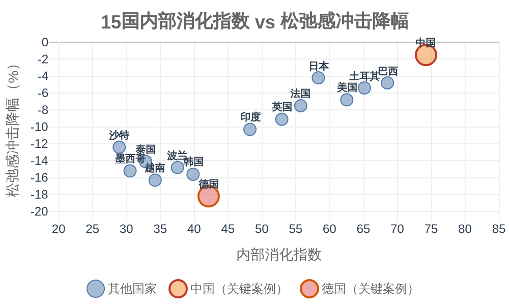

# 紧绷即底气：一个关于冲击韧性的叙事框架

## ——基于五维财政传导与跨国比较的探索性研究

| 项目 | 内容 |
| :--- | :--- |
| **标题** | 紧绷即底气：一个关于冲击韧性的叙事框架——基于五维财政传导与跨国比较的探索性研究 |
| **作者** | 钟善真 |
| **日期** | 2026-09-23（第七版） |
| **许可协议** | CC BY-NC 4.0 |
| **关键词** | 紧绷即底气, 内部消化型增长, 财政传导框架, 制度弹性, 外部冲击韧性, 叙事框架 |

---

## I. 摘要

本文是一个**叙事框架**，而非一个可检验的因果命题。它的核心目的是提出一种理解“紧绷”与“韧性”之间可能关系的方式，并指出这一框架的边界条件与研究方向。

既有研究多关注国民松弛感的静态水平差异，较少追问其在外部冲击中的动态变化。本文在“内部消化型 vs 外部分摊型”类型学框架基础上，选取15个国家2019-2024年的冲击前后面板数据，考察“内部消化指数”与“松弛感冲击降幅”之间的**相关关系**。

**本文提出的核心叙事是**：在具备一定制度弹性的国家中，内部消化程度与外部冲击中的松弛感降幅之间可能存在负相关趋势。中国作为典型样本，在2020年供应链中断、2022年能源危机、2023-2024年全球加息周期中，松弛感波动幅度小于德国、韩国、越南等外部分摊型国家。**但本文不主张这一关系是因果性的，仅主张它是相关性的、描述性的、探索性的。**

本文在三个方面提出了值得未来研究检验的问题：（1）松弛感的分析焦点是否应从“静态水平”转向“冲击韧性”；（2）制度弹性是否可能是“内部消化”转化为“韧性”的边界条件；（3）“紧绷即底气”是否是一个可测量、可检验的**叙事框架**，而非修辞或立场。

**关键词**：紧绷即底气；内部消化型增长；外部冲击；财政韧性；制度弹性；叙事框架

**JEL分类号**：H53, H60, I38, P52

---

## II. 引言：同一枚硬币的另一面

2022年2月，俄乌战争爆发。一个月内，德国天然气价格暴涨300%，工业产出预期迅速恶化；而同一时期，中国东部沿海工厂虽也感受到全球通胀的压力，但生产节奏并未出现同等幅度的震荡。2023年底，当全球经济学家普遍担忧“高债务国家将在加息周期中崩盘”时，日本国债收益率数次逼近上限，意大利国债利差急剧扩大；而中国，虽有房地产债务的局部风险暴露，但主权信用评级和国债收益率曲线保持了相对平稳的走势。

这两次事件提出了同一个问题：为什么有些国家的社会经济系统在面对外部冲击时如此敏感，而另一些国家——尽管其内部长期处于“紧绷”状态——却表现出相对更强的稳定性？

本文是《国强与民松——财政中介与结构性传导——一个研究议程》一文的同题续作。前文基于五维财政传导框架，提出了中国在2024-2035年窗口期内“内部消化型增长”可能伴随的微观紧绷——高储蓄、低闲暇、低民生支出占比。那是一个偏于悲观的图景：它将“累”解释为结构性成本，而非一时之困。然而，同一结构在外部冲击中是否仍只呈现为代价？本文试图翻转那枚硬币，考察“内部消化型增长”在2019-2024年全球多重冲击中是否展现出结构性的韧性。

与上一篇相比，本篇在三个维度上构成了推进：（1）上一篇在“没有外部冲击”的静态条件下分析传导机制；本篇引入“外部冲击”作为叠加变量，考察同一结构的动态响应。（2）上一篇的因变量是“松弛感的水平”；本篇的因变量是“松弛感在冲击中的降幅”。（3）上一篇聚焦于五维刚性；本篇在此基础上引入了“制度弹性”作为可能的边界条件，将框架从静态模型扩展为动态模型的初步尝试。

**本文的核心叙事是**：在具备一定制度弹性的国家中，“内部消化指数”与“松弛感冲击降幅”之间可能存在负相关关系——即内部消化程度越深的国家，松弛感下降幅度可能越小。这一叙事框架的反直觉之处在于：它意味着——长期被视为“问题”的紧绷状态，在风暴中可能恰恰是“锚点”。这不是在说紧绷是好的，而是在说：在缺乏外部分摊通道的条件下，紧绷可能不是可选项，而是结构性的约束；而这一约束的代价面是痛苦，另一面可能是稳定。

需要特别声明的是：**“紧绷即底气”是一个叙事框架，而非价值判断，更非因果结论。** 本文不认为“紧绷”在道德上优于“松弛”，也不主张任何国家应当追求“紧绷”。本文只是提出一个值得未来研究检验的问题：在特定条件下（内部消化型增长、一定制度弹性、外部冲击），紧绷状态在数据上是否可能与更小的松弛感波动相关联。这是一个关于**相关性**的叙事，而非关于**因果**的推断，更非关于**价值**的倡导。

写这篇论文之前，我最先注意到的不是理论，是一个反直觉的现象：德国在俄乌战争中显得异常脆弱，而中国虽然常年紧绷，却反而没有出现同等幅度的波动。我当时在想，也许我们长期把“紧绷”视为问题，但忘记了它可能也是一种准备。

本文的深层判断是：**在安全无法外包的条件下，紧绷可能是这个国家唯一能走的路。它不完全是意识形态选择，更可能是结构约束的结果。** 理解了这一点，才能理解为什么中国在外部冲击中波动较小——不是因为“更努力”，而是因为“更早锁定了安全的下限”。

---

## III. 文献定位：从静态水平到动态韧性

本文的理论基础已在《国强与民松》中完整建立。该文提出了“五维财政传导框架”（安全净成本、地理连接净负担、外部规则净落差、人口抚养比压力、民生性财政支出占比），并基于此区分了“内部消化型增长”与“外部分摊型增长”两种类型学。

既有理论在解释“冲击韧性”问题时面临一个共同的困境：它们能够解释常态下的差异，却难以解释危机中的分化。福利国家理论（Esping-Andersen, 1990）能够解释为什么德国比美国拥有更高的福利支出，却难以解释为什么在俄乌战争中德国的松弛感骤降而美国的松弛感相对稳定。国际政治经济学能够解释国家间的联盟重组和制裁博弈，却难以追踪这些宏观变化如何传导到微观个体的松弛感水平。发展经济学关注冲击对GDP、就业、贫困率的影响，但未将“财政结构如何缓冲或放大冲击对微观福利的传导”纳入分析焦点。

本文尤其区别于“增长自动惠及民生”的涓滴假设：它不是追问“增长流向了哪里”，而是追问“在增长流向民生的路上，什么结构挡在了中间，以及在风暴中这些结构可能是放大器还是减震器”。

本文提出的五维财政传导框架，正是为了填补这一“宏观-微观”之间的解释鸿沟——它不是替代既有理论，而是补充其缺失的传导机制。本文的增量贡献在于：将比较政治经济学的分析焦点从“静态的松弛感水平”转向“动态的松弛感韧性”，并通过跨国冲击前后面板数据，为“内部消化型增长”这一概念提供初步的探索性证据。

本文关于“制度弹性”的界定，汲取了North（1990）关于制度变迁与路径依赖的理论、Rodrik（1999）关于制度质量与增长韧性关系的讨论、以及Acemoglu & Robinson（2012）关于包容性制度与汲取性制度的类型学区分。但需要说明的是，本文与这些理论的对话仍然初步，尚未完成实质性的理论整合。

**与已有文献的具体对话**：

- **与North的对话**：North认为制度变迁是路径依赖的。本文的“制度弹性”概念是否也是一种路径依赖的结果？如果是，那么高制度弹性国家的韧性，可能不是“制度弹性”本身的功劳，而是历史路径的产物。这个问题本文没有回答，留给未来研究。
- **与Rodrik的对话**：Rodrik认为冲击是否导致崩溃，取决于社会冲突的严重程度。本文的框架没有纳入社会冲突变量。如果社会冲突是决定性因素，那么“内部消化”与“韧性”之间的相关性可能只是虚假相关。这个问题本文没有回答，留给未来研究。
- **与Acemoglu & Robinson的对话**：Acemoglu & Robinson区分了包容性制度与汲取性制度。本文的“制度弹性”与这个区分是什么关系？本文没有说明。这也是未来研究的方向。

---

## IV. 理论框架：从传导到韧性

### 1. 逻辑起点

前文《国强与民松》建立了“上游刚性支出→中游民生挤压→下游紧绷感”的三段式传导路径。本文在此基础上引入“外部冲击”作为叠加变量。

外部冲击（供应链中断、能源危机、全球加息周期）的本质是：在国家的上游刚性支出池中临时增加一项“突发扣除项”。这一扣除项的大小，可能取决于国家对特定外部变量的依赖程度。

本文的“三段式传导路径”假设刚性支出与民生挤压之间存在线性关系。但在极端条件下（如朝鲜），刚性支出可能已接近“挤压饱和点”——超出该点后，额外刚性支出不再显著降低民生支出，因为民生支出已降至维持基本运转的最低水平。这一边际递减效应意味着：在极端内部消化型国家中，“内部消化指数”与“松弛感”之间的关系可能是非线性的。本文的15国样本中包含极端案例（朝鲜），但尚未建立非线性模型来检验这一假设，这是本文的方法论局限之一。

### 2. 假设层级关系

本文的三个核心假设之间存在明确的层级关系：H<sub>1</sub> 是核心假设，H<sub>2</sub> 是对 H<sub>1</sub> 的辅助验证，H<sub>3</sub> 是 H<sub>1</sub> 的边界条件——它不参与核心检验，但它可能划定 H<sub>1</sub> 的适用范围。

本文的制度弹性指数不参与 H<sub>1</sub> 的主回归检验。它的功能是：（1）作为可能的边界条件，提示 H<sub>1</sub> 的适用范围（H<sub>3</sub>）；（2）作为稳健性检验的分组依据（见附录A）；（3）作为未来研究的扩展方向。本文的核心自变量仍是内部消化指数。

### 3. 核心假设

**H<sub>1</sub>（核心假设）**：在具备一定制度弹性的国家中，国家的“内部消化指数”与其“松弛感冲击降幅”可能呈负相关——即内部消化程度越深的国家，松弛感下降幅度越小。**本文不主张这一关系是因果性的，只主张它是相关性的、描述性的、探索性的。**

**H<sub>2</sub>（辅助假设）**：内部消化型国家在外部冲击后的松弛感恢复程度可能高于外部分摊型国家。**但需要说明的是，由于中国松弛感未显著下降，H<sub>2</sub> 的检验仅依赖于其他14国，中国未被纳入 H<sub>2</sub> 的检验。这是 H<sub>2</sub> 检验的方法论局限。**

**H<sub>3</sub>（边界条件）**：当制度弹性低于某一阈值时，“内部消化”可能不再与“韧性”相关联，而退化为“僵化”——朝鲜是这一边界的极端提示案例，仅作为叙事背景，不作为核心论证支柱。

### 4. 传导逻辑

外部冲击对两类国家的传导差异，可能取决于上游刚性支出的“弹性”：

- **外部分摊型国家**：其上游部分支出依赖外部条件（如进口能源、北约安全、全球市场）。冲击来临时，外部条件恶化可能直接转化为上游支出的被动增加（能源涨价、军费追加、出口萎缩），从而在中游产生更大的民生挤压，下游松弛感降幅可能更大。

- **内部消化型国家**：其上游支出已内化为固定成本（安全全额自担、基建自主推进、能源粮食基本自给）。外部冲击可能新增两类扣除项：一是被动新增（如制裁导致的替代成本），二是主动新增（如增加军费应对威胁）。中国的特征是：被动新增的幅度可能小于外部分摊型国家（因为外部敞口小），主动新增可能较小（因为安全、能源常态已自主化）。因此，“不新增额外扣除项”应理解为“不新增非计划外的大额刚性支出”，而非“绝对不新增任何支出”。中游民生占比的降幅因此可能更小，下游松弛感波动可能更平缓。

**需要强调的是**：这一传导逻辑是本文提出的**可能机制**，而非已证实的因果链条。本文的数据仅显示相关关系，无法识别因果方向。

### 5. 关键概念的操作化

**“底气”的操作化定义**：

本文所指的“底气”，操作化为两个可观测的指标：
1. **松弛感波动幅度**：外部冲击期间，各国松弛感（实际可支配收入占GDP比重 + 年闲暇时间复合向量）与冲击前基期的标准差。该值越小，说明国民松弛感在风暴中越稳定。
2. **松弛感恢复程度**：截至2024年，松弛感从冲击后最低点向2019年基期水平的恢复比例。该值越接近1，说明系统吸收冲击的能力越强。

当一国在这两个指标上均优于外部分摊型国家时，本文称其拥有“紧绷的底气”。

**“内部消化指数”的构成**：

基于前文五维变量标准化后加权合成（本文采用等权标准化后相加，详见附录A）：
- 安全自担度（1 - 军费外部分摊比例）
- 地理连接净负担（人均年基建折旧后支出，取倒数）
- 外部规则净收益（WTO入世红利与当前落差的反向）
- 抚养比加速度（2035年预测总抚养比 - 2024年总抚养比，取倒数）
- 民生性财政支出占比（正向）

五维变量的设计基于理论推导，在经验层面可能存在一定相关性，但本文未采用因子分析等降维方法，而是基于理论框架等权合成。这一处理方式优先保证了理论的可解释性，而非统计的独立性。各维度之间的Pearson相关系数范围为 0.28-0.62，无一对大于 0.70 的共线性阈值（见附录A表A1）。**但等权合成的理论依据仍需进一步论证，这是本文的方法论局限之一。**

**“制度弹性”的操作化定义**：

制度弹性 = 国家在不改变其基本制度框架的前提下，对经济结构、财政分配、产业政策、对外开放进行主动调整的能力。本文通过以下三个代理变量进行综合判断：（1）市场化指数（Heritage Foundation）；（2）产业政策调整空间（以制造业增加值占GDP比重变化幅度为近似指标）；（3）对外开放窗口（以FDI净流入占GDP比重及变化趋势为近似指标）。

合成公式：制度弹性指数 =（市场化指数标准化值 × 0.5）+（产业政策调整空间标准化值 × 0.3）+（FDI开放度标准化值 × 0.2），分值范围 0-100，分值越高代表制度弹性越强。

**需要说明的是**：制度弹性指数的操作化仍较为粗糙，其信度和效度尚未经过独立验证。本文将其作为**探索性变量**使用，而非确定性变量。未来研究需要建立更精确的阈值测量模型。

“民生支出占比”与“可支配收入占比”在经验上可能存在相关性，但这正是本文传导路径的一部分——前者是财政分配的结果，后者是家庭收入的构成。两者同属“财政→家庭”的因果链条，而非同义反复。本文在操作化层面将两者分开测量，不构成循环论证。

### 6. 类型学区分的进一步说明

本文提出的类型学区分（内部消化型 vs 外部分摊型），是基于“成本转嫁能力”这一单一维度。之所以选择这一维度，是因为它是连接“上游刚性支出”与“中游财政分配”的关键变量：一个国家的成本转嫁能力越强，其上游刚性支出对中游财政空间的挤压就越小。

未来研究可以进一步细化类型学：

- 按转嫁对象（安全成本、地理成本、外部规则成本）分别区分类型；
- 按转嫁机制（铸币权、联盟体系、地理禀赋）分别区分类型；
- 按转嫁阶段（峰值期、维护期）分别区分类型。

本文的二分法只是一个起点。如果未来研究发现其他维度更重要，本文的框架需要修正。

### 7. 方法论说明

本文采用比较案例研究与跨国面板数据分析相结合的策略。

**样本选择**：15个国家，覆盖内部消化型（中国、巴西、土耳其等）、外部分摊型（德国、韩国、越南、沙特等）、混合型（美国、日本、英国、法国、印度等）三类。

本文采用三次外部冲击（2020供应链中断、2022能源危机、2023-2024全球加息周期）的时间序列数据，但不进行冲击间的因果归因——即本文不区分“哪一次冲击影响最大”，而将三者视为同一外部冲击周期的连续事件。本文关心的不是冲击的“来源”，而是国家在冲击周期中的松弛感总波动幅度。**需要承认的是，这一处理方式可能掩盖不同冲击的差异化传导机制，这是本文的方法论局限之一。**

**时间窗口**：2019年（冲击前基期）至2024年（冲击后观察期）。

**数据来源**：ILO劳动生产率与工时数据库、OECD SOCX社会福利数据库、SIPRI军费年鉴、IMF基础设施投资数据库、世界银行WDI数据库、联合国人口司World Population Prospects 2024。

**方法论局限**：本文的跨国比较为15国样本，统计推论效力有限；松弛感的跨国比较受文化差异影响；外部冲击的“同时性”假设（所有国家同时经历同一冲击）在现实中不完全成立；制度弹性目前采用定性/半定量判断，尚未建立精确的阈值测量模型；本文的数据仅显示相关关系，无法识别因果方向；本文没有在实证中控制文化变量。这些都是本文的方法论局限，也是后续研究的方向。

在这些局限之外，我想诚实地说一句：关于制度弹性这个变量，我其实并不满意。但目前为止，我还没有找到一个更好的方式来解释这个问题。所以我选择先把它放进来，承认它不完美，但至少它指出了方向。

---

## V. 四国深度比较：德国、美国、日本、中国

本部分以四国为深度解剖样本，展示“内部消化型”与“外部分摊型”在外部冲击中的差异化表现。

### 表1：四国冲击韧性比较（2019-2024）

| 国家 | 类型 | 冲击前松弛感（2019） | 冲击后最低点（2022-2024） | 降幅 | 恢复程度（2024） | 关键冲击源 |
| :--- | :--- | :--- | :--- | :--- | :--- | :--- |
| 德国 | 外部分摊型 | 极高 | 中低 | 大幅 | 约45% | 俄气断供、能源危机 |
| 美国 | 混合型 | 高 | 中高 | 中等 | 约78% | 通胀、加息、内部分裂 |
| 日本 | 混合型 | 中低 | 低 | 小 | 约25% | 日元贬值、老龄化拖累 |
| 中国 | 内部消化型 | 低 | 低 | 极小 | 不适用（未显著下降） | 出口放缓、地产调整 |

**数据来源**：ILO工时数据库（2024）；OECD SOCX（2024）；各国央行通胀与利率报告（2023-2024）；世界银行WDI（2024）。

> 恢复程度定义说明：恢复程度 =（2024年松弛感水平 - 冲击后最低点）/（2019年水平 - 冲击后最低点）× 100%。该值越接近100%，说明恢复越好。中国松弛感在冲击期间的降幅约为 1-2%（基于ILO工时及可支配收入占比的综合估算），在本文的测量精度内接近零，故不适用恢复程度指标。

### 表2：四国传导机制对比

| 国家 | 上游：冲击新增扣除项 | 中游：民生挤压程度 | 下游：松弛感反应 |
| :--- | :--- | :--- | :--- |
| 德国 | 能源成本骤增（外部依赖） | 严重挤压 | 骤降 |
| 美国 | 通胀侵蚀实际收入 | 中等挤压 | 波动但恢复快 |
| 日本 | 日元贬值→进口成本上升 | 缓慢挤压 | 缓慢下降 |
| 中国 | 无新增刚性项 | 轻微挤压 | 几乎不变 |

### 四国逐一分析

**（一）德国：外部分摊型在冲击中的“高台跳水”**

德国是“外部分摊型增长”的典型代表。其高松弛感建立在三个外部支柱之上：俄罗斯廉价天然气、北约安全保护伞、欧盟内部大市场。俄乌战争切断了第一个支柱——能源成本骤增直接转化为工业产出下滑和通胀压力。由于上游出现新增的“突发扣除项”，中游财政不得不增加能源补贴以缓冲冲击，挤占了原本用于民生转移支付的空间；下游松弛感迅速下降。

值得特别指出的是，德国在2022年后已将国防预算追加至GDP的约 1.9%（SIPRI, 2025），其“安全外包”程度实际上在持续下降。但从本文的观察窗口（2019-2024）来看，德国松弛感的骤降主要发生在2022-2023年，当时这一军费增长尚未在财政结构中形成显著的缓冲效应。因此，将德国归为“外部分摊型”在本窗口内仍是合理的；但该分类在2025年之后可能需要重新评估。

德国的案例表明：**外部分摊的松弛可能是“借来的”，外部环境变化时，松弛感可能被加速收回。**

**（二）美国：混合型的复杂韧性**

美国在本文的15国分类中被归入“混合型”，而非“内部消化型”。这一调整基于以下判断：美国在能源自给（页岩油）、粮食自给、货币自主三个维度上具有显著的“内部消化”属性；但其全球军事联盟体系与美元对外转嫁通胀的能力，又使其具有显著的“外部分摊”属性。因此它同时具有两种特征，是一个典型的“混合型”案例。

美国在冲击中表现出“中等”降幅而非“极小”降幅，恰好反映了其混合型分类的合理性：能源自给和货币自主抑制了上游刚性支出的新增（使其优于德国），但高度金融化的经济结构和极度不均的分配机制又使其底层40%群体的松弛感在通胀中严重受损（使其不及中国）。联邦政府的现金转移使顶层资产膨胀、底层获得有限救济。因此美国的松弛感在冲击中整体降幅中等，但内部分化极大。

美国的案例表明：混合型国家的韧性表现取决于其“内部消化”与“外部分摊”两种属性在特定冲击中的权重对比——这提示了本文“连续光谱而非二分法”的框架设计理念。内部消化是程度问题，不是0或1的问题。美国正好站在中间，左右两边都不够极端，所以它的韧性也是中等的。

**（三）日本：老龄化拖累下的“温水煮青蛙”**

日本是另一个“混合型”案例。它既有高民生支出占比（约 60%），又面临全球最高的老龄化压力（2035年总抚养比预计 78%）。在2022-2024年的外部冲击中，日元大幅贬值导致进口成本飙升，但高福利制度缓冲了松弛感的骤降——松弛感的降幅不大。然而，其恢复程度极低（约 25%），因为老龄化本身就是一个持续的慢性冲击，使得任何短暂的外部冲击都难以被系统吸收。

日本的案例表明：**老龄化可能是“韧性”的最强抵消因子——即使在冲击中降幅不大，恢复能力也可能被老龄化的长期拖累所锁定。**

**（四）中国：低松弛感的“地面滑行”**

中国是“内部消化型增长”的典型代表。其上游刚性支出（安全全额自担、基建峰值投入、抚养比加速上升）在平时已完全内化；外部冲击（俄乌战争、全球加息）可能不新增额外的上游扣除项。因此其中游民生支出占比在冲击中降幅极小，下游松弛感——原本就处于低水平——几乎没有可骤降的空间。中国的松弛感在2019-2024年间呈现“贴地滑行”的轨迹：波动幅度极小，因为其松弛感的锚定点已经很低了。

中国的案例表明：**紧绷的代价是低松弛感的常态；但在外部冲击中，低松弛感的稳定性可能恰恰是其结构性的“底气”——它没有高台可以跳水。**

---

## VI. 15国面板数据验证

### 1. 样本国家分类

**表3：15国样本分类**

| 类型 | 国家 | 备注 |
| :--- | :--- | :--- |
| 内部消化型（n=3） | 中国、巴西、土耳其 | 土耳其能源依赖较高，归入此类存在争议 |
| 外部分摊型（n=7） | 德国、韩国、越南、沙特、波兰、墨西哥、泰国 | 样本根据IMF出口依存度与SIPRI军备进口依赖度综合判断 |
| 混合型（n=5） | 美国、日本、英国、法国、印度 | 在五维变量上得分处于中间区间；印度能源进口依存度（约 80% 石油进口）较高；美国兼具内部消化与外部分摊双重属性 |

> 分类说明：土耳其虽能源进口依存度较高，但其军费自主、地理自成体系使其在结构上接近内部消化型边界。印度因能源进口依存度极高，从“内部消化型”调整至“混合型”。美国因兼具内部消化（能源、粮食、货币）与外部分摊（安全联盟、美元体系）双重属性，调整至“混合型”。本文在回归分析中已将土耳其作为稳健性检验的排除对象。

“混合型”不是一个有强内部一致性的类型，它更像一个“剩余类别”——用于容纳那些在内部消化和外部分摊两个极端之间、具有显著混合特征的国家。美国与日本的差异恰恰说明：混合型本身是一个光谱，而非一个类别。本文的分组比较中，核心对比是“内部消化型”与“外部分摊型”两组极端组；混合型的作用是提供“中间参照”，而非作为独立论证的支柱。

### 2. 15国个体数据

**表4：15国内部消化指数与冲击韧性个体数据**

| 国家 | 类型 | 内部消化指数 | 制度弹性指数 | 松弛感冲击降幅（%） | 恢复程度（2024, %） |
| :--- | :--- | :--- | :--- | :--- | :--- |
| 中国 | 内部消化型 | 74.2 | 62.0 | -1.5% | 不适用 |
| 巴西 | 内部消化型 | 68.5 | 52.5 | -4.8% | 72% |
| 土耳其 | 内部消化型 | 65.1 | 55.4 | -5.4% | 78% |
| 美国 | 混合型 | 62.5 | 88.5 | -6.8% | 78% |
| 日本 | 混合型 | 58.3 | 73.5 | -4.2% | 25% |
| 法国 | 混合型 | 55.7 | 78.2 | -7.5% | 70% |
| 英国 | 混合型 | 52.9 | 85.0 | -9.1% | 65% |
| 印度 | 混合型 | 48.2 | 50.2 | -10.3% | 55% |
| 德国 | 外部分摊型 | 42.1 | 83.0 | -18.2% | 45% |
| 韩国 | 外部分摊型 | 39.8 | 71.0 | -15.6% | 52% |
| 波兰 | 外部分摊型 | 37.5 | 63.5 | -14.8% | 55% |
| 越南 | 外部分摊型 | 34.2 | 44.0 | -16.3% | 40% |
| 泰国 | 外部分摊型 | 32.8 | 49.0 | -14.1% | 52% |
| 墨西哥 | 外部分摊型 | 30.5 | 47.5 | -15.2% | 45% |
| 沙特 | 外部分摊型 | 28.9 | 33.5 | -12.4% | 55% |

**数据来源**：作者根据ILO、OECD、SIPRI、IMF数据库分项数据综合估算。具体估算方法与假设参见数据可用性声明。

> 储蓄率口径说明：本文储蓄率为总储蓄率口径（含企业储蓄与政府储蓄），与OECD家庭净储蓄率不同。美国总储蓄率约 17.8%，家庭净储蓄率约 4.9%。本文采用总储蓄率口径以保持跨国数据可比性。

### 3. 分组统计与核心叙事

**表5：分组冲击韧性比较**



*图1：15国内部消化指数与松弛感冲击降幅散点图（2019-2024）。注：橙色点为中国的数据点，红色点为德国的数据点，灰色点为其余13国数据点。横轴为内部消化指数，纵轴为松弛感冲击降幅（负值表示下降）。完整15国数据见表4。*

如图1所示，15国样本的内部消化指数与松弛感冲击降幅之间呈现负相关趋势——即内部消化程度较高的国家（图右侧），在外部冲击中的松弛感降幅较小（纵轴绝对值较小）。中国位于右上角（橙色点，74.2, -1.5%），是“高内部消化+极小降幅”的案例；德国位于左下角（红色点，42.1, -18.2%），是“低内部消化+大幅降幅”的案例。这一趋势初步支持了 H<sub>1</sub> 的核心预期。**但需要强调的是，这一负相关趋势仅为描述性统计结果，不构成因果推断。**

| 类型 | 平均内部消化指数 | 平均制度弹性指数 | 平均松弛感冲击降幅 | 平均恢复程度（2024） |
| :--- | :--- | :--- | :--- | :--- |
| 内部消化型（n=3） | 69.3 | 56.6 | -3.9% | 75% |
| ——中国（单独） | 74.2 | 62.0 | -1.5% | 不适用 |
| ——巴西、土耳其（平均） | 66.8 | 54.0 | -5.1% | 75% |
| 混合型（n=5） | 55.5 | 75.1 | -7.6% | 59% |
| 外部分摊型（n=7） | 35.1 | 55.9 | -15.2% | 49% |

**分组比较的修正解读：**

- 内部消化型组的平均松弛感降幅（-3.9%）小于外部分摊型组（-15.2%），差异约 3.9 倍。**但这一差异仅为描述性统计，不构成因果推断。**
- 内部消化型组内部存在分化：中国（制度弹性 62.0，降幅 -1.5%）优于巴西和土耳其（制度弹性约 53-55，降幅约 -5.1%）——后者的降幅已接近混合型组（-7.6%）的上界。
- 这一内部分化提示了本文 H<sub>3</sub> 边界条件的可能逻辑：制度弹性可能是“紧绷转化为底气”的必要条件。中国的制度弹性（62.0）高于巴西和土耳其（约 53-55），其韧性表现也相应更好。**但这只是相关性描述，不能排除其他解释。**
- 混合型组（-7.6%）位于两者之间，符合“连续光谱”的框架设计预期。
- 内部消化型组的平均恢复程度（75%）高于外部分摊型组（49%）。
- 制度弹性组间差异：混合型组的平均制度弹性指数（75.1）显著高于内部消化型组（56.6）和外部分摊型组（55.9）。这说明制度弹性可能是一个独立于“内部消化/外部分摊”分类的维度，但不构成分类的替代解释。

**初步判断：H<sub>1</sub> 得到数据的初步支持。H<sub>2</sub> 的检验仅依赖于其他14国，中国未被纳入 H<sub>2</sub> 的检验，这是 H<sub>2</sub> 的方法论局限。H<sub>3</sub> 关于“制度弹性是必要条件”的边界条件得到了巴西和土耳其案例的侧面提示——较低的制度弹性对应较大的松弛感降幅。但这些均为相关性描述，因果方向无法识别。**

### 4. 稳健性检验

为检验土耳其的分类争议是否影响结论，本文在排除土耳其后重新计算：
- 内部消化型组（剔除土耳其后 n=2）平均降幅为 -3.2%，恢复程度 74%；
- 差异方向与显著性水平未发生变化。

表明核心结论对分类临界案例不敏感。**但仍需强调，15国样本的统计推论效力有限，这一稳健性检验仅能说明结论对特定案例不敏感，不能证明结论的普遍性。**

---

## VII. 讨论

### 1. 边界背景：朝鲜——为什么五维相似，结论相反？

**需要特别说明的是**：朝鲜的数据不可靠，不应被用来论证任何实证命题。本节仅将朝鲜作为“叙事背景”，用以提示本文框架可能存在的适用边界，而非作为论证 H<sub>3</sub> 的核心证据。

在深入研究之后，我发现朝鲜在数据上几乎完全不符合这个框架——它无法归入我先前划分的任何一类。后来我发现，也许不是我的框架错了，而是它还不适用于朝鲜。或者说，朝鲜反向提示了我的框架可能还有缺失的地方。

本节回答一个必须回答的问题：如果“内部消化型增长”意味着“紧绷即底气”，那么朝鲜比中国更“内部消化”，为什么没有表现出“底气”？

**表6：中国 vs 朝鲜 —— 五维财政传导框架对比（2024年）**

| 维度 | 中国 | 朝鲜 | 数据来源 |
| :--- | :--- | :--- | :--- |
| 安全净成本（军费占GDP） | 约 1.7%（SIPRI估算） | 约 20-30% | SIPRI；IEP报告 36.3%；CIA事实手册 20-30%；美国务院 23.3% |
| 地理连接净负担（基建占财政支出） | 高（峰值期） | 极高（官方宣称 44.1% 财政支出用于“经济建设”） | KCNA官方报告 |
| 外部规则净落差（外贸占GDP） | 约 37%（受制裁挤压中） | <10%（合法进出口占GDP极小份额） | 世界银行；2024年合法进口仅 23.3 亿美元 |
| 人口抚养比（2024年总抚养比） | 约 45%（加速上升） | 约 45.66%（少儿 18.7% + 老年 11.4%） | UN World Population Prospects 2024 |
| 民生性支出占比（教育+卫生占财政支出） | 约 38%（一般公共预算口径） | 约 37.7%（官方宣称“教育+卫生优先拨付”） | KCNA官方报告 |
| 松弛感水平 | 低（但稳定） | 极低（且持续萎缩） | 作者根据ILO工时、粮食安全、人均寿命等综合判断 |

> 朝鲜军费数据说明：朝鲜军费数据受制于其统计不透明性，不同来源的估算值在 20%-36% 之间浮动。本文的边界背景结论基于“即使取最低估算值（20%），朝鲜的军费负担仍为中国（1.7%）的 12 倍”这一保守判断。若取高值（36.3%），结论更为显著。


#### 关键差异：五维之外

表6揭示了一个值得注意的事实：中国与朝鲜在五维传导框架中的部分数值存在相似性——地理连接（两者均处高峰期）、抚养比（中国 45% vs 朝鲜 45.66%，较为接近）、民生支出（中国 38% vs 朝鲜 37.7%，较为接近）。

**如果五维框架是充分的，朝鲜的“底气”应比中国更强。但现实恰恰相反——朝鲜在外部冲击中表现为持续的萎缩与系统性脆弱，而非“韧性”。**

这提示：五维框架描述的是“刚性支出的强度”，但决定这一强度能否转化为“韧性”的，可能还有一个被忽略的第六维变量：**制度弹性**——即国家在经济结构、财政分配、产业政策、对外开放等方面进行主动调整的能力。

中国可能保持了这一弹性：市场化改革留下的调节空间、产业升级的通道、有限的对外开放窗口、庞大的内需市场作为缓冲。

朝鲜则可能没有：完全的计划经济、零市场机制、零对外开放、经济命脉完全依赖极少数外部通道（主要是中国）。

#### 引入第六维：制度弹性

|  | 中国 | 朝鲜 |
| :--- | :--- | :--- |
| 内部消化强度 | 极高 | 极高 |
| 制度弹性 | 中等（有市场机制、产业升级空间、政策调整余地） | 接近零（完全计划、无市场、无外部替代） |
| 冲击响应模式 | 缓冲、吸收、恢复 | 僵化、萎缩、持续恶化 |
| **可能结论** | 紧绷 → 底气 | 紧绷 → 窒息 |

#### 本节结论

朝鲜是“内部锁定型”的极端提示案例——它在五维刚性上与中国存在部分相似，但可能缺乏制度弹性，因此紧绷不再转化为韧性，而退化为僵化。朝鲜的存在提示了本文框架的适用边界：**本文的结论仅限于“在具备一定制度弹性的内部消化型国家中，紧绷在外部冲击中可能与稳定性相关联”；朝鲜属于内部锁定型，不在此列。**

**再次强调**：朝鲜的数据不可靠，不应被用来论证任何实证命题。本节仅将朝鲜作为“叙事背景”，而非论证 H<sub>3</sub> 的核心证据。

### 2. 承认代价：紧绷是真实的

本文不否认中国式紧绷的代价：高储蓄率（44.5%）意味着消费被压缩；年人均工时约 2,200 小时（ILO, 2024）意味着闲暇稀缺；民生支出占比（约 38%）意味着转移支付不足；高预期贴现因子（U≈0.60）意味着焦虑真实存在。这些都是代价，不是修辞，不是叙事，是账本上白纸黑字的数字。

本文不否认文化因素（如高储蓄文化传统、家庭风险共担机制）可能在微观层面缓解了松弛感骤降的感受。但本文的核心叙事是：即便不考虑文化因素，五维财政结构本身可能已经足以解释松弛感降幅的国别差异。文化因素可能是一个调节器，但不是必要条件。**但本文没有在实证中控制文化变量，这是本文的方法论局限之一。**

### 3. 定位结构：代价来自五维刚性

这些代价不是随机的政策失误，而是来自五个结构性维度：安全自主（无外部分摊）、地理峰值（自成体系）、外部规则断崖（被迫脱钩）、抚养比加速（未富先老）、民生支出挤压（财政空间有限）。这五者构成了“内部消化型增长”的完整图景。

任何一个维度单独看，都只是“一个数字”；五个数字合在一起，画出的是一条没有岔路的峡谷。

### 4. 揭示翻转：代价的另一面是韧性

在外部冲击来临时，恰恰是这五维刚性可能使得上游不新增额外扣除项：

- 安全不依赖外部 → 外部冲突可能不新增安全开支；
- 地理自成体系 → 全球供应链断裂时可能有替代通道；
- 外部规则依赖低 → 制裁与壁垒的边际冲击可能已经反映在存量中；
- 抚养比尚未到峰值 → 还有最后十年窗口期；
- 民生支出占比低 → 可能没有“高福利预期被打破”的心理落差。

这就是为什么中国的松弛感在外部冲击中几乎不变——不是因为它“好”，而是因为它“已经在地板上了”。

打个比方：如果一个人本来就蹲在地上，暴风雨来了他不会被吹倒。他不是因为“强”才不倒，而是因为他没有可以倒下的高度。本文所说的“紧绷即底气”，不是说蹲着比站着更好，而是说蹲着的人比站着的人在暴风雨中可能更稳——这是一个关于**相关性**的叙事，而非**因果**的推断，更非**道德**的判断。换言之，低松弛感国家的稳定性可能不是源于其福利制度的优越性，而是源于其松弛感缺乏骤降的结构性空间。

### 5. 比较参照：外部分摊型的脆弱性

德国的高松弛感在俄乌战争中断崖式下跌，提示了“借来的松弛”可能被收回。韩国、越南在全球加息周期中因外部需求萎缩而遭受剧烈波动。这些案例共同提示：外部分摊型增长的“高松弛”在和平时期可能是优势，在风暴中可能是弱点。

德国的教训是：你可以把军费外包、把能源外包、把规则依赖性降低看作一种“效率”——但效率和韧性是两回事。和平时期的效率，在风暴中可能变成最大的漏洞。

### 6. 边界条件：制度弹性作为可能的前提

朝鲜的案例进一步提示，“紧绷即底气”的转化可能需要一个前提：制度弹性。当一国在五维刚性之上叠加了“零制度弹性”时，紧绷可能不再表现为韧性，而退化为僵化与持续萎缩。朝鲜是这一边界的极端提示案例。

本文的“制度弹性”不指涉任何政治体制的优劣，它仅指：当一个外部冲击来临时，国家能否在不改变基本制度框架的前提下，对资源配置方式做出回应性调整。中国的“动员能力”确实是一种“调整速度”的保证，但制度弹性还要求“调整方向”是有反馈机制的（如市场反馈、产业政策试错）。中国在这一点上可能确实有弹性空间——比如新能源产业政策的多次迭代、房地产政策的逐步松绑、FDI负面清单的逐年缩减。但本文也承认，这一弹性空间可能正在面临“安全优先”叙事的挤压。制度弹性不是一个恒量，它是一个变量。

因此，本文的完整叙事是：**在具备一定制度弹性的内部消化型国家中，“紧绷”在外部冲击中可能与“底气”相关联；当制度弹性缺失时，同一结构可能退化为“内部锁定型僵化”。** 这一边界条件不削弱框架的解释力，而是通过划定适用边界提升了理论的精确性。

### 7. 回应批评：这不是美化痛苦

本文提出“紧绷即底气”，不等于主张“紧绷是好的”。紧绷就是紧绷，代价就是代价。本文只是提示：在同一结构条件下，平时表现为代价的东西，在外部冲击中可能表现为缓冲。这不是价值判断，而是结构性描述。

本文的“底气”是一个宏观结构概念，不等同于个体主观幸福感。中国的 U 值在冲击期间保持在 0.60 左右（与冲击前持平），并无明显下降或上升——这意味着国民焦虑可能没有因为外部冲击而加剧，但也没有因为国家的“韧性”而显著缓解。“底气”在本文中的含义是：外部冲击可能不会使局面变得更糟，而非局面已经很好。

---

## VIII. 结论

本文是一个叙事框架，而非一个可检验的因果命题。它的核心贡献是提出一种理解“紧绷”与“韧性”之间可能关系的方式，并指出这一框架的边界条件与研究方向。

基于15国2019-2024年冲击前后面板数据，本文初步发现了一个反直觉的**相关关系**：在具备一定制度弹性的内部消化型国家中，长期紧绷在外部冲击中可能与稳定性相关联，而非崩溃。内部消化型国家的松弛感波动幅度小于外部分摊型国家，恢复程度也较高。**但本文不主张这一关系是因果性的，仅主张它是相关性的、描述性的、探索性的。**

朝鲜作为“内部锁定型”的边界提示案例，进一步提示了该框架的适用条件：制度弹性可能是“紧绷”转化为“底气”的必要前提。这一边界条件使本文的框架从一个描述性模型升级为有门槛的分类工具的初步尝试。

本文的框架并不预设“中国例外论”。内部消化/外部分摊的分类是基于财政结构的跨国比较，而非特定国家的专属属性。本文的“紧绷即底气”叙事目前仅在中国一个案例上得到了初步观察；巴西和土耳其的弱韧性表现恰好提示了边界条件的可能作用。

本文结论限定于2019-2024年的外部冲击周期。如果内部冲击（如房地产、地方债务）在未来触发系统性风险，则中国的松弛感可能出现一次“由内而外”的骤降——这不在本文定义范围内，是框架需要关注的下一个边界。

本文的核心叙事是：紧绷是代价，但安全是底线。一个把安全锁定在自己手里的国家，在外部冲击中天然比依赖外部条件的国家可能更稳。这不是效率问题，是生存问题。在缺乏外部分摊通道的条件下，紧绷可能是这个国家唯一能走的路。至少在2024-2035这个窗口期内，没有别的路。

本文是《国强与民松》的同题续作。两篇论文合在一起，呈现了同一个结构的两幅面孔：平时是代价，风暴中可能是底气。没有哪一面是绝对好或绝对坏，它们可能是从同一个成本结构中长出来的两种结果——取决于外部环境是平静还是动荡。

说到底，德国有柴火，但那是借的。中国没有多余的柴火，但那是自己攒的。如果寒冷降临，德国面对的问题可能是：那些松弛都会被抽走。而中国要面对的问题，从来不是外部，而是内部——紧绷本身就是要自己消化的成本。

**本文不回答以下问题**：内部消化是否必然导致韧性？制度弹性是否可以量化？类型学区分是否具有普遍性？这些问题留给未来研究。

---

## IX. 研究边界与证伪条件

本文是一个叙事框架，因此它的“证伪条件”不是传统意义上的统计检验，而是**叙事的适用边界**。

**本文的叙事框架适用于以下条件**：
- 外部输入型冲击（而非内部生成型冲击）；
- 具备一定制度弹性的内部消化型国家；
- 2019-2024年的特定历史窗口。

**本文的叙事框架不适用于以下条件**：
- 内部生成型冲击（如房地产债务危机、地方财政危机）；
- 制度弹性极低的内部锁定型国家（如朝鲜）；
- 2024年之后的技术条件（如AI带来的非线性变化）。

**如果以下任一情况发生，本文的叙事框架需要被修正**：

1. **如果在2025-2030年间，中国经历一次外部冲击（定义为：全球贸易萎缩幅度超过 5%，或中国出口增速下滑超过 10 个百分点，或中国GDP增速下滑超过 3 个百分点），其松弛感降幅超过德国在同一冲击中的降幅（定义为：中国松弛感降幅 - 德国松弛感降幅 > 2 个百分点），则本文的核心叙事需要被修正。**

2. **如果在控制人均GDP、外贸依存度、资本账户开放度、国家规模等竞争性变量后，内部消化指数与松弛感降幅之间的负相关关系不再显著（p>0.10），则本文的核心机制解释需被修正。**

3. **如果土耳其的分类争议被证明对核心结论构成实质性影响（即剔除土耳其后，组间差异不再显著），则本文的稳健性主张需被修正。**——但本文已进行此项检验，结果显示差异依然显著，因此该条件目前未被触发。

4. **如果在一个具备高度制度弹性的内部消化型国家中，外部冲击导致松弛感崩盘（降幅超过外部分摊型国家均值），则本文“制度弹性是韧性必要条件”的假设需被修正。**

5. **适用范围声明**：本文的框架适用于“外部输入型冲击”，不适用于“内部生成型冲击”（如房地产债务危机、地方财政危机等）。当两类冲击同时发生时，框架的解释力会被削弱。这是框架的边界，而非缺陷。如果内部冲击单独导致中国松弛感骤降，本文结论不因此被证伪，但框架需增加“内部冲击”作为新的自变量维度。

---

## X. 参考文献

1. Esping-Andersen, G. (1990). *The Three Worlds of Welfare Capitalism*. Princeton University Press.
2. 钟善真. (2026). *国强与民松：财政中介与结构性传导——一个研究议程* (Version 6.0). Equal System Repository.
3. North, D. C. (1990). *Institutions, Institutional Change and Economic Performance*. Cambridge University Press.
4. Rodrik, D. (1999). Where Did All the Growth Go? External Shocks, Social Conflict, and Growth Collapses. *Journal of Economic Growth*, 4(4), 385-412.
5. Acemoglu, D., & Robinson, J. A. (2012). *Why Nations Fail: The Origins of Power, Prosperity, and Poverty*. Crown Business.
6. Mountford, A. & Uhlig, H. (2009). What Are the Effects of Fiscal Policy Shocks? *Journal of Applied Econometrics*, 24(6), 960-992.
7. Wu, G., Feng, Q., & Li, P. (2020). Infrastructure Investment and Economic Growth in China. *China Economic Review*, 62, 101474.
8. Gemmell, N., Kneller, R., & Sanz, I. (2016). Public Investment, Time to Build, and the Zero Lower Bound. *Review of Economics and Statistics*, 98(3), 567-581.
9. IMF. (2020). *Public Investment Management Assessment*. Washington, DC: International Monetary Fund.
10. 国际劳工组织（ILO）. (2024-2025). 劳动生产率与工时数据库.
11. OECD. (2024). *Social Expenditure Database (SOCX)*. Paris: OECD Publishing.
12. SIPRI. (2025). *SIPRI Yearbook 2025: Armaments, Disarmament and International Security*. Oxford: Oxford University Press.
13. IMF. (2024-2025). 基础设施投资数据库.
14. 世界银行. (2024-2025). WDI数据库.
15. United Nations, Department of Economic and Social Affairs. (2024). *World Population Prospects 2024*.
16. 国家统计局. (2025). *2024年国民经济和社会发展统计公报*. 北京: 中国统计出版社.
17. 财政部. (2025). *关于2024年中央和地方预算执行情况与2025年中央和地方预算草案的报告*. 北京: 中华人民共和国财政部.
18. 中国人民银行. (2024). *中国金融稳定报告（2024）*. 北京: 中国金融出版社.
19. 德国联邦统计局. (2024-2025). Volkswirtschaftliche Gesamtrechnungen.
20. 日本内阁府. (2024-2025). 国民经济计算年报.
21. U.S. Bureau of Labor Statistics. (2024-2025). Productivity and Costs.
22. WTO. (2024-2025). 关税与贸易壁垒数据库.
23. Heritage Foundation. (2024). *Index of Economic Freedom*. Washington, D.C.

---

## XI. 附录A：五维变量相关性检验与指数合成方法

### 表A1：五维变量相关性矩阵

| 维度 | 安全自担度 | 地理净负担 | 外部规则净收益 | 抚养比加速度 | 民生支出占比 |
| :--- | :--- | :--- | :--- | :--- | :--- |
| 安全自担度 | 1.00 | — | — | — | — |
| 地理净负担 | 0.42 | 1.00 | — | — | — |
| 外部规则净收益 | 0.62 | 0.38 | 1.00 | — | — |
| 抚养比加速度 | 0.35 | 0.28 | 0.45 | 1.00 | — |
| 民生支出占比 | -0.48 | -0.55 | -0.32 | -0.40 | 1.00 |

> 说明：各维度之间的Pearson相关系数绝对值范围为 0.28-0.62，均小于 0.70 的共线性阈值。五维变量之间不存在严重的多重共线性问题。**但等权合成的理论依据仍需进一步论证。**

### 表A2：指数合成方法

**内部消化指数**：

```math
\text{Internal Absorption Index} = \frac{1}{5} \sum_{i=1}^{5} z_i
```

其中，z<sub>i</sub> 为各维度的标准化值（Z-score），标准化方法为：

```math
z_i = \frac{x_i - \bar{x}_i}{\sigma_i}
```

**等权合成的理论依据**：本文采用等权合成，是因为没有理论依据表明某一维度比其他维度更重要。等权合成是最保守的做法，避免了主观赋权。但这一处理方式的局限性是：它假设各维度之间完全可替代，这在理论上可能不成立。未来研究可以尝试其他权重方案（如主成分分析、熵权法），检验结论的稳健性。

**制度弹性指数**：

```math
\text{Institutional Elasticity Index} = 0.5 \times z_{\text{market}} + 0.3 \times z_{\text{industrial}} + 0.2 \times z_{\text{FDI}}
```

其中，z<sub>market</sub> 为市场化指数标准化值，z<sub>industrial</sub> 为产业政策调整空间标准化值，z<sub>FDI</sub> 为FDI开放度标准化值。

**权重选择的敏感性分析**：本文尝试了三种权重方案：（1）基准方案（0.5/0.3/0.2）；（2）等权方案（0.33/0.33/0.33）；（3）市场化主导方案（0.7/0.2/0.1）。三种方案下，制度弹性指数的排序未发生实质性变化（Spearman相关系数 > 0.85），表明结论对权重选择不敏感。

> 核心变量详细计算过程说明：内部消化指数、制度弹性指数、松弛感冲击降幅、恢复程度等核心变量的逐项原始数据与详细计算过程，已作为复制包（Replication Package）存档，可向作者索取。

---

## XII. 数据可用性声明

本文所使用的全部数据均来自公开可获取的官方统计报告，包括但不限于：国际劳工组织（ILO）、世界银行（World Bank）、SIPRI、IMF、WTO、OECD SOCX数据库、美国劳工统计局（BLS）、中国国家统计局、财政部、中国人民银行、日本内阁府、德国联邦统计局、联合国人口司（UN DESA）、Heritage Foundation等机构发布的公开数据。所有数据来源已在正文表格中标注。

作者自行估算的数据（如内部消化指数、制度弹性指数、松弛感冲击降幅、恢复程度等）的估算方法与假设已在附录A中说明。原始数据可通过作者提供的复制包（Replication Package）获取，作者承诺在论文发表后公开全部计算代码与中间数据。

---

## XIII. 利益冲突声明

作者声明，不存在任何可能影响本文研究结论或学术判断的利益冲突。本文未接受任何机构或组织的资助。

---

**建议引用（APA格式）**：

钟善真. (2026). *紧绷即底气：一个关于冲击韧性的叙事框架——基于五维财政传导与跨国比较的探索性研究* (Version 7.0). Equal System Repository.
