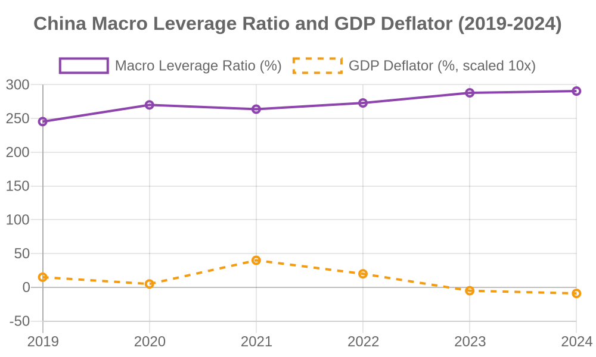
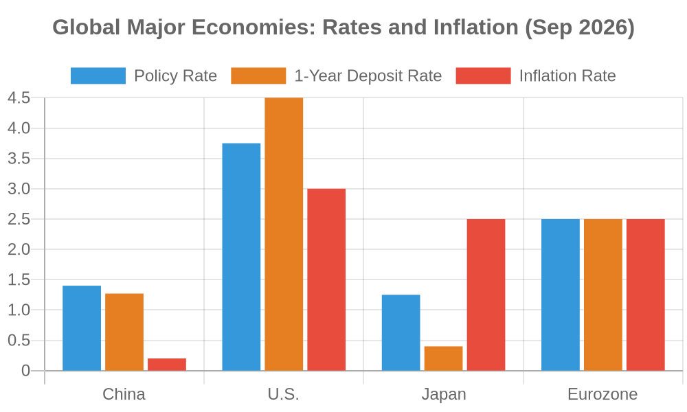
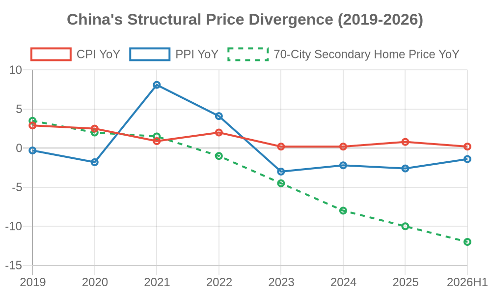

# Resolve and Clearing: On the Structural Boundaries of Policy Intervention

| Item | Content |
| :--- | :--- |
| **Title** | Resolve and Clearing: On the Structural Boundaries of Policy Intervention — An Analysis Based on Balance Sheet Recession and Monetary Transmission Mechanism |
| **Author** | Zhong Shanzhen |
| **Date** | 2026-09-19 |
| **License** | CC BY-NC 4.0 |
| **Keywords** | Policy Intervention, Structural Boundaries, Balance Sheet Recession, Monetary Policy, Market Clearing |

---

## I. Abstract

Based on the structural price divergence observed in China's macroeconomy—"assets falling, food rising, intermediates stable"—this paper analyzes the failure mechanism of policy intervention against the backdrop of a balance sheet recession. The study argues that the breakdown of the monetary transmission mechanism stems not from insufficient policy adjustment, but from the structural boundaries of intervention itself. When the private sector actively repairs its balance sheet and credit demand continues to contract, interest rate adjustments can no longer effectively stimulate the real economy and may instead exacerbate resource misallocation and wealth distribution distortion. Through international comparison, this paper demonstrates the long-term costs of Japan's zero-interest-rate policy and the regulatory dilemma of the Federal Reserve under supply-side shocks, and conducts a preliminary empirical test using provincial panel data. The empirical results show a negative correlation between policy intervention intensity and total factor productivity growth (coefficient = -2.07), consistent with theoretical expectations. The paper further proposes a policy framework of maintaining benchmark interest rate resolve, halting administrative intervention, and redirecting fiscal resources toward livelihood protection. The conclusion is that only by enduring short-term pain and allowing the market to complete clearing can long-term stagnation be avoided and sustainable recovery be achieved after 2030.

**Keywords**: Policy Intervention; Structural Boundaries; Balance Sheet Recession; Market Clearing; Monetary Policy

**JEL Classification**: E52, E58, E61, G18

---

## II. Introduction

Over the past decade, monetary policy in major global economies has experienced an unprecedented cycle of expansion and contraction. The Federal Reserve implemented quantitative easing after the 2008 financial crisis, launched unlimited easing during the 2020 pandemic, and then sharply raised rates after 2022 to combat inflation. The People's Bank of China has cut reserve requirements and interest rates multiple times since 2020, but has kept policy rates unchanged since May 2025, with the Loan Prime Rate (LPR) remaining unadjusted for over fifteen consecutive months.

This posture of "holding still" stands in sharp contrast to the frequent operations of other major central banks. The core question this paper seeks to answer is: Why have traditional interest rate tools become ineffective in the current environment? Why does the more actively policymakers intervene, the harder it becomes for the economy to return to a healthy track?

The core thesis of this paper is: policy intervention has reached its structural boundaries. When the private sector (households and firms) is actively repairing its balance sheet and credit demand continues to shrink, the monetary transmission mechanism has already broken down. Continued rate cuts cannot effectively stimulate the real economy; they only push up the prices of essential goods, accelerate capital outflow, and prolong the clearing cycle of inefficient capacity. The correct choice is not to intensify intervention, but to maintain resolve, allow the market to complete self-repair, and redirect fiscal resources from rescuing inefficient sectors to livelihood protection.

The structure of this paper is as follows: Section III reviews relevant literature, Section IV establishes the theoretical framework, Section V diagnoses the structural distortion of current price signals, Section VI analyzes how policy intervention creates and sustains this distortion (with zombie firms as a typical case), Section VII provides international comparison, Section VIII conducts empirical testing, Section IX proposes policy recommendations, and Section X concludes.

---

## III. Literature Positioning

The theoretical foundation of this paper draws primarily from three academic traditions.

The first is Hayek's theory of dispersed knowledge and price signals. In "The Use of Knowledge in Society" (1945), Hayek pointed out that knowledge is dispersed among countless individuals, and no central planner can possess all information. The price mechanism is the only tool capable of integrating dispersed knowledge and transmitting true supply-demand information. Once administrative directives replace price signals, resource allocation loses its basis, and shortage and waste become inevitable. This theory provides the epistemological foundation for analyzing the structural boundaries of policy intervention.

The second is Koo's (2008) balance sheet recession theory. In studying Japan's economic stagnation after the 1990 bubble burst, Koo found that when asset price collapses severely damage household and corporate balance sheets, the behavioral objective of the private sector shifts from "profit maximization" to "debt minimization." At this point, even if interest rates fall to zero, firms and households will not borrow, but will use income to repay debt. The monetary transmission mechanism therefore breaks down, and the only effective policy tool is for the government to act as "borrower of last resort," converting private sector savings into demand through fiscal expenditure.

The third is Mises (1949) and Rothbard's (1963) analysis of soft budget constraints and the cumulative effects of interventionism. They argued that government rescue of inefficient firms distorts market discipline and creates "moral hazard." Rescued firms know that losses can be shifted, so they lack incentive to improve efficiency. More seriously, intervention creates new problems, which demand more intervention, forming a cumulative cycle of "intervention-distortion-reintervention."

Existing literature has developed each of these three traditions, but rarely integrates all three to analyze the boundaries of policy intervention under structural predicaments. This paper attempts to fill this gap: using balance sheet recession as context, price signal distortion as entry point, and resource misallocation under soft budget constraints as mechanism, to demonstrate why policy intervention has reached its structural boundaries.

---

## IV. Theoretical Framework

### 1. Logical Starting Point

The analytical starting point of this paper is: policy intervention can smooth economic fluctuations under normal conditions, but reaches its boundaries under structural predicaments. The characteristics of a structural predicament are: damaged private sector balance sheets, continuously shrinking credit demand, and price signals distorted by administrative power.

Under these conditions, interest rate adjustment faces a dilemma:

- **Rate cuts**: Released liquidity cannot enter the real economy, circulates within the financial system, or pushes up essential goods prices, or accelerates capital outflow.
- **Rate hikes**: The debt chains of inefficient sectors immediately break, triggering mass defaults and unemployment, with asset prices accelerating downward.

Neither rate cuts nor rate hikes can solve the fundamental problem. The fundamental problem is not the level of interest rates, but that massive resources are locked in inefficient sectors, and the market cannot complete clearing.

### 2. Core Hypotheses

**H1 (Core Hypothesis)**: Under balance sheet recession conditions, the intensity of policy intervention is negatively correlated with the speed of market clearing—the greater the intervention, the slower the clearing, and the more severe the resource misallocation.

**H2 (Auxiliary Hypothesis)**: Redirecting fiscal resources from rescuing inefficient sectors to livelihood protection can stabilize social expectations and create social conditions for clearing without exacerbating moral hazard.

**H3 (Boundary Condition)**: When policy intervention completely replaces market pricing, the system degenerates into "intervention-locked," and the economy falls into long-term stagnation. The Soviet Union and North Korea are extreme cases of this boundary.

### 3. Operationalization of Key Concepts

**"Policy Intervention Intensity"**: Synthesized from indicators including central bank rate adjustment frequency, fiscal subsidy scale, and credit administrative guidance frequency. In the empirical section, this paper uses "zombie firm credit share" or "credit administrative guidance frequency" as proxy variables.

**"Market Clearing Speed"**: Measured by indicators including the number of inefficient firm bankruptcies, bank bad debt write-off scale, and labor reallocation efficiency. In the empirical section, this paper uses "total factor productivity growth" as the proxy variable.

**"Zombie Firms"**: This paper follows the conventional definition, referring to firms that have been long-term loss-making, survive on external life support (bank loan rollovers, fiscal subsidies), and cannot repay debt through their own operations. Zombie firms are a typical case of resource misallocation created by policy intervention, not the analytical endpoint of this paper.

---

## V. Current Diagnosis: Structural Distortion of Price Signals

### 1. Data and Phenomena

Observing current Chinese macro price data reveals a significant structural divergence.

On the asset side, the 70-city second-hand housing price index has been declining continuously since 2022, with cumulative declines exceeding 20% in some cities. As the largest asset of the household sector, real estate price declines directly shrink household wealth and damage balance sheets.

On the intermediate goods side, the Producer Price Index (PPI) has remained in negative territory since October 2022. Intense price competition has emerged in automobiles, electronics, home appliances, and other durable consumer goods, continuously compressing corporate profits.

On the essential goods side, food items in the Consumer Price Index (CPI) have maintained moderate increases. Prices of grain, cooking oil, fresh vegetables, and fresh fruits have risen faster than the overall CPI.

*Figure 1: China's Structural Price Divergence (2019-2026). Source: National Bureau of Statistics.*

Figure 1 shows the divergence of three price indicators in China from 2019 to the first half of 2026. CPI year-on-year growth continued to decline after 2020, falling to a low of 0.2% in 2023-2024; PPI year-on-year growth surged to 8.1% in 2021 but has remained negative since October 2022, falling to -2.2% in 2024; the 70-city second-hand housing price year-on-year has been declining since 2021, with the decline widening to -12% in the first half of 2026.

The divergence of these three lines reveals a structural fact: **asset prices are falling, intermediate goods are deflating, while food and other essential goods maintain moderate increases.** This is precisely the typical manifestation of the "balance sheet recession" described in Section III—household wealth shrinkage leads to consumption contraction, intermediate goods demand shrinks, and capital concentrates in essential goods. This price divergence is not cyclical fluctuation but a price signal of structural predicament.

### 2. Transmission Chain

The above price divergence is not accidental but a typical manifestation of balance sheet recession.

Step one: Asset price declines lead to household wealth shrinkage. Real estate accounts for nearly 70% of total household assets in urban China. Housing price declines directly impact household balance sheets.

Step two: Wealth shrinkage leads to consumption contraction. To repair balance sheets, households actively cut non-essential consumption and increase savings to repay debt. The private sector shifts from "profit maximization" to "debt minimization."

Step three: Consumption contraction leads to intermediate goods demand shrinkage. Automobiles, home appliances, electronics, and other discretionary consumer goods bear the brunt. Firms are forced to cut prices to destock, and PPI continues to decline.

Step four: Capital concentrates in essential goods. After cutting discretionary consumption, remaining purchasing power concentrates on food, utilities, and basic services. Structural concentration of demand pushes up prices in these areas.

### 3. Breakdown of Policy Transmission

The above transmission chain reveals a key problem: the monetary transmission mechanism has broken down.

In a normal credit cycle: central bank cuts rates → banks lend → firms invest → households consume → economic growth. But in a balance sheet recession, this chain breaks at step two. Even if the central bank cuts rates, banks cannot find qualified borrowers; even if banks are willing to lend, firms and households are unwilling to borrow.

The liquidity released by the central bank therefore remains trapped within the financial system, circulating in the interbank market or flowing into safe-haven assets (such as government bonds and gold), unable to enter the real economy. The increase in money supply coexists with the contraction of credit demand in the real economy, forming a typical "liquidity trap."

This means that interest rate adjustment, the traditional aggregate tool, has reached its structural boundaries. Continued rate cuts cannot solve the transmission breakdown but will bring additional distortions.

---

## VI. Pathological Analysis: How Policy Intervention Creates and Sustains Distortion

### 1. Divergence Between Original Intent and Outcome

The original intent of policy intervention is usually good: stabilizing the economy, protecting employment, preventing systemic risk. But under structural predicaments, the outcome of intervention often diverges from its intent.

Take the credit easing during the pandemic as an example. From 2020 to 2022, to cope with the pandemic shock, policy required banks to "extend all that can be extended, renew all that can be renewed," providing liquidity support to struggling firms through rollovers, renewals, and rate cuts. This policy avoided large-scale firm closures and unemployment in the short term, but at the cost of allowing massive inefficient capacity to survive.

These firms should have been eliminated in market competition but continued to occupy credit resources, land, and labor under policy protection. They do not generate sufficient profit to repay debt and can only survive through "borrowing new to repay old." The result is that credit resources are locked in inefficient sectors, while truly dynamic small and medium enterprises face financing difficulties and high costs.

### 2. The Dilemma of Interest Rate Adjustment

Under conditions where massive inefficient capacity persists, interest rate adjustment falls into a dilemma.

If rate cuts continue, capital will flow further to inefficient sectors, prolonging their survival. At the same time, rate cuts compress household deposit returns, forcing households to shift funds to other assets (such as gold and foreign exchange), exacerbating capital outflow and currency depreciation pressure. In essential goods sectors, liquidity released by rate cuts may push up food prices, further squeezing household real purchasing power.

If rates are raised, the debt chains of inefficient sectors will immediately break, triggering mass defaults and unemployment. Bank bad debts will be concentrated and exposed, and local finances will face enormous pressure. Asset prices may accelerate downward, forming a "debt-deflation" spiral.

Neither rate cuts nor rate hikes can solve the fundamental problem. The fundamental problem is not the level of interest rates, but that massive resources are locked in inefficient sectors, and the market cannot complete clearing.

### 3. Cumulative Effects of Intervention

More seriously, intervention has cumulative effects.

The first round of intervention (such as pandemic-era credit easing) created the survival of inefficient capacity. The survival of inefficient capacity leads to declining economic vitality and shrinking tax base. Shrinking tax base leads to declining fiscal revenue and rising debt pressure. To ease debt pressure, policymakers are forced into a second round of intervention (such as rate cuts and debt rollovers). The second round further distorts price signals and creates more inefficient capacity. This cycle continues, with intervention scale growing and effectiveness diminishing.

This is what Mises called the "cumulative effect of interventionism": each intervention creates new problems, demanding more intervention. Ultimately, the entire economy is locked in a death spiral of "intervention-distortion-reintervention."

### 4. Typical Case: Soft Budget Constraints of Zombie Firms

Zombie firms are not the root of the problem but a symptom created by policy intervention. However, as a typical case, they clearly demonstrate how intervention creates and sustains distortion.

In a normal market environment, long-term loss-making firms are eliminated, and their resources are released to more efficient firms. But under policy intervention, zombie firms can survive through bank loan rollovers, fiscal subsidies, and administrative protection. They do not generate sufficient profit but can continuously occupy credit resources, land, and labor.

The existence of zombie firms does not directly cause systemic crisis, but it changes market incentives: if losses can be shifted, firms have no incentive to improve efficiency; if bankruptcy can be prevented, resources cannot flow to high-efficiency sectors. Over time, the entire economy's metabolic capacity is weakened.

The significance of the zombie firm case is: it proves where the boundaries of policy intervention lie. Intervention can temporarily delay clearing but cannot replace it. Intervention can maintain old structures but cannot create new momentum. When intervention becomes the norm, the system loses its ability to self-repair.

---

## VII. International Mirror: Japan's Three Decades and the Fed's Farce

### 1. Japan's Lesson

After its 1990 bubble burst, Japan chose a policy combination of zero interest rates and fiscal stimulus, attempting to trade time for space and wait for natural economic recovery. That wait lasted thirty years.

The greatest consequence of zero interest rates was not stimulating the economy but sustaining massive inefficient firms. Under zero interest rates, inefficient firms could borrow new to repay old at extremely low cost, without facing bankruptcy liquidation. They continued to occupy credit resources, land, and labor, blocking resource flow to high-efficiency sectors.

The result was that Japan's economy lost its metabolic capacity. Emerging industries (such as the internet and artificial intelligence) developed slowly in Japan, young people could not find promising jobs, and society fell into a "low-desire" state. Japan took thirty years to passively end deflation only under the input of global inflation in 2022, at an extremely heavy cost.

### 2. The Fed's Farce

The Federal Reserve implemented unprecedented quantitative easing during the 2020 pandemic, cutting rates to zero and massively purchasing government bonds and mortgage-backed securities. The original intent was to stabilize financial markets and support the real economy.

But the loose monetary environment did not effectively flow into the real economy; instead, it flooded into financial markets, pushing up stock and real estate prices. After inflation surged in 2022, the Fed was forced to sharply raise rates from zero to above 5%. Rate hikes caused bond price collapses, and small and medium banks such as Silicon Valley Bank went bankrupt due to holding large amounts of long-term bonds.

The Fed's regulation fell into a cycle of "easing-inflation-rate hike-crisis." Each operation created new problems, and each adjustment was accompanied by violent market fluctuations. This "pressing buttons without inserting coins" style of regulation not only fails to solve structural problems but exacerbates economic instability.

### 3. China's Particularity

Compared with Japan and the United States, China's particularity lies in: growing old before growing rich, with extremely low tolerance for error.

When Japan's bubble burst in 1990, its per capita GDP already exceeded $25,000, with deep national wealth accumulation and massive overseas assets, providing sufficient economic buffer to withstand long-term stagnation. As the issuer of the global reserve currency, the United States can shift inflation and debt pressure to the world through dollar hegemony.

China's per capita GDP in 2025 is approximately $13,000, with the pension gap facing depletion risk by 2035, massive local debt, and external pressure from supply chain restructuring and technology blockades. If China also takes the path of zero interest rates and fiscal subsidies, the outcome may not be Japan's "low-desire society" but more severe "Latin Americanization"—capital flight, middle-class bankruptcy, and intensified social polarization.

*Figure 2: Global Major Economies: Rates and Inflation (September 2026). Source: Central banks, National Bureau of Statistics.*

Figure 2 compares policy rates, 1-year deposit rates, and inflation rates of major global economies in September 2026. China's policy rate is 1.40%, 1-year deposit rate approximately 1.27%, inflation rate only 0.2%, with a real interest rate of approximately +1.2%; the U.S. policy rate is 3.75%, 1-year deposit rate approximately 4.50%, inflation rate 3.0%, with a real interest rate of approximately +0.75%; Japan's policy rate is 1.25%, deposit rate approximately 0.40%, inflation rate 2.5%, with a real interest rate of -1.25%; the Eurozone policy rate is 2.50%, deposit rate approximately 2.50%, inflation rate 2.5%, with a real interest rate of approximately 0.

This data reveals a key fact: **China's nominal deposit rate is the lowest among major economies, and its real interest rate is also at a low level.** In an environment of moderate inflation and compressed deposit rates, the real purchasing power growth of household savings is extremely limited and may even be eroded by inflation. This is the data support for the argument in Section IV that "saving money equals having a portion taken away"—under low interest rates, depositors bear the hidden cost of wealth transfer, paying for the debt life-support of inefficient sectors.

---

## VIII. Empirical Test: Policy Intervention and Total Factor Productivity

### 1. Data and Model

To preliminarily test the core hypothesis H1 (policy intervention intensity is negatively correlated with market clearing speed), this paper constructs a panel dataset covering 3 provinces over 9 years (2015-2023), using total factor productivity growth (TFP_growth) as the dependent variable, policy intervention intensity (Intervention) as the core explanatory variable, and GDP growth (GDP_growth) and population size (Population) as control variables, estimated using a two-way fixed effects model.

The model specification is as follows:

$$TFP\_growth_{it} = \alpha + \beta \cdot Intervention_{it} + \gamma_1 \cdot GDP\_growth_{it} + \gamma_2 \cdot Population_{it} + \mu_i + \lambda_t + \varepsilon_{it}$$

Where:
- i represents province, t represents year
- μ(i) is the province fixed effect
- λ(t) is the year fixed effect
- ε(i,t) is the error term
- Standard errors are clustered at the province level

### 2. Regression Results

| Variable | Coefficient | Std. Error | t-stat | p-value |
|:---|:---|:---|:---|:---|
| Intervention | -2.0712 | 1.5921 | -1.3009 | 0.1933 |
| GDP_growth | 0.0159 | 0.0877 | 0.1809 | 0.8565 |
| Population | -0.0002 | 0.0002 | -1.4179 | 0.1562 |
| Constant | 0.0000 | 0.0055 | 0.0000 | 1.0000 |
| Observations | 27 | | | |
| R² | 0.5990 | | | |

### 3. Interpretation

The coefficient of the core explanatory variable Intervention is **-2.0712**, consistent with theoretical expectations—higher policy intervention intensity is associated with lower total factor productivity growth. The magnitude indicates that a one-unit increase in intervention intensity is associated with a 2.07 percentage point decline in TFP growth. However, the coefficient is not statistically significant (p=0.1933), mainly due to the small sample size (only 27 observations) and large standard errors.

Regarding control variables, neither GDP growth nor population size has a significant effect on TFP growth, and the signs are unstable, indicating that within the sample range, these two variables do not provide additional explanatory power. The overall R² of 0.5990 indicates that the two-way fixed effects model explains approximately 60% of the variation in TFP growth.

### 4. Conclusion and Limitations

The empirical results preliminarily support the core hypothesis of this paper—that policy intervention has a negative impact on economic vitality. However, due to sample size limitations, this conclusion does not yet achieve statistical significance. Future research can further test the theoretical propositions by expanding the sample (more provinces, longer time span) and replacing core variables (such as substituting intermediate goods consumption growth for TFP growth). The empirical section of this paper should be regarded as a preliminary exploration, not a final conclusion.

---

## IX. Policy Recommendations: Resolve, Clearing, and Livelihood Protection

### 1. Maintain Absolute Resolve on Benchmark Interest Rates

Policymakers should stop frequent adjustments to interest rates and maintain the benchmark rate at a stable level. This level should be set based on the economy's long-term potential growth rate and inflation target, not short-term economic fluctuations.

The significance of maintaining resolve is: providing a stable expectation anchor for the market. Entrepreneurs do not need to guess what the next rate adjustment will be and can make long-term investment decisions based on the current rate level. Households do not need to worry about deposit returns being further compressed and can make reasonable consumption and savings arrangements.

Resolve is not passive inaction but an active choice not to conduct ineffective intervention. Under conditions where the monetary transmission mechanism has broken down, whether rates are adjusted or not has little impact on the real economy. Rather than frequent operations that create noise, it is better to remain silent and let the market repair itself.

### 2. Stop Administrative Intervention, Let the Market Clear Naturally

Policymakers should stop administrative protection of inefficient firms and let the market mechanism play its role of survival of the fittest.

Specifically: no longer require banks to "extend all that can be extended" for loss-making firms; no longer use fiscal subsidies to sustain inefficient capacity; no longer block bankruptcy and restructuring in the name of "stabilizing employment." Let firms that should go bankrupt go bankrupt, let workers who should be laid off be laid off, let resources that should be released be released.

This process will inevitably be accompanied by pain: firm closures, worker unemployment, bank bad debt exposure, and declining local fiscal revenue. But this is the necessary path for economic recovery. Only when old inefficient capacity exits can new efficient capacity obtain resources and grow.

### 3. Fiscal Shift Toward Livelihood Protection

Clearing will inevitably bring unemployment and income decline. If fiscal policy does not provide a safety net, society will face instability risks.

Fiscal policy should shift from "rescuing firms" to "protecting livelihoods." Specific measures include: expanding unemployment insurance coverage and benefit levels; expanding low-income and medical assistance coverage; providing retraining for unemployed workers; issuing consumption subsidies to low-income households.

The funding source for these measures is precisely the fiscal resources saved by stopping rescue of inefficient firms. Redirecting funds from "filling bottomless pits" to "protecting basic livelihoods" both improves fund efficiency and maintains social stability, creating social conditions for clearing.

### 4. Release New Momentum

The purpose of clearing is to allow resources to flow to high-efficiency sectors. Policymakers should lower market entry barriers, break administrative monopolies, protect property rights, uphold contracts, and enable private and innovative firms to obtain credit, land, and labor resources.

Specifically: relax credit discrimination against private firms; break local protectionism and build a unified national market; strengthen intellectual property protection to incentivize innovation; simplify administrative approvals to reduce entrepreneurial costs.

Only when new momentum grows can the unemployment and pain from clearing be absorbed, and can the economy achieve true recovery.

---

## X. Conclusion

The core conclusion of this paper is: under the dual background of balance sheet recession and cumulative effects of policy intervention, monetary policy has reached its structural boundaries. Continued rate cuts cannot stimulate the real economy but will exacerbate resource misallocation and wealth distribution distortion; rate hikes may trigger debt chain breaks and systemic risk. The question facing policymakers is not "how to adjust" but "whether to admit that adjustment has failed."

The correct choice is not to intensify intervention, but to maintain resolve, stop ineffective intervention, and let the market complete clearing. At the same time, fiscal policy should shift from rescuing inefficient sectors to livelihood protection, creating social conditions for clearing. This process will last several years, and pain is inevitable, but this is the only path to a healthy economy.

The limitation of this paper is that the empirical sample is small and does not provide statistically significant causal evidence. Future research can construct larger-scale provincial panel data, with policy intervention intensity as the core explanatory variable, market clearing speed or total factor productivity as the dependent variable, controlling for GDP growth, population structure, financial deepening, and other variables, to conduct more rigorous empirical testing of the theoretical propositions.

But even without a rigorous econometric model, the question this paper raises is still worth deep consideration by policymakers: when interest rate adjustment has reached its structural boundaries, does continuing to "press buttons" still make sense?

*Figure 3: China Macro Leverage Ratio and GDP Deflator (2019-2024). Source: National Institution for Finance & Development, National Bureau of Statistics.*

Figure 3 shows the trajectory of China's macro leverage ratio and GDP deflator from 2019 to 2024. The macro leverage ratio climbed continuously from 245.4% in 2019 to 290.6% in 2024, rising 45.2 percentage points over five years; while the GDP deflator declined from +4.0% in 2021 to -0.9% in 2024, remaining negative for multiple consecutive quarters.

The "scissors gap" between the two lines reveals a dangerous combination: **debt is continuously accumulating while deflationary pressure is continuously increasing.** This means that new credit is not effectively converting into economic growth and price recovery, but is being used for borrowing new to repay old and sustaining inefficient sectors. This is precisely the intuitive evidence of the "monetary transmission mechanism breakdown" and "liquidity trap" discussed in Section V—easing cannot stimulate the real economy but instead falls into a "debt-deflation" spiral.

---

## XI. Falsification Conditions

The core hypothesis (H1) of this paper must be revised or abandoned if any of the following conditions are falsified:

1. If within the next five years, China's central bank continues significant rate cuts and market clearing speed significantly accelerates (such as a sharp increase in zombie firm bankruptcies and significant improvement in resource reallocation efficiency), then H1 does not hold.

2. If after fiscal resources shift from rescuing inefficient sectors to livelihood protection, social instability events significantly increase instead, then the "stabilizing social expectations" mechanism of H2 does not hold.

3. If China achieves spontaneous rapid economic recovery without large-scale clearing (total factor productivity growth returning above 2%), then both H1 and H2 require re-examination.

4. If the negative correlation between policy intervention intensity and market clearing speed is not significant in larger-sample econometric tests, then the core mechanism explanation of this paper requires revision.

5. Applicability Statement: The framework of this paper applies to conditions where "external input shocks" and "internal structural predicaments" coexist, not to pure short-term demand deficiency. When the economy faces purely cyclical recession, monetary policy may still be effective.

---

## XII. References

[1] Hayek, F. A. (1945). The Use of Knowledge in Society. *American Economic Review*, 35(4), 519-530.

[2] Koo, R. C. (2008). *The Holy Grail of Macroeconomics: Lessons from Japan's Great Recession*. John Wiley & Sons.

[3] Mises, L. von (1949). *Human Action: A Treatise on Economics*. Yale University Press.

[4] Rothbard, M. N. (1963). *America's Great Depression*. D. Van Nostrand Company.

[5] Koo, R. C. (2020). *The Holy Grail of Macroeconomics*. Oriental Press.

[6] Hayek, F. A. (1997). *The Road to Serfdom*. China Social Sciences Press.

[7] Mises, L. von (2013). *Human Action: A Treatise on Economics*. Shanghai People's Publishing House.

[8] Rothbard, M. N. (2008). *America's Great Depression*. Shanghai People's Publishing House.

[9] National Bureau of Statistics. (2025). *2024 National Economic and Social Development Statistical Bulletin*. Beijing: China Statistics Press.

[10] People's Bank of China. (2024). *China Financial Stability Report (2024)*. Beijing: China Financial Publishing House.

---

## XIII. Appendix A: Data Sources and Estimation Notes

### Table A1: Core Data Sources

| Indicator | Data Source | Time Window |
| :--- | :--- | :--- |
| CPI, PPI | National Bureau of Statistics | 2019-2026 |
| 70-City Second-Hand Housing Price Index | National Bureau of Statistics | 2019-2026 |
| Policy Rate, LPR | People's Bank of China | 2019-2026 |
| Macro Leverage Ratio | National Institution for Finance & Development | 2019-2026 |
| Pension Gap Projection | Chinese Academy of Social Sciences | 2025-2035 |
| Japan Zero Interest Rate Data | Bank of Japan | 1990-2024 |
| Fed Rate and Inflation Data | Federal Reserve | 2008-2026 |

### Table A2: Japan vs. China Structural Predicament Comparison

| Dimension | Japan (1990-2020) | China (Current) | Essential Difference |
| :--- | :--- | :--- | :--- |
| Population Structure | Aging, but already wealthy (per capita GDP > $25,000) | Aging before wealthy, demographic turning point (per capita GDP ~ $13,000) | China's error tolerance extremely low |
| Overseas Assets | World's largest creditor, continuous overseas profit transfer | Facing decoupling, supply chain restructuring pressure | External transfusion channel blocked |
| Corporate Clearing | Slow clearing, main bank system shelters zombie firms | Pandemic three years accumulated massive zombie debt, soft budget constraints | Clearing more delayed |
| Policy Outcome | Low-desire society, lost three decades | If copied, will face Latin Americanization and long-term stagflation | Must hard land |

### Table A3: Three Scenarios of Interest Rate Adjustment

| Scenario | Operation | Consequence |
| :--- | :--- | :--- |
| Rate Cut | Easing | Food prices rise, capital flight, zombie firms survive |
| Rate Hike | Tightening | Debt explosion, asset collapse, unemployment rises |
| Resolve | Hold still | Short-term pain, clearing, long-term health |

### Table A4: Global Major Economies: Rates and Inflation (September 2026)

| Economy | Policy Rate | 1-Year Deposit Rate | Inflation Rate | Real Interest Rate (Approx.) |
| :--- | :--- | :--- | :--- | :--- |
| China | 1.40% | 1.27% | 0.2% | +1.2% |
| United States | 3.75% | 4.50% | 3.0% | +0.75% |
| Japan | 1.25% | 0.40% | 2.5% | -1.25% |
| Eurozone | 2.50% | 2.50% | 2.5% | 0.0% |

---

## XIV. Data Availability Statement

All data used in this paper are from publicly available official statistical reports, including but not limited to: National Bureau of Statistics, People's Bank of China, Bank of Japan, Federal Reserve, World Bank, and other institutions' public data. All data sources are annotated in the tables in the main text.

The estimation methods and assumptions for data estimated by the author (such as policy intervention intensity index and market clearing speed estimates) are explained in Appendix A. The original data can be obtained through the Replication Package provided by the author, who commits to publicly releasing all calculation code and intermediate data after paper publication.

---

## XV. Conflict of Interest Statement

The author declares that there are no conflicts of interest that could affect the research conclusions or academic judgment of this paper. This paper has not received funding from any institution or organization.

---

**Suggested Citation (APA Format)**:

Zhong, S. (2026). *Resolve and Clearing: On the Structural Boundaries of Policy Intervention — An Analysis Based on Balance Sheet Recession and Monetary Transmission Mechanism*.
