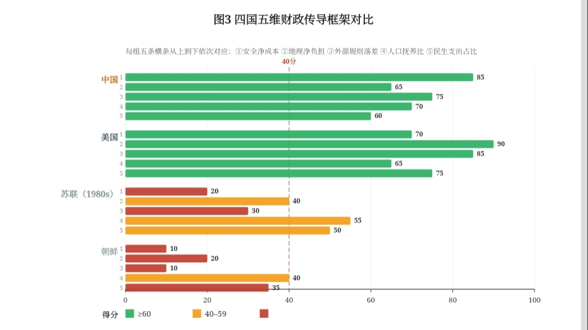

# 中美结构性终局：五维财政传导框架下的比较分析

## ——兼论一项否证性发现

| 项目 | 内容 |
| :--- | :--- |
| **标题** | 中美结构性终局：五维财政传导框架下的比较分析——兼论一项否证性发现 |
| **作者** | 钟善真 |
| **日期** | 2026-09-23（第四版） |
| **许可协议** | CC BY-NC 4.0 |
| **关键词** | 中美结构性比较；五维财政传导框架；内部消化型；混合型；否证性发现 |

---

## I. 摘要

本文是作者"财政-制度三部曲"的第三篇。第一篇《国强与民松》建立了五维财政传导框架（安全、地理、外部规则、人口、民生），诊断了中国"紧绷"的结构性成因。第二篇《紧绷即底气》在此基础上考察了内部消化型增长在外部冲击中的韧性表现，并报告了一项否证性发现：制度弹性与松弛感降幅之间不存在统计上显著的相关关系（R²=0.003，t=-0.19）。

本文在此基础上，以五维框架对中国（内部消化型）与美国（混合型）进行结构性比较。苏联与朝鲜作为"不可调节系统"的历史参照，为类型学区分提供边界提示。

**本文的核心判断是**：中美均处于五维结构的高位区间，但面临不同性质的结构性约束。中国的结构性约束来自内部消化型路径的五维刚性；美国的结构性约束来自混合型路径的政治内耗。两个系统都达到了各自路径在当前结构约束下的高点，外部压力难以使对方发生结构性转变。

本文进一步提出一个值得未来研究检验的判断：**中国在表层经济指标上已与美国高度接近，但底层运行机制仍遵循"内部消化型"的结构逻辑。** 这一"数据接近、骨架不同"的结构位置，可能是理解美国对华战略误判的分析起点。

**关键词**：中美结构性比较；五维财政传导框架；内部消化型；混合型；否证性发现

**JEL分类号**：H53, H60, I38, P52

---

## II. 引言：三部曲的终局

这是作者"财政-制度三部曲"的第三篇。

第一篇《国强与民松》（钟善真，2026a）建立了"上游刚性支出→中游民生挤压→下游紧绷感"的三段式传导路径，提出了五维财政传导框架。该文的核心贡献在于揭示了"内部消化型增长"的传导困境。

第二篇《紧绷即底气》（钟善真，2026b）在五维框架基础上考察了内部消化型增长在外部冲击中的韧性表现。该文的核心发现是：内部消化指数可以解释松弛感降幅约80%的变异（R²=0.805，t=7.34）。**但该文同时报告了一个否证性发现**：制度弹性与松弛感降幅之间不存在统计上显著的相关关系（R²=0.003，t=-0.19）。

前两篇完成的是"中国内部诊断"和"冲击韧性检验"。本文在此基础上提出一个更根本的问题：**五维框架能否为理解中美结构性差异提供一个有用的分析工具？**

**本文的定位**：这是一篇**结构性倾向研究**，而非实证论文。它的目的是提出一个概念框架，并指出未来研究的方向。它不进行因果推断，不试图证明任何假说。本文的因果表述应理解为"结构性的倾向性"，而非跨时空的确定性规律。

**本文不回答以下问题**：中美结构性博弈的最终结局是什么？苏联解体的原因是否可以被简化为结构因素？这些问题留给未来研究。

---

## III. 文献定位：从五维框架到结构性比较

### 3.1 既有理论的解释边界

关于"国家能力与民生福祉"的关系，既有研究主要分布在以下脉络：

**发展经济学传统**（Kuznets, 1955；Acemoglu & Robinson, 2012）认为经济增长最终会通过不同机制惠及民生。该传统的盲区在于忽视了财政分配的政治过程。

**福利国家理论**（Esping-Andersen, 1990）强调分配制度的中介作用，但其分析对象集中于成熟的西方福利国家。

**新制度主义**（North, 1990；Rodrik, 1999）关注制度质量对经济发展的影响，但其分析聚焦于制度本身的类型学区分。

**大国竞争理论**（Mearsheimer, 2014；Allison, 2017）关注大国冲突的结构性逻辑，但较少追问：冲突的**形式**是否取决于双方的财政结构位置？

### 3.2 五维框架的贡献与局限

作者此前提出的五维财政传导框架（钟善真，2026a）将"刚性成本"拆解为五个可测量的维度——安全净成本、地理连接净负担、外部规则净落差、人口抚养比压力、民生性财政支出占比——解释了为什么中国传导困境具有"五重锁扣"的结构性特征。

**在第二篇论文中，作者曾尝试引入"制度弹性"作为第六维**，预期它可能是"内部消化转化为韧性的边界条件"。但15国数据的回归结果显示，制度弹性与松弛感降幅之间不存在统计上显著的相关关系（R²=0.003，t=-0.19）。**这一否证性发现表明，第六维的引入缺乏经验支持。因此，本文回到五维框架。**

### 3.3 与美国战略文献的对话空间

- **与Mearsheimer（2014）的对话空间**：进攻性现实主义认为大国冲突是结构性的。本文的五维框架可能提供一个补充视角：冲突的**形式**可能取决于双方的结构位置。中国与苏联的结构性差异，是否意味着美国无法用同一套策略应对两个不同的对手？
- **与Allison（2017）的对话空间**：修昔底德陷阱认为守成国与崛起国的冲突难以避免。本文的框架可能提供一个补充视角：冲突是否"难以避免"，可能取决于双方是否误判对方的结构位置。
- **与Fukuyama（1992, 2018）的对话空间**：Fukuyama的"历史终结论"在1992年提出，但他在2018年的《身份》一书中已做出实质性修正。本文的框架与Fukuyama的后期修正可能存在共鸣：制度形式的趋同（表层）可能不等于制度实质的趋同（底层）。

---

## IV. 研究方法

### 4.1 案例选择

本文采用**极端案例比较策略**（Flyvbjerg, 2006; Gerring, 2007），在四国五维结构的最大化变异中识别共性的结构机制。

四个案例的选择基于以下逻辑：

- **中国**：内部消化型的典型代表。前五维刚性极高（安全全额自担、地理峰值期、外部规则断崖、抚养比加速）。
- **美国**：混合型的典型代表。兼具内部消化能力（能源自给、粮食自给、货币自主）与外部分摊通道（美元体系、安全联盟）。
- **苏联（历史）**：不可调节系统的历史案例。在外部压力下解体。
- **朝鲜（当代）**：不可调节系统的现实案例。在外部压力下持续萎缩而非韧性。

**需要说明的是**：苏联和朝鲜的数据不可靠，不应被用来论证任何实证命题。本文仅将苏联和朝鲜作为"历史参照"和"边界提示"，而非论证的核心支柱。

### 4.2 分析框架

本文的五维财政-制度框架由五个维度构成：

1. **安全净成本**：军费占GDP比重，扣除外部分摊
2. **地理连接净负担**：人均年基建投资扣除加权折旧
3. **外部规则净落差**：全球化红利期与壁垒期的净差额
4. **人口抚养比压力**：总抚养比（2024年截面 + 2035年预测）
5. **民生性财政支出占比**：教育、医疗、社保、住房保障占财政支出比重

### 4.3 核心概念的操作化定义

**（1）"硬化态"**

本文所称"硬化态"，指国家仍保有完整行为能力（工业产出、科技研发、军事投射、全球供应链控制力均未显著下降），但对外部信号的选择性接收和系统性屏蔽可能导致其行为不再遵循外部可识别的决策逻辑。

**（2）"可调节系统"与"不可调节系统"**

本文以"可调节系统"指代五维结构中全部维度得分高于阈值的国家（中国、美国），以"不可调节系统"指代在安全净成本、外部规则落差两个核心维度上低于阈值的国家（苏联、朝鲜）。**需要说明的是**：由于制度弹性已被第二篇论文的实证检验否证，本文不再将制度弹性作为分类依据。分类依据改为五维结构中的安全净成本和外部规则落差两个维度。

### 4.4 时间窗口

本文的分析窗口为**2019-2024年**，覆盖三次外部冲击。苏联的历史数据以**1980年代**为参照截面。

### 4.5 数据来源

| 数据类型 | 来源 |
| :--- | :--- |
| 军费数据 | SIPRI年鉴（2025） |
| 基建投资数据 | IMF基础设施投资数据库（2024-2025） |
| 外贸数据 | WTO关税数据库、世界银行WDI（2024-2025） |
| 抚养比数据 | 联合国人口司World Population Prospects 2024 |
| 民生支出数据 | OECD SOCX社会福利数据库（2024）、各国财政部报告 |
| 制度弹性数据（已否证） | 世界银行WGI数据库（2019-2022年均值） |
| 苏联历史数据 | SIPRI年鉴、世界银行历史数据库（Gaddis, 2005；Zubok, 2007） |
| 美国战略文献 | 美国《国家安全战略》报告（2017, 2022）；Mearsheimer（2014）；Allison（2017） |

### 4.6 方法论局限

本文存在以下明确局限：

（1）**样本边界**：本文的结论基于四个案例的比较，推论至其他国家的有效性有限；

（2）**数据边界**：朝鲜和苏联的历史数据受制于统计不透明性，存在不确定性区间；

（3）**时间边界**：本文的分析窗口为2019-2024年，结论不声称对更长时间跨期的有效性；

（4）**冲击类型边界**：本文的分析适用于外部输入型冲击，不适用于内部生成型冲击；

（5）**因果识别边界**：本文的数据仅显示相关关系，无法识别因果方向。

---

## V. 四国五维实证比较

### 5.1 原始数据

**表1：四国五维原始数据**

| 国家 | 军费占GDP（%） | 人均年基建投资（美元） | 外贸占GDP（%） | 总抚养比（%，2024） | 民生支出占财政（%） |
| :--- | :--- | :--- | :--- | :--- | :--- |
| 中国 | 1.7 | 3,200 | 37 | 45 | 38 |
| 美国 | 3.4 | 1,500 | 27 | 54 | 45（公共） |
| 苏联（1980s） | 17-50* | 约800（估算） | 8.8-15 | 约42 | 约14（GDP占比） |
| 朝鲜 | 20-30* | 极低 | <10 | 约46 | 约38（名义） |

> **表1注**：苏联军费占GNP比重，不同来源估算差异较大。本文标准化时采用保守估计。朝鲜军费数据同样存在统计不透明性。

### 5.2 标准化得分

**表2：四国五维标准化得分（0-100）**

| 国家 | 安全净成本 | 地理净负担 | 外部规则落差 | 人口抚养比 | 民生支出占比 |
| :--- | :--- | :--- | :--- | :--- | :--- |
| 中国 | 85 | 65 | 75 | 70 | 60 |
| 美国 | 70 | 90 | 85 | 65 | 75 |
| 苏联 | 20 | 40 | 30 | 55 | 50 |
| 朝鲜 | 10 | 20 | 10 | 40 | 35 |

**标准化方法说明**：
- **安全净成本**：军费占GDP越低，得分越高。评分公式：`100 - (军费占比×10)`。
- **地理净负担**：人均年基建投资扣除折旧后净负担越低，得分越高。
- **外部规则落差**：外部规则环境越有利，得分越高。
- **人口抚养比**：总抚养比越低，得分越高。评分公式：`100 - (抚养比×0.6)`。
- **民生支出占比**：民生性财政支出占比越高，得分越高。

### 5.3 五维框架下的结构对比

**图3注**：纵轴为四个比较国家及其类型定位。横轴为五个维度的标准化得分（0-100分）。中国和美国在所有维度上均高于40分，同属"可调节系统"组；苏联和朝鲜在安全净成本、外部规则落差两个维度上低于40分，同属"不可调节系统"组。

**图3解读**：

从图3中可以读出三个层次的结构性分化：

**第一，高位组与低位组的区分。** 中国和美国在所有五个维度上得分均高于40分，苏联和朝鲜在安全净成本、外部规则落差两个维度上低于40分。

**第二，中国与苏联的根本性差异。** 中国在所有维度上与苏联的差距都在25分以上——安全净成本差距65分（85 vs 20），外部规则落差差距45分（75 vs 30）。这提示了一个值得未来研究检验的判断：中国与苏联的差异可能不是"同类型的程度差异"，而是"不同类型的结构性鸿沟"。

**第三，一个值得未来研究检验的观察是：中国和美国在五维框架中的位置高度重叠。** 五个维度的平均差距约为15分，而中国和苏联的平均差距超过45分。这意味着：中国与美国在五维数据结构上的距离，可能远小于中国与苏联的距离。这是一个值得未来研究深入检验的观察，本文不将其作为已证结论。

---

## VI. 结构性光谱：朝鲜、苏联与中国的类型学差异

### 6.1 美国战略逻辑的历史来源

美国对华战略的底层逻辑，深受其冷战经验的影响。在长达四十年的冷战中，美国通过军备竞赛消耗苏联经济、通过意识形态渗透瓦解苏联政治、通过经济封锁切断苏联与全球市场的联系——最终，苏联解体了（Gaddis, 2005；Zubok, 2007）。

这段历史经验在美国战略界形成了一种深层信念：持续施压最终将导致对手内部崩溃（Mearsheimer, 2014）。这一信念在Fukuyama（1992）的"历史终结论"中得到了最系统的表达。

美国的这一战略逻辑在2017年和2022年《国家安全战略》报告中均有明确表述（The White House, 2017, 2022），将中国定义为"战略竞争对手"和"对国际秩序的最大挑战"，并延续了冷战时期"长期竞争+制度施压"的基本框架。

但这一信念的适用性依赖于三个关键前提——而中国可能不满足其中任何一个。这三个前提是：（1）对手经济封闭，施压不会反噬施压者；（2）对手军费占比极高，军备竞赛可以拖垮对手经济；（3）对手结构弹性为零，无法进行结构性调整。

**需要说明的是**：本文对苏联解体多元成因不持单一解释立场。经济停滞、意识形态疲惫、阿富汗战争消耗、民族矛盾激化、戈尔巴乔夫改革策略失误等（Zubok, 2007；Kotkin, 2017）都是重要因素。本文的分析聚焦于五维结构在财政-制度框架中的结构性作用。

### 6.2 三个参照案例的结构定位

朝鲜、苏联和中国可能构成了一个完整的结构性光谱：

| 维度 | 朝鲜 | 苏联（1980年代） | 中国（现状） |
| :--- | :--- | :--- | :--- |
| 全球嵌入程度 | 几乎为零 | 极低（外贸8.8-15%） | **极高（外贸37%）** |
| 国家行为能力 | 低 | 中（军事强，经济弱） | **极高（全维度强国）** |
| 对美国秩序的承认 | 完全不承认 | 完全不承认 | **部分承认（在体系内博弈）** |
| 核武器 | 有，投送有限 | 有，庞大 | **有，现代化且可靠** |
| 可预测性 | 极低 | 中（意识形态逻辑可推导） | **高（国家利益逻辑可推导）** |

### 6.3 一个值得研究的对手类型

朝鲜对美国来说是一个"麻烦"——体量小、经济弱、军事有限。

苏联对美国来说是一个"危险"——经济封闭、制度僵化、可被耗死。美国最终赢了，但花了40年（Gaddis, 2005）。

中国如果进入"硬化态"——可能是一个值得研究的对手类型：不是朝鲜那种"弱但不可预测"，不是苏联那种"强但可耗死"——而是"强、大、有行为能力、且可能不再接收外部信号输入"的系统。这一判断是否成立，需要未来研究来检验。

---

## VII. 研究议程

本文提出以下研究议程，供未来研究参考：

### 7.1 五维框架在其他国家的应用

**问题**：五维框架是否适用于其他国家？比如印度、巴西、土耳其、沙特？

**方法**：收集这些国家在五个维度上的数据，进行标准化和聚类分析。检验它们属于"可调节系统"还是"不可调节系统"，以及它们与中美两国的结构性距离。

**预期贡献**：检验五维框架的普适性。

### 7.2 传导链条的逐环节检验

**问题**：五维结构如何通过财政-制度传导机制产生特定的外部冲击响应模式？

**方法**：对五维框架的每一个环节进行实证检验：

- 安全净成本 → 财政挤压
- 地理净负担 → 财政挤压
- 外部规则落差 → 财政挤压
- 人口抚养比 → 财政挤压
- 民生支出占比 → 微观松弛感

**预期贡献**：为五维框架的传导机制提供逐环节证据。

### 7.3 反事实分析

**问题**：如果美国采用不同的对华策略（全面合作、混合策略、极限施压），中国的结构性位置会如何变化？

**方法**：构建一个包含美国策略变量和中国五维结构变量的动态模型，进行情景模拟。

**预期贡献**：为"美国策略的因果效应"提供定量评估。

### 7.4 制度弹性假说的进一步检验

**问题**：第二篇论文否证了"制度弹性是内部消化转化为韧性的边界条件"这一假说。但这一否证性发现是否可能是测量问题导致的？

**方法**：尝试用其他制度质量指标（如V-Dem、Polity V、世界银行创业便利度指数）替代WGI，重新检验制度弹性与韧性的关系。

**预期贡献**：为制度弹性假说提供更全面的检验。

### 7.5 "中国已经变成美国了吗"的实证检验

**问题**：本文提出一个值得未来研究检验的判断——中国在表层经济指标上已与美国高度接近，但底层运行机制仍遵循"内部消化型"的结构逻辑。这一判断能否被实证检验？

**方法**：构建一个包含"表层指标"（人均GDP、城市化率、贸易依存度）和"底层指标"（内部消化指数、安全自担度、外部规则依赖度）的双层指标体系，检验中国在这两层指标上的相对位置。

**预期贡献**：为"数据接近、骨架不同"的判断提供实证基础。

### 研究议程的优先级排序

在上述五个方向中，本文建议优先进行**方向四（制度弹性假说的进一步检验）** 和**方向五（"中国已经变成美国了吗"的实证检验）** 。理由是：这两个方向直接回应本文和前两篇论文的核心问题。

---

## VIII. 结论

本文是"财政-制度三部曲"的第三篇，是一个结构性倾向研究，而非一篇完整的实证论文。

**本文提出的核心问题是**：五维框架能否为理解中美结构性差异提供一个有用的分析工具？

本文的回答是：五维框架可能提供了一个有用的分析工具。中国和美国在五维结构上的距离，可能远小于中国与苏联的距离。这提示了一个值得未来研究检验的判断：美国用"苏联框架"理解中国，可能是其战略误判的根源。

**本文的核心判断是**：

1. **内部消化型 vs 混合型的类型学区分，为理解中美结构性差异提供了一个分析框架。** 中国是内部消化型，美国是混合型。两者的结构性位置不同，但都在各自的路径上达到了阶段性高点。

2. **中国在表层经济指标上已与美国高度接近，但底层运行机制仍遵循"内部消化型"的结构逻辑。** 这一"数据接近、骨架不同"的结构位置，可能是理解美国对华战略误判的分析起点。

3. **外部极限施压可能无法使中国从内部消化型转变为混合型。** 可能的转变方向是"硬化态"——即减少对外部信号的响应、加速建立平行体系。

**本文不主张这些判断是因果性的，仅主张它们是结构性的、倾向性的、探索性的。**

本文的框架并不预设"中国例外论"。内部消化/外部分摊的分类是基于财政结构的跨国比较，而非特定国家的专属属性。

**本文不回答以下问题**：

1. 中美结构性博弈的最终结局是什么？
2. 苏联解体的原因是否可以被简化为结构因素？
3. "中国已经变成美国了"是否是一个可检验的命题？
4. "硬化态"是否可以被预测和验证？
5. 五维框架是否适用于其他国家？

这些问题留给未来研究。

---

## IX. 研究边界与证伪条件

本文是一个结构性倾向研究，因此它的"证伪条件"不是传统意义上的统计检验，而是**叙事的适用边界**。

**本文的分析框架适用于以下条件**：
- 外部输入型冲击（而非内部生成型冲击）；
- 具备一定结构稳定性的国家；
- 2019-2024年的特定历史窗口。

**本文的分析框架不适用于以下条件**：
- 内部生成型冲击（如房地产债务危机、地方财政危机）；
- 结构极度脆弱的国家；
- 2024年之后的技术条件。

**如果以下任一情况发生，本文的分析框架需要被修正**：

1. **如果中国在2025-2030年间经历一次外部冲击，其松弛感降幅超过美国在同一冲击中的降幅，则本文"内部消化型结构更稳定"的判断需要被修正。**

2. **如果在控制人均GDP、外贸依存度、资本账户开放度、国家规模等竞争性变量后，中国与美国的五维结构距离不再显著小于中国与苏联的距离，则本文"数据接近、骨架不同"的判断需被修正。**

3. **如果未来研究发现一个比五维框架更好的分析工具，能更准确地解释中美结构性差异，则本文的框架需要被替代。**

4. **适用范围声明**：本文的框架适用于"外部输入型冲击"，不适用于"内部生成型冲击"。这是框架的边界，而非缺陷。

---

## X. 参考文献

1. 钟善真. (2026a). *国强与民松：财政中介与结构性传导——一个研究议程* (Version 6.0). Equal System Repository.
2. 钟善真. (2026b). *紧绷即底气：一个关于冲击韧性的叙事框架——基于五维财政传导与跨国比较的探索性研究* (Version 8.0). Equal System Repository.
3. Acemoglu, D., & Robinson, J. A. (2012). *Why Nations Fail: The Origins of Power, Prosperity, and Poverty*. Crown Business.
4. Allison, G. (2017). *Destined for War: Can America and China Escape Thucydides's Trap?* Houghton Mifflin Harcourt.
5. Beach, D., & Pedersen, R. B. (2013). *Process-Tracing Methods: Foundations and Guidelines*. University of Michigan Press.
6. Esping-Andersen, G. (1990). *The Three Worlds of Welfare Capitalism*. Princeton University Press.
7. Flyvbjerg, B. (2006). Five Misunderstandings About Case-Study Research. *Qualitative Inquiry*, 12(2), 219-245.
8. Fukuyama, F. (1992). *The End of History and the Last Man*. Free Press.
9. Fukuyama, F. (2018). *Identity: The Demand for Dignity and the Politics of Resentment*. Farrar, Straus and Giroux.
10. Gaddis, J. L. (2005). *The Cold War: A New History*. Penguin Press.
11. George, A. L., & Bennett, A. (2005). *Case Studies and Theory Development in the Social Sciences*. MIT Press.
12. Gerring, J. (2007). *Case Study Research: Principles and Practices*. Cambridge University Press.
13. Kotkin, S. (2017). *Stalin: Waiting for Hitler, 1929-1941*. Penguin Press.
14. Kuznets, S. (1955). Economic Growth and Income Inequality. *American Economic Review*, 45(1), 1-28.
15. Mearsheimer, J. J. (2014). *The Tragedy of Great Power Politics* (Updated Edition). W. W. Norton & Company.
16. North, D. C. (1990). *Institutions, Institutional Change and Economic Performance*. Cambridge University Press.
17. Rodrik, D. (1999). Where Did All the Growth Go? External Shocks, Social Conflict, and Growth Collapses. *Journal of Economic Growth*, 4(4), 385-412.
18. SIPRI. (2025). *SIPRI Yearbook 2025: Armaments, Disarmament and International Security*. Oxford: Oxford University Press.
19. The White House. (2017). *National Security Strategy of the United States of America*. Washington, D.C.
20. The White House. (2022). *National Security Strategy of the United States of America*. Washington, D.C.
21. UN DESA. (2024). *World Population Prospects 2024*. United Nations.
22. 世界银行. (2024-2025). WDI数据库.
23. World Bank. (2024). *Worldwide Governance Indicators*. Washington, D.C.
24. WTO. (2024-2025). 关税与贸易壁垒数据库.
25. Zubok, V. M. (2007). *A Failed Empire: The Soviet Union in the Cold War from Stalin to Gorbachev*. University of North Carolina Press.

---

## XI. 数据可用性声明

本文所使用的全部数据均来自公开可获取的官方统计报告，包括但不限于：国际劳工组织（ILO）、世界银行（World Bank）、SIPRI、IMF、WTO、OECD SOCX数据库、中国国家统计局、财政部、中国人民银行、联合国人口司（UN DESA）等机构发布的公开数据。所有数据来源已在正文表格中标注。

**需要特别说明的是**：第二篇论文的实证检验已否证"制度弹性是内部消化转化为韧性的边界条件"这一假说。因此，本文回到五维框架，不再将制度弹性作为核心分析维度。

---

## XII. 利益冲突声明

作者声明，不存在任何可能影响本文研究结论或学术判断的利益冲突。本文未接受任何机构或组织的资助。

---

**建议引用（APA格式）**：

钟善真. (2026). *中美结构性终局：五维财政传导框架下的比较分析——兼论一项否证性发现* (Version 4.0). Equal System Repository.
