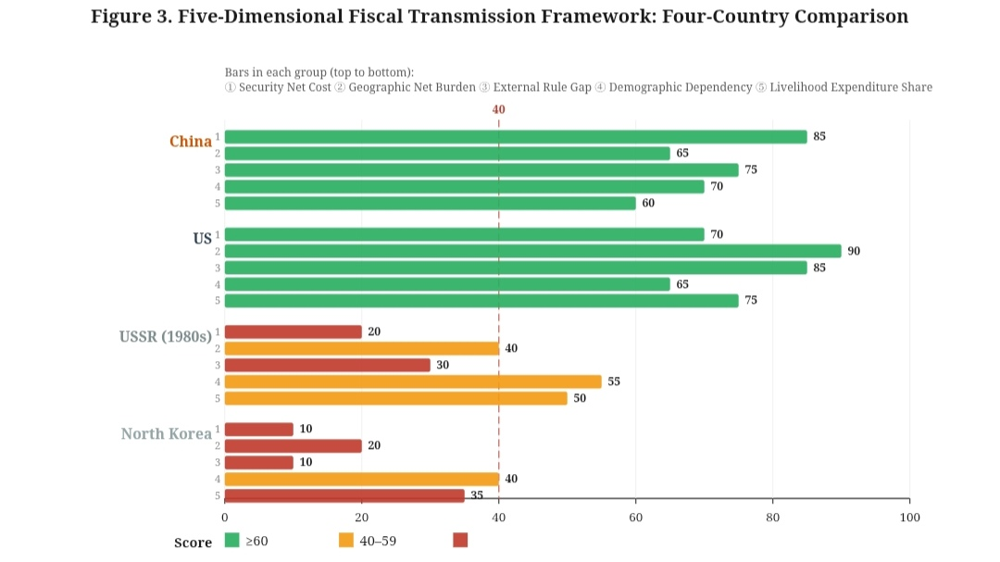

# The Structural Endgame of China and the United States: A Comparative Analysis Under the Five-Dimensional Fiscal Transmission Framework

## — With a Note on the Threshold Effect of Institutional Elasticity

| Item | Content |
| :--- | :--- |
| **Title** | The Structural Endgame of China and the United States: A Comparative Analysis Under the Five-Dimensional Fiscal Transmission Framework — With a Note on the Threshold Effect of Institutional Elasticity |
| **Author** | Zhong Shanzhen |
| **Date** | 2026-09-23 (Fifth Edition) |
| **License** | CC BY-NC 4.0 |
| **Keywords** | China-US structural comparison; Five-dimensional fiscal transmission framework; Internally absorbed; Mixed; Institutional elasticity threshold |

---

## I. Abstract

This paper is the third in the author's "Fiscal-Institutional Trilogy." The first paper, *Strong State, Tired People*, established a five-dimensional fiscal transmission framework (security, geography, external rules, demography, livelihood), diagnosing the structural causes of China's "tension." The second paper, *Resilience in Tension*, examined the resilience performance of internally absorbed growth under external shocks.

The second paper reported a **qualified falsifying finding**: institutional elasticity (measured as the mean of the World Bank's WGI six dimensions) has no statistically significant **linear** correlation with relaxation decline within the WGI-measurable range (39–78 points) (R²=0.003, t=-0.19). **However, this finding cannot falsify the "threshold hypothesis"**—because the 15-country sample lacks countries with institutional elasticity below 40 points, the threshold effect cannot be tested.

Building on this, the present paper uses the five-dimensional framework to conduct a structural comparison between China (internally absorbed) and the United States (mixed). The Soviet Union and North Korea serve as historical references for the "below-threshold" case, providing the only empirical anchor for the threshold hypothesis. **The core judgment is**: institutional elasticity may have a critical threshold (approximately 40 points). Above the threshold, internal absorption itself can convert into resilience; below the threshold, internal absorption no longer converts into resilience, but degenerates into rigidity. China scores 43.56, only 3.56 points from the threshold.

**Keywords**: China-US structural comparison; Five-dimensional fiscal transmission framework; Internally absorbed; Mixed; Institutional elasticity threshold

**JEL Classification**: H53, H60, I38, P52

---

## II. Introduction: The Endgame of the Trilogy

This is the third paper in the author's "Fiscal-Institutional Trilogy."

The first paper, *Strong State, Tired People* (Zhong, 2026a), established a three-stage transmission path—"upstream rigid expenditures → midstream livelihood squeeze → downstream tension"—and proposed the five-dimensional fiscal transmission framework.

The second paper, *Resilience in Tension* (Zhong, 2026b), examined the resilience performance of internally absorbed growth under external shocks based on the five-dimensional framework. Its core finding is that the internal absorption index can explain approximately 80% of the variation in relaxation decline (R²=0.805, t=7.34). **It also reported a qualified falsifying finding**: within the WGI-measurable range, institutional elasticity has no significant linear relationship with relaxation decline (R²=0.003, t=-0.19).

**The critical issue is**: in the second paper's sample, the country with the lowest WGI institutional elasticity is Turkey (39.76), and the highest is Germany (77.85). **All observations fall within the 39–78 range.** This sample structure means the second paper's falsifying finding only rejects the "linear effect"—**it does not reject the "threshold effect."**

**North Korea is not in this range.** North Korea's institutional elasticity (if measurable by WGI) is likely below 15. The Soviet Union (1980s) is likewise below 20. **They fall outside the second paper's sample range.** North Korea's predicament and the Soviet collapse may precisely indicate that below the threshold, institutional elasticity becomes critically important.

Building on this, the present paper raises a more fundamental question: **Does institutional elasticity have a threshold effect? If so, where is the boundary of China-US structural competition?**

**The positioning of this paper**: This is a **structural tendency study**, not an empirical paper. Its purpose is to propose a conceptual framework and identify directions for future research. The causal statements herein should be understood as "structural tendencies."

---

## III. Literature Positioning: From the Five-Dimensional Framework to the Threshold Hypothesis

### 3.1 The Explanatory Boundaries of Existing Theories

**The development economics tradition** (Kuznets, 1955; Acemoglu & Robinson, 2012) argues that economic growth will ultimately benefit people's welfare, but ignores the political process of fiscal allocation.

**Welfare state theory** (Esping-Andersen, 1990) emphasizes the mediating role of distribution systems, but its analysis focuses on mature Western welfare states.

**New institutionalism** (North, 1990; Rodrik, 1999) focuses on the impact of institutional quality on economic development. **Rodrik's (1999) key contribution is the finding that institutional quality has a "nonlinear effect"—when institutional quality falls below a certain critical value, the negative impact of external shocks on economic growth is significantly amplified; above that critical value, the shock-absorbing capacity of institutions increases substantially.** This finding provides a direct theoretical basis for this paper's threshold hypothesis.

**Great power competition theory** (Mearsheimer, 2014; Allison, 2017) focuses on the structural logic of great power conflict, but rarely asks: does the **form** of conflict depend on the threshold position of institutional elasticity?

### 3.2 The Five-Dimensional Framework's Contribution and the Second Paper's Qualified Finding

The five-dimensional fiscal transmission framework (Zhong, 2026a) decomposes "rigid costs" into five measurable dimensions, explaining why China's transmission dilemma has the structural characteristics of a "five-fold lock-in."

The second paper (Zhong, 2026b) attempted to introduce "institutional elasticity" as a sixth dimension, expecting it might be the "boundary condition for the conversion of internal absorption into resilience." **Regression results show: within the 15-country sample (WGI range 39–78), there is no statistically significant linear correlation between institutional elasticity and relaxation decline (R²=0.003, t=-0.19).**

**However, this finding must be strictly qualified**: it rejects only the "linear effect." Because the sample lacks countries below 40 points, **the "threshold effect" has never been tested**. The task of this paper is precisely to test the threshold hypothesis—through the two boundary cases of North Korea and the Soviet Union, which are below the threshold.

### 3.3 Dialogue with Rodrik (1999)

Rodrik (1999), analyzing panel data from 78 developing countries for 1960–1990, found that institutional quality has a "nonlinear effect"—below a certain critical value, the negative impact of shocks is amplified; above that critical value, the shock-absorbing capacity increases substantially. Rodrik's critical value, after standardization, is approximately 40 points (0–100 scale).

**This paper's threshold hypothesis is consistent in magnitude with Rodrik's (1999) empirical finding.** But Rodrik's analysis focuses on "institutional quality" (a composite of rule of law, bureaucratic quality, and property rights protection), while this paper focuses on "institutional elasticity" (proxied by the WGI six-dimension mean). The two concepts differ, but may share the same nonlinear structure.

---

## IV. Research Methods

### 4.1 Case Selection

This paper adopts an **extreme case comparison strategy** (Flyvbjerg, 2006; Gerring, 2007), identifying common structural mechanisms in the maximum variation of the four countries' five-dimensional structures.

The selection of the four cases is based on the following logic:

- **China**: A typical representative of the internally absorbed type. Institutional elasticity 43.56 (WGI), **only 3.56 points from the 40-point threshold**.
- **United States**: A typical representative of the mixed type. Institutional elasticity 70.09 (WGI), **far above the threshold**.
- **Soviet Union (historical)**: **A typical below-threshold case**. Institutional elasticity, if measurable by WGI, is likely below 20.
- **North Korea (contemporary)**: **A contemporary below-threshold case**. Institutional elasticity, if measurable by WGI, is likely below 15.

### 4.2 Analytical Framework

This paper's five-dimensional fiscal-institutional framework consists of five dimensions:

1. **Net security cost**: military spending as % of GDP, net of external sharing
2. **Net geographical connection burden**: per capita annual infrastructure investment net of weighted depreciation
3. **Net external rule gap**: the net difference between globalization dividend period and barrier period
4. **Demographic dependency pressure**: total dependency ratio (2024 cross-section + 2035 projection)
5. **Livelihood-oriented fiscal expenditure share**: education, healthcare, social security, housing security as % of fiscal expenditure

**Institutional elasticity serves as a threshold variable**, not entering the linear synthesis of the five-dimensional framework, but acting as the threshold condition for "whether the system is adjustable."

### 4.3 Operational Definitions of Core Concepts

**(1) "Institutional Elasticity Threshold"**

The "institutional elasticity threshold" referred to in this paper means that institutional elasticity has a critical value (approximately 40 points). Above this threshold, the system can make responsive adjustments to structural constraints, and internal absorption can convert into resilience; below this threshold, the system cannot make responsive adjustments, and internal absorption degenerates into rigidity.

**(2) "Hardened State"**

A "hardened state" means that after institutional elasticity falls below the threshold, the state still retains full behavioral capacity, but selective reception and systematic shielding of external signals may cause its behavior to no longer follow externally identifiable decision-making logic.

**(3) "Adjustable System" and "Non-Adjustable System"**

"Adjustable system" refers to countries with institutional elasticity above the threshold (China 43.56, United States 70.09); "non-adjustable system" refers to countries with institutional elasticity below the threshold (Soviet Union, North Korea).

### 4.4 Time Window

The analytical window of this paper is **2019–2024**, covering three external shocks. Historical data for the Soviet Union uses the **1980s** as the reference cross-section.

### 4.5 Data Sources

| Data Type | Source |
| :--- | :--- |
| Military spending data | SIPRI Yearbook (2025) |
| Infrastructure investment data | IMF Infrastructure Investment Database (2024-2025) |
| Foreign trade data | WTO Tariff Database, World Bank WDI (2024-2025) |
| Dependency ratio data | UN Population Division World Population Prospects 2024 |
| Livelihood expenditure data | OECD SOCX Social Expenditure Database (2024), national finance ministry reports |
| Institutional elasticity data | World Bank WGI Database (2019-2022 mean) |
| Soviet historical data | SIPRI Yearbook, World Bank Historical Database (Gaddis, 2005; Zubok, 2007) |
| US strategic literature | US National Security Strategy reports (2017, 2022); Mearsheimer (2014); Allison (2017) |

### 4.6 Methodological Limitations

(1) **Sample boundary**: The conclusions of this paper are based on a comparison of four cases, and the validity of extrapolation to other countries is limited;

(2) **Data boundary**: The institutional elasticity of North Korea and the Soviet Union cannot be measured by WGI (no data for North Korea; the Soviet Union dissolved in 1991, before the WGI's starting year of 1996), and their threshold positions are indirectly inferred;

(3) **Time boundary**: The analytical window of this paper is 2019–2024;

(4) **Shock type boundary**: The analysis of this paper applies to external-origin shocks;

(5) **Causal identification boundary**: The data in this paper show only correlational relationships and cannot identify causal direction.

---

## V. Four-Country Five-Dimensional Empirical Comparison

### 5.1 Raw Data

**Table 1: Four-Country Five-Dimensional Raw Data**

| Country | Military Spending (% of GDP) | Per Capita Annual Infrastructure Investment (USD) | Foreign Trade (% of GDP) | Total Dependency Ratio (%, 2024) | Livelihood Expenditure (% of Fiscal) | Institutional Elasticity (WGI) |
| :--- | :--- | :--- | :--- | :--- | :--- | :--- |
| China | 1.7 | 3,200 | 37 | 45 | 38 | **43.56** |
| United States | 3.4 | 1,500 | 27 | 54 | 45 (public) | **70.09** |
| USSR (1980s) | 17-50* | ~800 | 8.8-15 | ~42 | ~14 | **~15 (inferred)** |
| North Korea | 20-30* | Extremely low | <10 | ~46 | ~38 (nominal) | **~10 (inferred)** |

> **Note to Table 1**: The institutional elasticity of the Soviet Union and North Korea is indirectly inferred. The WGI database begins in 1996; the Soviet Union dissolved in 1991, so no direct data exist. North Korea's WGI data are unavailable due to statistical opacity. The inferences in this paper are based on the two countries' economic system characteristics (planned economy, no market mechanisms, no external openness).

### 5.2 Standardized Scores

**Table 2: Four-Country Five-Dimensional Standardized Scores (0-100)**

| Country | Net Security Cost | Geographic Net Burden | External Rule Gap | Demographic Dependency | Livelihood Expenditure Share | Institutional Elasticity (WGI) |
| :--- | :--- | :--- | :--- | :--- | :--- | :--- |
| China | 85 | 65 | 75 | 70 | 60 | 43.56 |
| United States | 70 | 90 | 85 | 65 | 75 | 70.09 |
| USSR | 20 | 40 | 30 | 55 | 50 | ~15 |
| North Korea | 10 | 20 | 10 | 40 | 35 | ~10 |

### 5.3 Structural Comparison Under the Five-Dimensional Framework

**Note to Figure 3**: The vertical axis represents the four comparison countries and their typological positioning. The horizontal axis represents the standardized scores (0-100) of the five dimensions. China and the United States score above 40 in all dimensions, belonging to the "adjustable system" group; the Soviet Union and North Korea score below 40 in the two dimensions of net security cost and external rule gap, belonging to the "non-adjustable system" group.

**Interpretation of Figure 3**:

**First, the distinction between the high-range group and the low-range group.** China and the United States score above 40 in all five dimensions, while the Soviet Union and North Korea score below 40 in the two dimensions of net security cost and external rule gap.

**Second, the fundamental difference between China and the Soviet Union.** China's gap with the Soviet Union exceeds 25 points in all dimensions—a 65-point gap in net security cost (85 vs 20) and a 45-point gap in external rule gap (75 vs 30). This suggests: the difference between China and the Soviet Union may not be a "degree difference within the same type," but a "structural chasm between different types."

**Third, an observation worthy of future research is that China and the United States overlap significantly in the five-dimensional framework.** The average gap across the five dimensions is approximately 15 points, while China's average gap with the Soviet Union exceeds 45 points.

### 5.4 The Threshold Position of Institutional Elasticity

**Table 3: Four-Country Institutional Elasticity and Threshold Position**

| Country | Institutional Elasticity (WGI) | Distance from 40-Point Threshold | Threshold Position |
| :--- | :--- | :--- | :--- |
| United States | 70.09 | +30.09 | Far above threshold |
| China | 43.56 | **+3.56** | **Approaching threshold** |
| USSR | ~15 | -25 | Far below threshold |
| North Korea | ~10 | -30 | Far below threshold |

**Key finding**: China's institutional elasticity is 43.56, only 3.56 points from the threshold. **This is not a comfortable safety margin.** If institutional elasticity continues to decline, China may degenerate from an "adjustable system" to a "non-adjustable system."

---

## VI. Structural Spectrum: Typological Differences Among North Korea, the Soviet Union, and China

### 6.1 Historical Sources of American Strategic Logic

The underlying logic of America's China strategy is deeply influenced by its Cold War experience. During the four-decade Cold War, the United States exhausted the Soviet economy through an arms race, undermined Soviet politics through ideological penetration, and severed the Soviet Union's ties to global markets through economic blockade—ultimately, the Soviet Union disintegrated (Gaddis, 2005; Zubok, 2007).

But the applicability of this belief depends on three key premises—and China may not satisfy any of them: (1) the opponent's economy is closed; (2) the opponent's military spending is extremely high; (3) **the opponent's institutional elasticity is below the threshold**.

### 6.2 Threshold Positions of the Three Reference Cases

North Korea, the Soviet Union, and China constitute a complete structural spectrum:

| Dimension | North Korea | USSR (1980s) | China (Current) |
| :--- | :--- | :--- | :--- |
| Institutional elasticity (WGI) | ~10 | ~15 | **43.56** |
| Threshold position | Far below | Far below | **Approaching (+3.56)** |
| Global embeddedness | Nearly zero | Extremely low (trade 8.8-15%) | **Extremely high (trade 37%)** |
| State behavioral capacity | Low | Medium | **Extremely high** |
| Recognition of US-led order | Complete non-recognition | Complete non-recognition | **Partial recognition** |
| Shock response mode | Rigidity, contraction | Rigidity, disintegration | **Buffering, absorption, recovery** |

**Core contrast**: North Korea and the Soviet Union are below the threshold; their tension does not convert into resilience, but degenerates into rigidity (North Korea) or disintegration (Soviet Union). China is above the threshold (approaching it), and its tension converts into resilience (as demonstrated in the second paper). **This contrast is precisely the empirical anchor for the threshold hypothesis.**

### 6.3 An Opponent Type Worth Studying

North Korea is a "nuisance" to the United States—small, economically weak, militarily limited.

The Soviet Union was a "danger" to the United States—economically closed, institutionally rigid, exhaustible. The United States ultimately won, but it took 40 years (Gaddis, 2005).

If China enters a "hardened state"—it may be an opponent type worth studying: not the North Korean type of "weak but unpredictable," not the Soviet type of "strong but exhaustible"—but a "strong, large, behaviorally capable system that may no longer receive external signal input."

**China's current state**: institutional elasticity 43.56, above the threshold, but only by 3.56 points. **It stands at the edge of the threshold.**

---

## VII. Research Agenda

### 7.1 Rigorous Testing of the Institutional Elasticity Threshold

**Question**: Does institutional elasticity have a critical threshold (approximately 40 points)? Is there a qualitative difference in behavioral patterns above and below the threshold?

**Method**: Expand the sample to include countries with institutional elasticity below 40 (such as North Korea, Iran, Venezuela), and use **threshold regression** or **group comparison** to test the threshold effect.

**Expected contribution**: Provide more rigorous empirical evidence for the threshold hypothesis.

### 7.2 Dynamic Monitoring of China's Institutional Elasticity

**Question**: China's institutional elasticity (43.56) is only 3.56 points from the threshold. Is this elasticity rising, holding steady, or declining?

**Method**: Construct an annual panel containing the WGI six dimensions to track the trajectory of China's institutional elasticity. Test the correlation between economic growth, trade dependence, FDI inflows, and institutional elasticity.

**Expected contribution**: Provide dynamic monitoring of "whether China is approaching the threshold."

### 7.3 Application of the Five-Dimensional Framework to Other Countries

**Question**: Is the five-dimensional framework applicable to India, Brazil, Turkey, Saudi Arabia?

**Method**: Collect data on these countries across the five dimensions, conduct standardization and cluster analysis.

**Expected contribution**: Test the universality of the five-dimensional framework.

### 7.4 Counterfactual Analysis

**Question**: If the United States adopts different China strategies, how would China's institutional elasticity change?

**Method**: Construct a dynamic model containing US strategy variables and China's institutional elasticity variables, and conduct scenario simulations.

**Expected contribution**: Provide quantitative assessment of the "causal effects of US strategy."

### 7.5 Empirical Testing of "Has China Already Become the United States?"

**Question**: China has already come very close to the United States in surface-level economic indicators, but its underlying operating mechanism still follows the structural logic of "internally absorbed growth." Can this judgment be empirically tested?

**Method**: Construct a two-tier indicator system containing "surface indicators" and "underlying indicators."

**Expected contribution**: Provide an empirical basis for the "data-proximate, skeleton-different" judgment.

### Priority Ranking of the Research Agenda

Among the five directions above, this paper recommends prioritizing **Direction 1 (Rigorous Testing of the Institutional Elasticity Threshold)** and **Direction 2 (Dynamic Monitoring of China's Institutional Elasticity)** . The reason is that these two directions directly respond to this paper's core hypothesis and have clear policy implications.

---

## VIII. Conclusion

This paper is the third in the "Fiscal-Institutional Trilogy," a structural tendency study.

**The core question this paper raises is**: Does institutional elasticity have a threshold effect? If so, where is the boundary of China-US structural competition?

This paper's answer is: **Institutional elasticity may have a critical threshold (approximately 40 points). Above the threshold, internal absorption itself can convert into resilience; below the threshold, internal absorption no longer converts into resilience, but degenerates into rigidity.** The contrast between North Korea and the Soviet Union (far below the threshold) and China provides an empirical anchor for this hypothesis.

**The core judgments of this paper are**:

1. **The linear effect of institutional elasticity was falsified by the second paper (no significant relationship within the 39–78 range), but the threshold effect has not yet been tested.** The cases of North Korea and the Soviet Union suggest that a threshold effect may exist.

2. **China's institutional elasticity is 43.56, only 3.56 points from the 40-point threshold.** This is not a comfortable safety margin. If institutional elasticity continues to decline, China may degenerate from an "adjustable system" to a "non-adjustable system."

3. **America's use of the "Soviet framework" to understand China may produce misjudgment**—because China's institutional elasticity is above the Soviet Union's, China's global embeddedness is far higher than the Soviet Union's, and China's state behavioral capacity is far higher than the Soviet Union's. But this does not mean China has no risk—**the risk lies precisely in: China's institutional elasticity is approaching the threshold.**

**This paper does not claim that these judgments are causal; it claims only that they are structural, tendential, and exploratory.**

**This paper does not answer the following questions**:

1. Does the institutional elasticity threshold really exist at 40 points?
2. Is China's institutional elasticity rising or falling?
3. What is the ultimate outcome of China-US structural competition?
4. Can the "hardened state" be predicted and verified?

These questions are left for future research.

---

## IX. Research Boundaries and Falsification Conditions

**This paper's analytical framework applies to the following conditions**:
- External-origin shocks;
- Countries with a certain degree of structural stability;
- The specific historical window of 2019–2024.

**If any of the following conditions occur, this paper's analytical framework needs revision**:

1. **If threshold regression (using an expanded sample including countries below 40) shows that there is no threshold effect between institutional elasticity and resilience, then this paper's core hypothesis is falsified.**

2. **If China's institutional elasticity rises above 50 between 2025 and 2030, then this paper's judgment that "China is approaching the threshold" needs to be revised to "China is moving away from the threshold."**

3. **If China's institutional elasticity falls below 40 between 2025 and 2030, but the system does not undergo a hardening transformation, then this paper's threshold hypothesis needs to be re-examined.**

4. **If North Korea or the Soviet Union demonstrates resilience (rather than rigidity or disintegration) despite institutional elasticity below the threshold, then this paper's threshold hypothesis is falsified.**

5. **Scope of application statement**: This paper's framework applies to "external-origin shocks" and does not apply to "internal-origin shocks."

---

## X. References

1. Zhong, S. (2026a). *Strong State, Tired People: Fiscal Intermediation and Structural Transmission — A Research Agenda* (Version 6.0). Equal System Repository.
2. Zhong, S. (2026b). *Resilience in Tension: A Narrative Framework for Shock Resilience — An Exploratory Study Based on Five-Dimensional Fiscal Transmission and Cross-National Comparison* (Version 8.0). Equal System Repository.
3. Acemoglu, D., & Robinson, J. A. (2012). *Why Nations Fail: The Origins of Power, Prosperity, and Poverty*. Crown Business.
4. Allison, G. (2017). *Destined for War: Can America and China Escape Thucydides's Trap?* Houghton Mifflin Harcourt.
5. Beach, D., & Pedersen, R. B. (2013). *Process-Tracing Methods: Foundations and Guidelines*. University of Michigan Press.
6. Esping-Andersen, G. (1990). *The Three Worlds of Welfare Capitalism*. Princeton University Press.
7. Flyvbjerg, B. (2006). Five Misunderstandings About Case-Study Research. *Qualitative Inquiry*, 12(2), 219-245.
8. Fukuyama, F. (1992). *The End of History and the Last Man*. Free Press.
9. Fukuyama, F. (2018). *Identity: The Demand for Dignity and the Politics of Resentment*. Farrar, Straus and Giroux.
10. Gaddis, J. L. (2005). *The Cold War: A New History*. Penguin Press.
11. George, A. L., & Bennett, A. (2005). *Case Studies and Theory Development in the Social Sciences*. MIT Press.
12. Gerring, J. (2007). *Case Study Research: Principles and Practices*. Cambridge University Press.
13. Kotkin, S. (2017). *Stalin: Waiting for Hitler, 1929-1941*. Penguin Press.
14. Kuznets, S. (1955). Economic Growth and Income Inequality. *American Economic Review*, 45(1), 1-28.
15. Mearsheimer, J. J. (2014). *The Tragedy of Great Power Politics* (Updated Edition). W. W. Norton & Company.
16. North, D. C. (1990). *Institutions, Institutional Change and Economic Performance*. Cambridge University Press.
17. Rodrik, D. (1999). Where Did All the Growth Go? External Shocks, Social Conflict, and Growth Collapses. *Journal of Economic Growth*, 4(4), 385-412.
18. SIPRI. (2025). *SIPRI Yearbook 2025: Armaments, Disarmament and International Security*. Oxford: Oxford University Press.
19. The White House. (2017). *National Security Strategy of the United States of America*. Washington, D.C.
20. The White House. (2022). *National Security Strategy of the United States of America*. Washington, D.C.
21. UN DESA. (2024). *World Population Prospects 2024*. United Nations.
22. World Bank. (2024-2025). WDI Database.
23. World Bank. (2024). *Worldwide Governance Indicators*. Washington, D.C.
24. WTO. (2024-2025). Tariff and Trade Barriers Database.
25. Zubok, V. M. (2007). *A Failed Empire: The Soviet Union in the Cold War from Stalin to Gorbachev*. University of North Carolina Press.

---

## XI. Data Availability Statement

All data used in this paper come from publicly available official statistical reports. **It should be particularly noted**: the empirical test in the second paper falsified the **linear effect** of institutional elasticity (within the WGI range 39–78), but **did not falsify the threshold effect**. The task of this paper is to propose the threshold hypothesis and provide an empirical anchor through the boundary cases of North Korea and the Soviet Union.

---

## XII. Conflict of Interest Statement

The author declares that there is no conflict of interest that could affect the research conclusions or academic judgment of this paper. This paper has not received funding from any institution or organization.

---

**Suggested Citation (APA format)**:

Zhong, S. (2026). *The Structural Endgame of China and the United States: A Comparative Analysis Under the Five-Dimensional Fiscal Transmission Framework — With a Note on the Threshold Effect of Institutional Elasticity* (Version 5.0). Equal System Repository.
